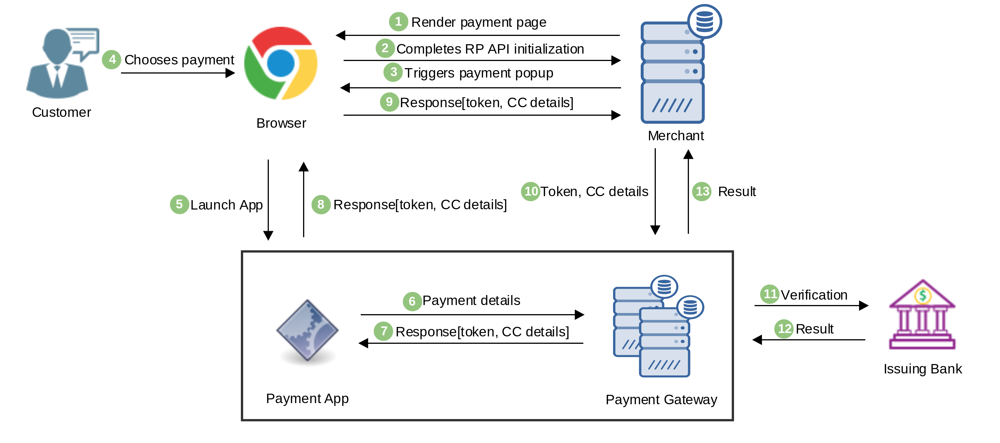
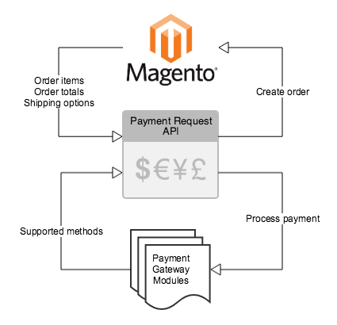

## Overview
The Payment Request API (PR API) is designed to eliminate standard checkout forms.
It is a [W3C standard](https://www.w3.org/TR/payment-request/) candidate so most of the modern browsers support it.
PR API allows improving user workflow during the purchase process, providing a more consistent user experience and
enabling merchants to easily leverage different payment methods. To get more details, please, read
[Introducing the Payment Request API](https://developers.google.com/web/fundamentals/payments/).

The Payment Request API allows achieving the following goals:

* Let the browser act as an intermediary among merchants, users, and payment methods
* Standardize the payment communication flow as much as possible
* Seamlessly support different secure payment methods
* Work on any browser, device, or platform - mobile or otherwise
* Is an open and cross-browser standard

PR API supports different payment methods like:

* Basic Card (standardized by [W3С](https://w3c.github.io/payment-method-id/#registry)) - a payment method that provides
credit, debit, and prepaid card payment information
* URL-based (like Google Pay, AliPay, Apple Pay, Samsung Pay, etc.) - anyone can develop and provide their own solution

## General Transaction Flow
In general, the payment transaction flow looks like this:

1. JS components initialize Payment Request API on the rendered page.
1. The browser performs PR API initialization with provided from the configuration payment details, like allowed payment
methods, types of supported credit cards, etc.
1. After PR API initialization, JS component calls `show()` method to show payment popup.
1. A customer chooses one of the available payment methods or fills credit card details.
1. The browser sends payment details to the chosen payment application (like Google Pay, Apple Pay, etc.).
1. Payment Application sends data to a payment gateway.
1. The payment gateway returns a response with token or credit card details (depends on the chosen payment method).
1. The application sends received data to the browser.
1. Now, js component can process received payment details before sending to the payment gateway.
1. A merchant website sends a transaction with payment details to the payment gateway.
1. Payment Gateway sends the payment transaction to an issuing bank for a verification.
1. The issuing bank verifies the transaction and sends back a result to the payment gateway.
1. The payment gateway sends the response to the merchant's website and it completes the order.

## Magento Core and Payment Gateway Modules Responsibilities


Magento Open Source implements the general flow of Payment Request API invocation and provides payment method independent
data such as order items, total and shipping options.

Payment Gateway integration modules responsible for providing valid data for supported payment methods that may be used
by Payment Request API.

Payment Gateway integration modules provide information about supported payment methods to Magento Open Source framework
which manages it.

The working prototype located in the public repository for [Payment Improvements](https://github.com/magento/payment-improvements/tree/payment-request-api).
All technical details related to the implementation and additional design document located in [Payment Improvements Wiki](https://github.com/magento/payment-improvements/wiki) space.

## Checkout Flow with PR API
Payment Request API doesn't replace standard Magento checkout flow. The main idea is to provide additional, more consistent
user experience flow which doesn't require any additional payment forms. As not all browsers support PR API, a customer
still should have a possibility to use standard checkout. In a case, if PR API is supported by a browser, both variants
should be available. Fortunately, PR API allows to detect is it supported by the browser or not:
```javascript
if(window.PaymentRequest) {
  // Use Payment Request API
} else {
  // Fallback to traditional checkout
  window.location.href = '/checkout/traditional';
}
```
## PCI Compliance and Security

As PR API with basic-card payment method can return credit card data like, CC number, expiration date, CVV, etc. there
are few important security notes. If merchant's site is compliant with PCI SAQ A, it isn't allowed to handle raw credit
card data directly. The merchants compliant with PCI DSS or
[PCI SAQ A-EP](https://www.pcisecuritystandards.org/documents/PCI-DSS-v3_2-SAQ-A_EP.pdf) should not worry about it.

As a possible solution, the usage of [Braintree](https://developers.braintreepayments.com/guides/google-pay/client-side/javascript/v3),
[Stripe](https://stripe.com/docs/stripe-js/elements/payment-request-button) or other Payment Gateways which support
PR API allows avoiding PCI compliance certification.