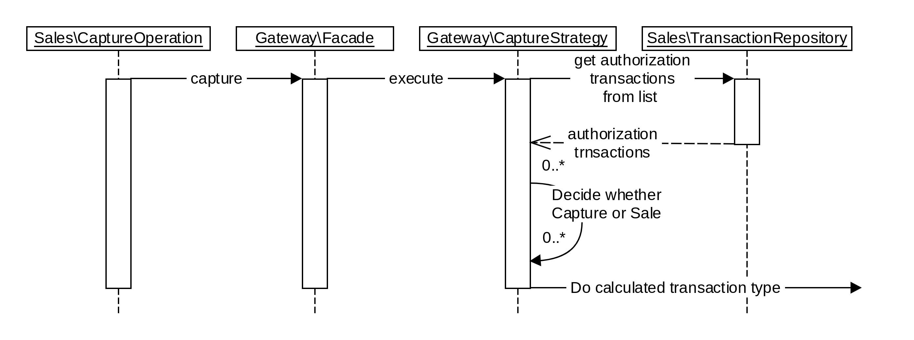
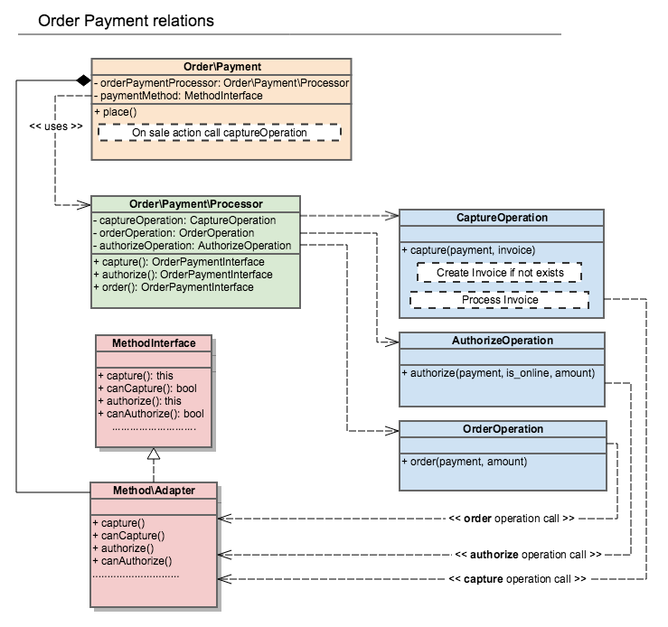
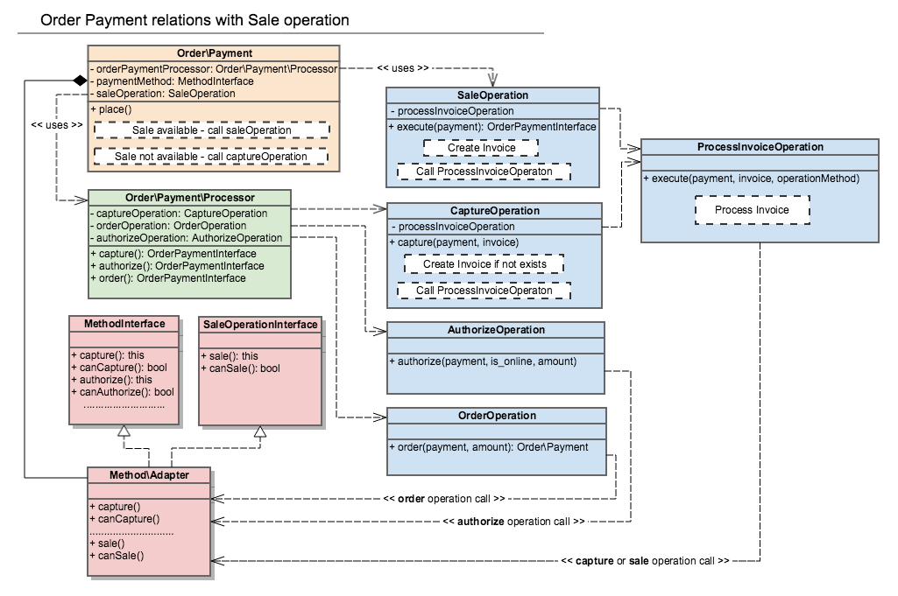

## Overview
[Magento payment provider gateway](https://devdocs.magento.com/guides/v2.2/payments-integrations/bk-payments-integrations.html) doesn't support `sale` payment operation out of the box like `authorize` or `capture` operations.

This operation is available for the majority of payment methods.

Now, each payment method should implement an own workaround for `sale` payment operation, because [Order\Payment](https://github.com/magento/magento2/blob/2.2-develop/app/code/Magento/Sales/Model/Order/Payment.php#L445) calls capture instead sale:

**Magento\Sales\Model\Order\Payment**
```php
protected function processAction($action, Order $order)
{
    $totalDue = $order->getTotalDue();
    $baseTotalDue = $order->getBaseTotalDue();
 
    switch ($action) {
        ............................................................................
        case \Magento\Payment\Model\Method\AbstractMethod::ACTION_AUTHORIZE_CAPTURE:
            $this->setAmountAuthorized($totalDue);
            $this->setBaseAmountAuthorized($baseTotalDue);
            $this->capture(null);
            break;
        default:
            break;
    }
}
```
[This article](https://community.magento.com/t5/Magento-DevBlog/The-Magento-Sale-Payment-Operation/ba-p/67251) describes how to solve this problem in each particular case but doesn't solve the problem in general.

All payment integrations implement boilerplate code for `sale` operation:


## Theory of Operation
For the current moment, we have next relations in order payment workflow.


I propose to introduce `Magento\Payment\Model\SaleOperationInterface` and `Magento\Payment\Model\Method\Adapter` should implement this interface along with `Magento\Payment\Model\MethodInterface`.
```php
<?php
namespace Magento\Payment\Model;

/**
 * Responsible for support of `sale` payment operation via Magento payment provider gateway.
 *
 * @api
 */
interface SaleOperationInterface
{
    /**
     * Checks `sale` payment operation availability.
     *
     * @return bool
     *
     */
    public function canSale(): bool;

    /**
     * Executes `sale` payment operation.
     *
     * @param InfoInterface $payment
     * @param float $amount
     * @return $this
     *
     */
    public function sale(InfoInterface $payment, float $amount);
}
```


`Magento\Sales\Model\Order\Payment\Operations\CaptureOperation` includes logic responsible for invoice creating and invoice processing.
Logic responsible for invoice processing should be extracted from `CaptureOperation` into separate command `Magento\Sales\Model\Order\Payment\Operations\ProcessInvoiceOperation`.

`SaleOperation` and `CaptureOperation` commands will use `ProcessInvoiceOperation` for invoice processing and calls to [Magento payment provider gateway](https://devdocs.magento.com/guides/v2.2/payments-integrations/bk-payments-integrations.html).


`Order\Payment` will call `SaleOpertion` if `sale` operation is available for payment method. Otherway, `CaptureOperation` will be called for backward compatibility with existing payment integrations.

**Magento\Sales\Model\Order\Payment**
```php
<?php
protected function processAction($action, Order $order)
{
    $totalDue = $order->getTotalDue();
    $baseTotalDue = $order->getBaseTotalDue();
    
    switch ($action) {
        ............................................................................
        case \Magento\Payment\Model\Method\AbstractMethod::ACTION_AUTHORIZE_CAPTURE:
            $this->setAmountAuthorized($totalDue);
            $this->setBaseAmountAuthorized($baseTotalDue);
            if ($this->canSale()) {
                $this->saleOperation->sale($this);
            } else {
                $this->capture(null);
            }
            break;
        default:
            break;
    }
}
 
/**
 * Check sale operation availability for payment method.
 *
 * @return bool
 */
private function canSale(): bool
{
    $method = $this->getMethodInstance();
    return $method instanceof SaleOperationInterface && $method->canSale();
}
```

## Payment provider integration configuration
Payment integration should be based on [Magento payment provider gateway](https://devdocs.magento.com/guides/v2.2/payments-integrations/bk-payments-integrations.html).

Integrations based on deprecated `Magento\Payment\Model\Method\AbstractMethod` this solution doesn't support.

In `config.xml` `can_sale`  option should be defined:

```xml
<config xmlns:xsi="http://www.w3.org/2001/XMLSchema-instance" xsi:noNamespaceSchemaLocation="urn:magento:module:Magento_Store:etc/config.xsd">
    <default>
        <payment>
            <braintree>
                ......................
                <can_sale>1</can_sale>
                ......................
            </braintree>
        </payment>
    </default>
</config>
```
In `di.xml` `sale` command should be defined in `CommandPool`:
```xml
<!-- Commands infrastructure -->
<virtualType name="BraintreeCommandPool" type="Magento\Payment\Gateway\Command\CommandPool">
    <arguments>
        <argument name="commands" xsi:type="array">
            ...............................................................
            <item name="sale" xsi:type="string">BraintreeSaleCommand</item>
            ...............................................................
        </argument>
    </arguments>
</virtualType>
```

## Backward compatibility
 - New @api interface `SaleOperationInterface` should be introduced - **MINOR** change according to SemVer
 - Two public methods should be added in `Magento\Payment\Model\Method\Adapter` @api class - *sale()* and *canSale()*

I suppose these changes can be made in the scope of **2.3 release** publication.
