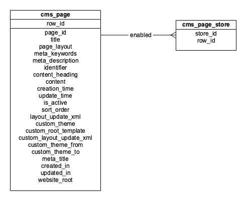
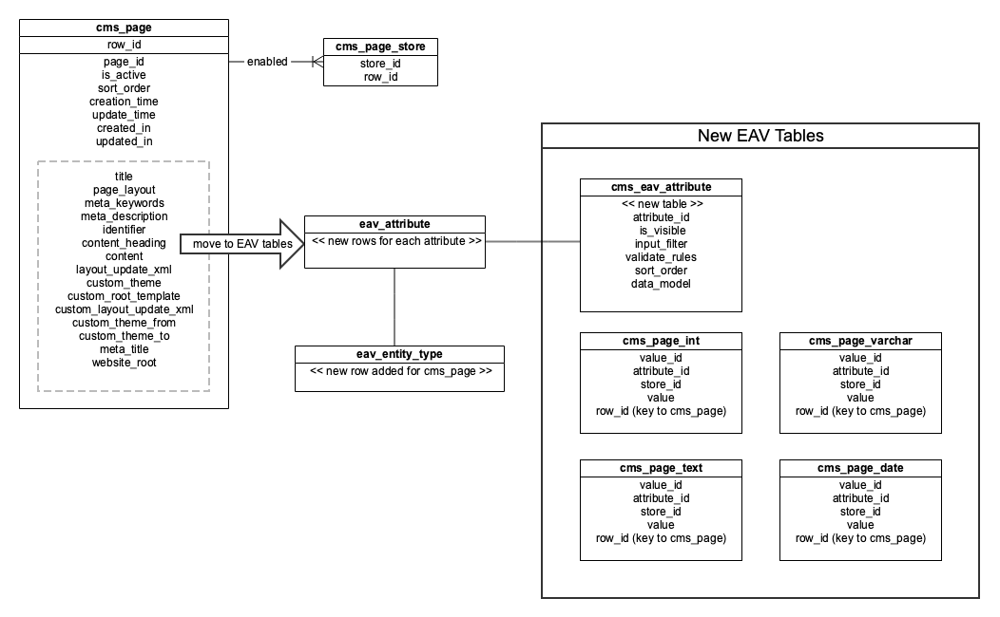

## [HLD] MC-13907: Add StoreView Scope to CMS Pages

HLD for [MC-13907](https://jira.corp.magento.com/browse/MC-13907): Allow CMS Page to Be Edited and Viewed in Admin Based On StoreView

**Current state**

CMS content such as pages and blocks don't support MagentoScope like products and categories do. Merchants need to duplicate pages and blocks and assign them to different storeviews in order to get content localized.

**Problems:**

1. Websites with many languages (EMEA region mostly) need to manage huge number of pages to get the content localized. They maintain certain naming convention for pages to simplify the process of finding the localized duplicates, but making changes for that pages and launching them is still very time consuming and tidies work that slows down time to market for content significantly

2. Websites with several locales usually have dedicated content manager per each locale. They speak the language of the region they manage. Their role in ACL is limited to the particular scope (responsible for certain region) can't edit CMS pages that are assigned to the scope they have access (MAGETWO-69693) 

3. Product widget added into the page with PageBuilder or as a widget will render all products based on conditions regardless of website selected for Product. That causes products not sold on the web store to be displayed there.

4. When block is added to the page with Pagebuilder, it will render an empty block on Stage if the CMS Block is saved to a unique store view (not All Store Views or Default Store View). Sometimes it renders scope specific content on all storeview scope. This causes lots of confusion. 

5. Dynamic Block content types will render All Store Views content

**Objectives**

1. СMS Pages have MagentoScope. 
2. Admin user with scope specific role is able to edit scope specific content
3. CMS Page is assigned to AllStoreviews by default. 
4. Changing the drop-down value will cause the page to load the content for that specific storeview
5. CMS Page content attributes have storeview scope except: 
   - enable page - global
   - store view - global 
6. Changing the drop-down value to any value other than All Store Views will by default have the "Use Default Value" checkbox checked for all storeview specific attributes
7. ContentHeading is removed from the CMS Page Form(only new pages affected)
8. PageTitle content attribute value is copied to MetaTitle by default

### Terms

-   **Magento Scope**: the ability to define Magento components specific to a store view

### Overview
CMS Pages can currently be turned on/off for store views, but the content cannot be customized. Epic MC-13907 will provide support for customizing a Page at the store view level so that users can more easily manage localized content.

**Current schema:**

The current page design ties a CMS page to one or more store views but this association does not differentiate content by store view, it only defines the availability of the page to a store view.

### Design
All of the page attributes that can be applied to store scope will be defined as EAV attributes and stored in new EAV tables. This will allow the attributes to follow the same pattern as other Magento components and will be familiar to extension developers. This will also build in support for staging content specific to store views.

-   A new entry to `eav_entity_type` table will be made to define cms_page as an entity type and provide mapping to the models and associated attributes & tables

-   Each attribute will be defined in the `eav_attribute` table and the new `cms_eav_attribute` table
    
-   An upgrade script will be provided that will convert all existing data into the new schema, associating all existing pages to the All Store Views scope.

##### Pros:
-   EAV aligns with existing Product & Category design
-   This approach will allow users to manage products & CMS pages the same way
-   EAV is familiar and recommended
##### Cons:
-   EAV may be overkill since we aren’t (for now) adding the ability for admin to create additional attributes
-   These changes will be backwards incompatible and must be delivered in 2.4

Note: These changes will not address the existing difficulty of using the same content for multiple websites/store views. A new story will be created to address this separately and will be owned by Eugene.

#### Scenario: New Page
When a new page is created, it will default to the All Store Views scope and the user will not be able to select a different scope until the page is saved. This ensure there is always a default fallback defined and is how the Product & Categories scope selection works.

#### Scenario: Creating different content for a specific store view
When an existing page is loaded it will default to the "All Store Views" scope. When the user selects a new store scope the system will attempt to load the content matching the current `page_id` and selected `store_id`. If none exists, it will fallback to the "All Store Views" data. If changes are made and saved, new entries will be created in the EAV tables for the selected `store_id`.

#### Scenario: Deleting a page
Deleting a page deletes all content associated with it for all store views.

#### Scenario: Duplicating a page
When the user opens a CMS page and selects "Save and Duplicate", any changes made will be saved and the page will be duplicated, along with all of the store-specific content. The new page will be (globally) disabled by default, as it currently functions.

### Breaking Changes
This new schema will introduce breaking changes to any developers that retrieve or modify CMS pages, either by API calls or accessing the database tables. Any extensions that customize the CMS UI could also be impacted.

### Component Dependencies
- Store

### Extension Points and Scenarios
Page Builder components (and potentially other extensions) will need to be aware of the selected store view to render store-sensitive data (such as Product List). The store switcher component adds the chosen store_id to the application context and will be available as Page Builder currently expects (via StoreManager) without additional changes.

### Data size and Performance Requirements
No new degradations
