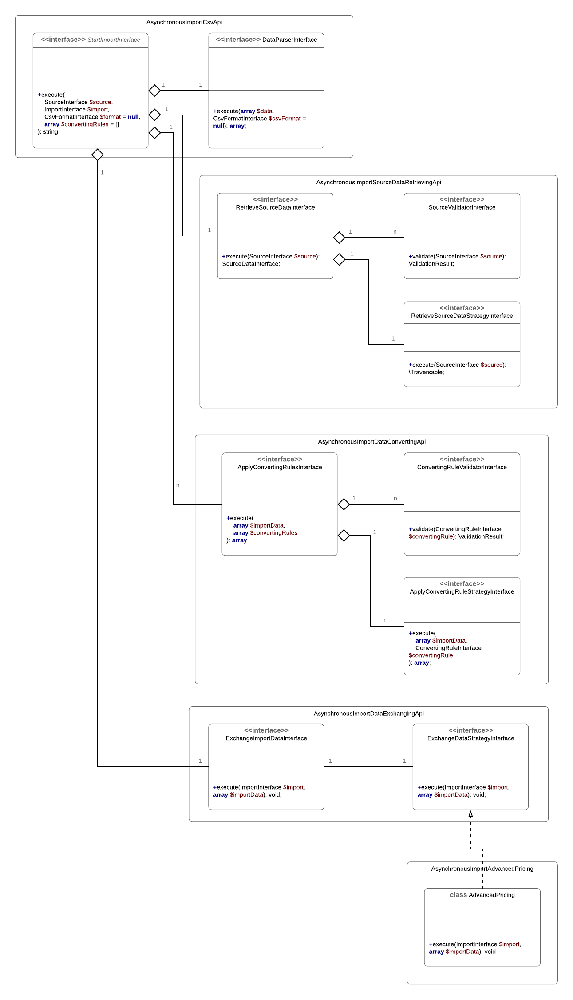

# Asynchronous Import as separate service

Main idea of extension is to replace current Import module with new implementation that will allow to users import objects in Magento by using Asynchronous approach.

## Workflow

- Upload source data to instance storage (optional step);
- Retrieve source data from Source (partial reading);
- Parse source data;
- Apply data converting rule;
- Exchange data with Magento instance via Bulk API Service contracts / Bulk API REST (partial processing);
- Later an user can request balk status of import and resubmit objects which were failed during the import;

## REST API

- [REST API](rest-api.md)

## Modularity (API / Extension points)

- [Start Import based on CSV data (main entry point)](modularity/import-csv.md)
- [Source data retrieving](modularity/source-data-retrieving.md)
- [Data converting before import](modularity/data-converting.md)
- [Data exchanging with Magento instance](modularity/data-exchanging.md)
- [Import advanced pricing](modularity/advanced-pricing.md)

## MVP

[MVP Board](https://app.zenhub.com/workspaces/async-import-5b5f349bd6768d6255917727/reports/burndown?milestoneId=4625823)

- Sources data retrieving: *HTTP, HTTPS, base64*;
- CSV reader;
- Data Converting Rules;
- Import Data Exchanging;
- Import Configuration;
- Product import;
- Stock import;
- Advanced pricing import;
- Documentation;

## UML

## TODO
- Design of Import configuration;
- Design of Get Import status;
- Design of Import processing - Sync / Async
- Design of Restart failed operations
