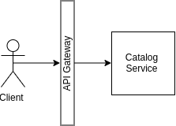
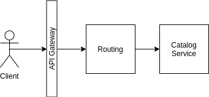
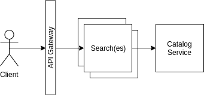

# Catalog Service

## Purpose of Catalog Service
Catalog has a single purpose of returning product information that was intended to be shown at the storefront, both product listing or PDP.
Basically saying Catalog will answer on questions:
* How the product should look like to satisfy storefront requirements.
* How client of the Catalog can request products.

## Usage examples

### Direct call
Catalog service can be involved directly through the gateway.


A good example of such services is sales channels integrations that have to synchronize across connected channels.

### Routing
Clients who want to retrieve product data by URL.


Literally any application.


### Listings and search

Category page, search results, layered navigation.




## Performance requirements

Different scenarios may require different sets of attributes.


## We need DSL

```json
{
  "query": "products",
  "fields": [
    {
      "field": "id",
      "filter": [
        "1652b2fe-f758-11e9-8f0b-362b9e155667",
        "1652b588-f758-11e9-8f0b-362b9e155667",
        "1652b7c2-f758-11e9-8f0b-362b9e155667",
        "1652b8f8-f758-11e9-8f0b-362b9e155667",
        "1652bb00-f758-11e9-8f0b-362b9e155667",
        "1652bc40-f758-11e9-8f0b-362b9e155667",
        "1652be5c-f758-11e9-8f0b-362b9e155667",
        "1652bf88-f758-11e9-8f0b-362b9e155667",
        "1652c186-f758-11e9-8f0b-362b9e155667"
      ]
    },
    {"field": "name"},
    {"field": "sku"},
    {
      "field": "priceRange",
      "fields": [
        {
          "field": "minimumPrice",
          "fields": [
            {"field": "finalPrice"}
          ]
        }
      ]
    },
    {
      "field": "attributes",
      "filter": [
        "attributeCode1",
        "attributeCode2",
        "attributeCode3"
      ]
    },
    {"field": "options"}
  ]
}
```

```php
<?php

/**
 * Class Field
 */
class Field
{
    /**
     * @var string
     */
    private $name;

    /**
     * @var array
     */
    private $fields;

    /**
     * @var array
     */
    private $filter;

    /**
     * Field constructor.
     *
     * @param string $name
     * @param array $fields
     * @param array $filter
     */
    public function __construct(
        string $name,
        array $fields = [],
        array $filter = []
    ) {
        $this->name = $name;
        $this->fields = $fields;
        $this->filter = $filter;
    }
}

$field = new \Field(
    'products',
    [
        new \Field(
            'id',
            [],
            [
                "1652b2fe-f758-11e9-8f0b-362b9e155667",
                "1652b588-f758-11e9-8f0b-362b9e155667",
                "1652b7c2-f758-11e9-8f0b-362b9e155667",
                "1652b8f8-f758-11e9-8f0b-362b9e155667",
                "1652bb00-f758-11e9-8f0b-362b9e155667",
                "1652bc40-f758-11e9-8f0b-362b9e155667",
                "1652be5c-f758-11e9-8f0b-362b9e155667",
                "1652bf88-f758-11e9-8f0b-362b9e155667",
                "1652c186-f758-11e9-8f0b-362b9e155667"
            ]
        ),
        new \Field(
            'priceRange',
            [
                new \Field(
                    'minimumPrice',
                    [
                        new \Field('finalPrice')
                    ]
                )
            ]
        ),
        new \Field('sku'),
        new \Field(
            'attributes',
            [],
            [
                "attributeCode1",
                "attributeCode2",
                "attributeCode3"
            ]
        ),
        new \Field('options')
    ]
);


```