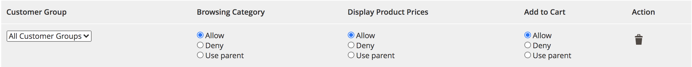
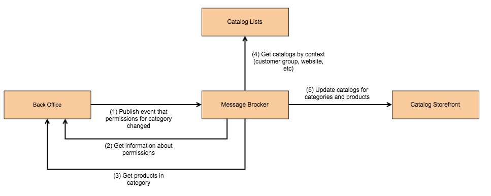
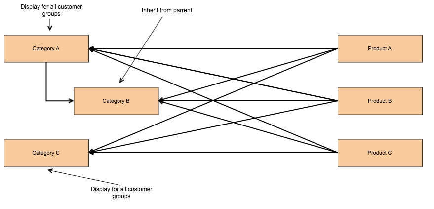
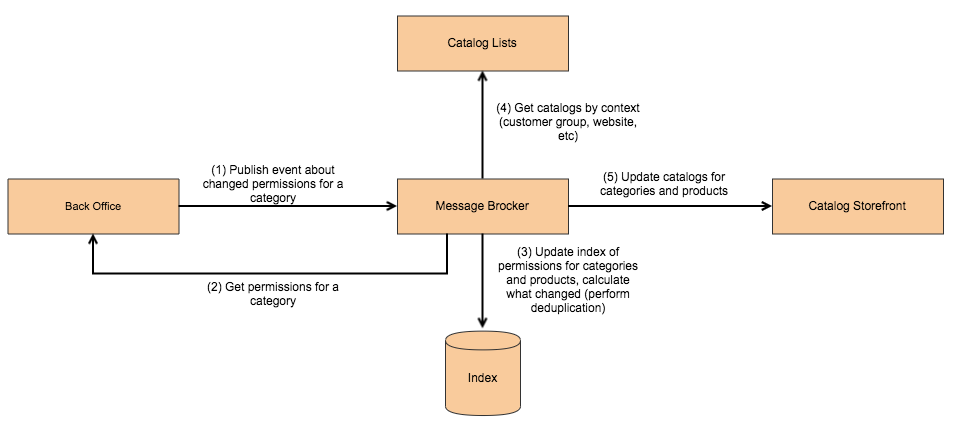

# Catalog permissions

## Problem statement

The goal of this proposal is to define how catalog permissions will be synchronized to the storefront. It also proposes to replace customer groups and website, used to represent product visibility with catalogs (the exact name should be defined).

## Overview of category permissions

Visibility for categories and products determined by the following options

* Website assignment
* Catalog permissions

Catalog permission settings looks like this and applied on the category level.



Category permissions set on the website and category level and applied to products in the category.

Below is the example of how data looks like for 2 customer groups.

```json
{
	"permissions": {
		"1": {
			"is_visible": "true",
			"allow_display_prices": "true",
			"allow_add_to_cart": "true",
		},
		"2": {
			"is_visible": "true",
			"allow_display_prices": "true",
			"allow_add_to_cart": "true",
		}
	}
}
```

## Using catalogs to represent visibility

Catalog are going to be used to represent visibility of the product. To represent permissions and websites with catalogs we will have to create catalog for website and customer group (for which we have catalog permissions configured) combinations.

More information on catalogs [here](https://wiki.corp.magento.com/pages/viewpage.action?spaceKey=ARCH&title=Organization+Structure%2C+Magento+Instance+Registration+and+Scope+Isolation).

## Catalog Lists service

Here is how synchronization of data might look like.



API of the Catalog Lists service.

```
syntax = "proto3";

// Request
message ScopeList {
    repeated Scope values = 1;
}

message Scope {
    string key = 1;
    string value = 2;
}

// Response
message Catalog {
	int id = 1;
}

service CatalogListsService {
  rpc GetCatalogs(ScopeList) returns (Catalog);
}
```

Might need to create bulk API.

## APIs to synchronize permissions

GET catalog-export/catalog-permissions/category?category_ids[0]=1&customer_group_ids[0]=1&customer_group_ids[1]=2&customer_group_ids[2]=3

```json
{
	"category_id": 1,
	"visible_for": [1, 2, 3],
	"display_prices_for": [1, 2, 3],
	"allow_add_to_cart_for": [1, 2, 3],
}
```

API to get categories for product.

GET catalog-export/category-product/product-relation?ids[0]=1&ids[1]=2

```json
[
	{
		"product_id": 1,
		"categories": [1, 2, 3, 4]
	},
	{
		"product_id": 2,
		"categories": [1, 2, 4]
	}
]
```

API to update catalogs for categories and products.

```
syntax = "proto3";

message CatalogProductRelation {
	repeated int product_id = 1;
    int catalog_id = 2;
}

service CatalogService {
  rpc UpdateCatalogProductRelation(CatalogProductRelation) returns (google.protobuf.Empty);
}

message CatalogCategoryRelation {
	repeated int category_id = 1;
    int catalog_id = 2;
}

service CatalogService {
  rpc UpdateCatalogCategoryRelation(CatalogCategoryRelation) returns (google.protobuf.Empty);
}
```

## Use cases

Example 1
There are 3 categories A, B, C. Categories B and C are subcategories of A. Category B configured to inherit permissions, category C configured to allow access to all customer groups. Category A has been configured to allow access to all customer groups. Products belongs to all categories. Then permissions changes for category A to disallow access for all customer groups.



Example 2

We added permissions for 1 customer group to a category. There are no categories that extend permissions from this category. Category has 30000 products. These products assigned to other categories, we have 10 unique categories total.

Example 3

We removed permissions for 1 customer group from a category. There are no categories that extend permissions from this category. Category has 30000 products. These products assigned to other categories, we have 10 unique categories total.

## Ways to sync data

### Option 1 - Keep index on Magento side
To build efficient communication between Magento and massage broker we need to rely on index. If this index present in Magento we could publish the following events (assuming we add deduplication to know what exactly changed, it can be added later)

Category permissions A changed
Category permissions B changed

API to get permissions for a category.

Calculation for example 1

We publish 2 events
* 2 queries to get permissions for 2 categories
* 62 queries to get products in categories
* 10 queries to get permissions for 10 categories (let's assume that products in 2 categories also present in other 10 categories)
* 1 query to create catalogs
* 2 queries to update category permissions in storefront
* 30 queries to update product permissions in storefront
Total 105 queries

Calculation for example 2

We publish 1 event
* 1 query to get permissions for a category
* 30 queries to get products in categories (page size 1000)
* 30 queries to get permissions for 30 product batches (10 categories)
* 1 query to create catalogs
* 1 query to update catalogs for category in storefront
* 30 queries to update catalogs for product in storefront
Total 93 queries

Calculation for example 3

We publish 1 event
* 1 query to get permissions for a category
* 30 queries to get products in categories
* 30 queries to get permissions for 30 product batches (10 categories)
* 1 query to create catalogs
* 1 query to update catalogs for category in storefront
* 30 queries to update catalogs for product in storefront
Total 93 queries

As we could have anchor categories, we need to publish events for child categories and parent, if they are anchor categories.

### Option 2 - Add index to Message broker (alternative)




If we publish only event that permissions for category updated and expect message broker to calculate permissions for child categories and products that belong to these categories, we would have to request data that didn't change for categories and products unless we have index on message broker side.

Calculations for example 1

In case we don't have an index, message broker will have to do at least 7 calls to fetch permissions: get category A child categories, get category A permissions, get category B permissions, get category A products, get category B products, get product A permissions, get product B permissions. This is way worse than in Option 1.

If we have index on message broker side we would be able to get necessary data to calculate permissions with only 1 call. We will have to maintain index of categories, relations of products and categories and catalog permissions in message broker to allow this.

## Visual merchandiser

Visual merchandiser allows to assign products to category based on the rule. Under the hood it simply updates category to product assignment. If there are already products in the category, visual merchandiser will replace these products with products selected by the rule. Visual merchandiser also has precedence over is anchor setting of the category.

When category assignment change we need to publish event that we need to sync category products.

```json
{
	"meta": {
		"type": "catalog.product.relation.updated"
	},
	"data": {
		"relations": [
			{
				"10": [1, 2],
				"15": [1, 2, 3]
			}
		]
	}
}
```

Catalog permissions can add additional processing to handle this event to update permissions for a category.

API to get categories for product.

GET catalog-export/category-product/category-relation?category_id[0]=1&product_ids[1]=2&product_ids[1]=3

```json
{
	"category_id": "1",
	"products": {
		"2": "1000",
		"3": "1001"
	}
}
```

## Use cases

Example 1

Let's say we have a category, for which we changed product assignment and it contains 30000 products. These products assigned to other categories, we have 10 unique categories total.

* We publish 30 events
* 10 queries to get permissions for 10 categories (let's assume that these products also present in other 10 categories)
* 1 query to create catalogs
* 30 queries to update product permissions
Total 41 queries

Example 2

Let's say we have a category, for which we added 1 product.

We publish 1 event
* 1 query to get permissions for a category
* 1 query to create catalogs
* 1 query to update product permissions
Total 3 queries

Example 3

Let's say we have a category, for which we added 1 product. Category has permissions for 50 customer groups.

We publish 1 event
* 1 query to get permissions for a category
* 1 query to create catalogs
* 1 query to update product permissions
Total 3 queries

Example 4

Let's say we have a category, for which we added 1 product. Category has permissions for 50 customer groups.

We publish 1 event
* 1 query to get permissions for a category
* 50 query to create catalogs
* 50 queries to update product permissions
Total 101 queries

We can do deduplication and only publish events for the products that were affected. If the parent category is anchor, we will have to sync products for that category as well.

## Extensibility

Catalog permissions need to be implemented as a separate module(s), as this is ee feature.

Catalog permissions should rely on catalogs which is open source functionality.

This can be additionally clarified.