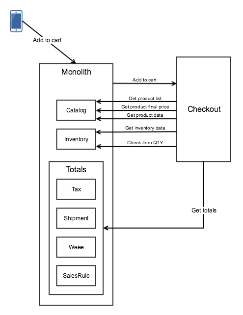
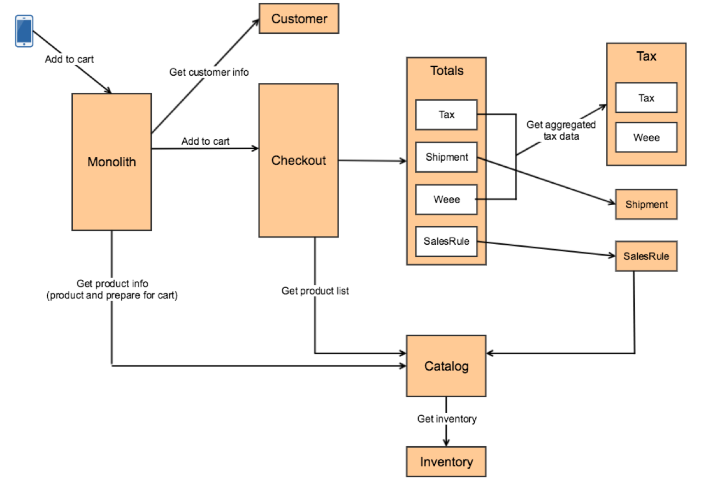
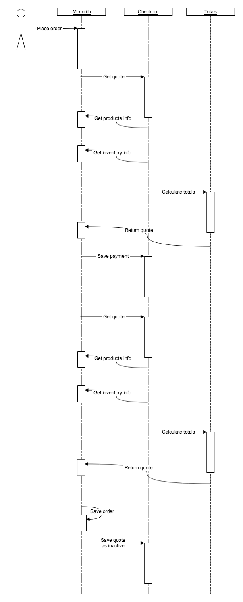

# Checkout Service

## Overview

This document describes design and communication of monolith application and checkout service.

## Design

Operations that are currently per item (inventory requests) need to be done for multiple items to reduce number of calls.

Shared interfaces (product interfaces) need to be moved into API modules. For backwards compatibility we can export interfaces in the new API modules under old name. Shared configuration (configuration for extension attributes) need to be moved to a separate modules as well.

## Communication Between Monolith and Checkout Service

### Add to Cart Operation

Current communication for add to cart operation (has one of the largest amount of communication).

Total 23 calls on Open Source. Commerce will have one more call. Customizations could increase number of calls.

#### Call Analysis

Catalog
* 2 calls to get list of products with different criteria
* 1 call to get final price for QTY
* 1 call to get product info
* 1 call to prepare item for cart
Possible optimizations: remove prepare item for cart call, 2 product list calls into 1 call, we will get 3 calls.

Inventory
* 2 calls to get different stock data
* 1 call to validate 
Possible optimizations: group stock data calls into 1, we will get 2 calls as a result.

Customer
* 7 calls to get customer data
Possible optimizations: pass as an argument of operation.

Quote/shipment
* 2 calls
Possible optimizations: need to investigate if we can eliminate 1 call, as a result we can potentially get 1 call.

Tax
* 2 calls
Possible optimizations: need to investigate if we can eliminate 1 call, as a result we will get 1 call.

Integration
* 1 call that can be removed.

#### Additional Optimizations

* Pass customer/group/addresses as an argument.
* Make inventory checks a separate operation (validate-cart) that will be performed after product added to cart on each cart load asynchronously and before placing order
* Totals should not be recalculated on each cart load page, only when cart changes and before placing the order to make sure product data didn't change.
* Create service for totals calculation to reduce number of calls to BFF
* Group calls to the same service (request all needed data in the beginning); can lead to shared state

After we applying the following optimizations, we will have communication with checkout service as shown below
* Pass customer as an argument of add to cart operation
* Aggregate calls to catalog and inventory services Magento\CatalogInventory\Api\StockRegistryInterface::getStockItemBySku, Magento\CatalogInventory\Api\StockRegistryInterface::getStockStatusBySku need to combine into one call
* Prepare item for cart logic should be eliminated, service should receive cart ready to add
* Create API that would allow to calculate totals for the quote

If we apply these additional optimizations, communication between services will look like this
* Have tax service return aggregated information that later can be used to display tax on product page or totals. Question: wouldn't this data be redundant in some cases?
* Move totals to it's own service: 1) reduce number of calls to monolith, 2) cache of requested data from tax, quote and sales service and as a result reduce amount of communication.

Cons
* More work for initial iteration as we would have to decouple more services with checkout

Pros
* Allows reduce calls to BFF
* Allows to avoid intermediate state of calculating totals in BFF and reduce amount of backwards incompatible changes

### Place Order Operation

Communication for place order operation looks similar. The only major differences are that we need to save payment, load quote multiple times and save quote. This flow potentially can be optimized.

## Transactions
Currently Quote module is responsible for creating an order. Need to move this responsibility to order service (BFF after first iteration).

BFF will be responsible for loading quote and managing the transaction. If order placing failed, no additional transactions need to be rolled back after first iteration as all transactions being performed on BFF. If order placing successful, but  removing quote failed, we would need to retry removing quote instead of rolling back. Mechanism of retrying of failed operations is a general concern and should be discussed separately.

## Open Questions
* Format of the data API receives is different from the format service contracts use in some cases (for date for instance we expect string via API, but the actual interfaces use array). A: Leave external API for backwards compatibility, introduce new types for services.
* Hydration/extraction for certain entities triggers initialization of resource models/queries to database, ProductInterface is one of the examples. A: Some of these interfaces should not be shared, quote should have it's own ProductInterface. What to do with backwards compatibility?
* Code reuse (reusing the same modules). It's anti pattern, but maybe for us it's ok? A: Deal on case by case basis.
* When adding product to cart for product option of type file we need to upload the file. A: Storage of these files can be responsibility of separate service.
* Quote uses \Magento\Catalog\Model\Product\Type\AbstractType::prepareForCartAdvanced to prepare product for cart. A: BFF should pass product that already ready to be added to cart. Later can consider exposing this API on the catalog service.
* Quote need to get price for a product in certain QTY. We can't pass product with final price as price can depend on tier price. A: BFF need to expose API that would allow to retrieve final price for product in certain QTY.
* A lot of fields are not part of the data interfaces. A: Add fields to interfaces or use extension attributes.