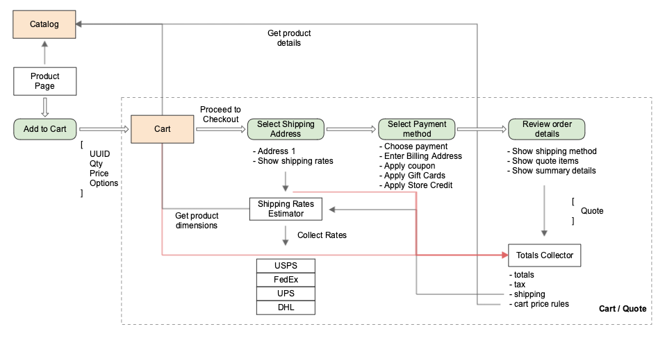
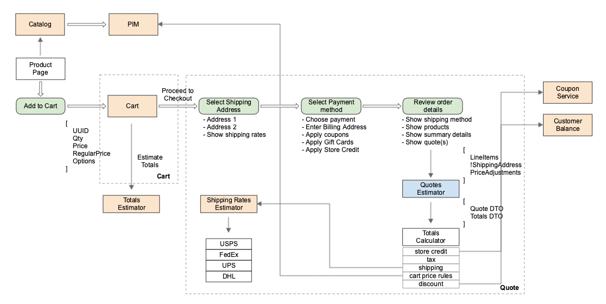
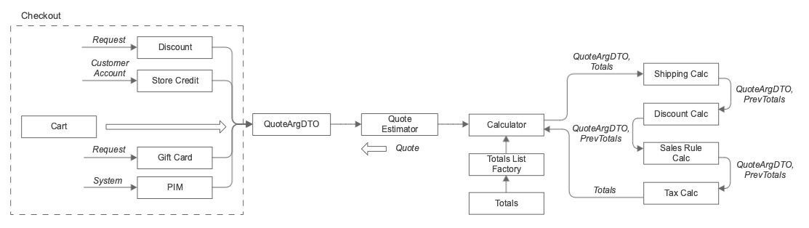
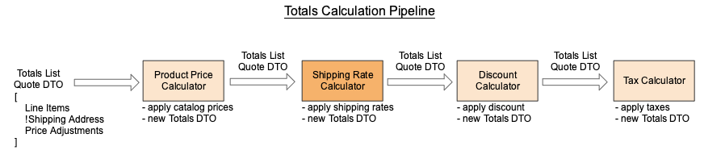
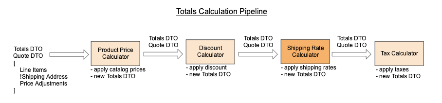

# Alternative checkout flow

In scope of work on GraphQL and storefront APIs we have an opportunity to improve design and features of storefront checkout.

The purpose of this document is to discuss possible alternatives to current Magento checkout flow which might be introduced as an alternative API. 

The cart is just a container for the items the user wants to purchase. In the proposed flow the cart is created as soon as user adds product to cart. The data from cart entity should be enough to render mini-cart and cart pages. Taxes and other adjustments are not calculated at these steps.

The quote, on the other hand, contains a full break down of all adjustments calculated. It provides the user with the total he has to pay for the items in the cart.

It is possible to split cart items into separate quotes. This can be done based on shipping addresses or shipping sources.

Each quote is used to create a separate order. Multiple payment methods (with independent billing address each) can be selected during each order creation.

This proposal describes multiple approaches for the checkout flow.

## Bidirectional checkout flow

This flow is based on the current checkout flow and assumes improving current API without data flow modification. The Cart and Quote modules will still use Catalog and PIM to retrieve product details.

The `Add to Cart` operation receives only basic list of product attributes like UUID (SKU for the current implementation), quantity, price and options. All additional details like product dimensions for shipping rates calculations, each module (service) will request from PIM (Catalog for the current implementation).

The different quote's calculators, like Cart Price Rule calculator, can make requests to PIM/Catalog to retrieve additional product details. In general, the proposed schema does not change the checkout flow significantly but has ideas for API improvements.

## Uni-directional checkout flow

The flow assumes that each component like Cart, Quote, Shipping, etc. will receive all needed details to perform operations. This approach allows resolving and reducing a list of dependencies between modules. Cart will depend on Catalog. Quote will depend on Cart and must not depend on Catalog. Order will depend on Quote and must not depend on Cart or Catalog.

There are few open questions related to this approach:

- How the data should be validated if services will rely only on the input data. For example, a price calculator uses product regular price and quantity for totals calculations and there is no guaranty that the product price was not changed after `Add to Cart` operation.
- How quotes should be recalculated if quotes were saved some time ago and input data is not valid anymore.

The fallback actions could solve mentioned problems but we still will have have dependencies to the components like PIM. Additional solution - a signature usage for data consistency verification.

### Data Flow

  1. When Quote is created?
     * For physical products on Review & Payments step
     * For virtual products billing address has to be entered first
  2. Cart properties:
     * Line Items:
       * SKU
       * Selected options (custom/configurable)
       * Quantity
       * Regular price
       * Price
  3. Quote factory arguments: Quote
     * !Line Items
     * Dimensions (weight & size) (based on LineItems)
     * Shipping (requited for physical products)
       * Address
       * Selected Shipping Method
     * Billing address (required for virtual products). Need use cases
     * Coupons
     * Gift cards
     * Store credit
     * Cart rules (calculated by Applicable catalog rules calculator)
     * Customer
  4. Totals calculator: Totals
     * QuoteArgumentDTO
     * PreviousTotals
  5. Quote
     * Line Items     
     * Shipping addresses
     * Price Adjustments
        * Line Items Totals
            * Totals
            * Adjustments
                * Taxes
                * Cart rule discounts
        * Coupons
        * Gift cards
        * Store credit
        * Taxes
     * Customer (optional)
  6. Place Order: Order
     * Quote
     * PaymentMethods with Billing Addresses

### Quote creation flow

## Totals calculation improvements

The current approach for quote calculation has multiple drawbacks like: changes the quote object, quote totals collector is difficult to customize, a complicated logic to define the order of totals calculation (tax before/after discount, discount/tax rules for shipping, etc.), additional calls to 3rd party systems for shipping rate prices updating.

The proposed solution assumes that a quote will be an immutable object, each calculator will create new totals object based on previous and the order of calculation can be changed via configuration. As one of benefits of the proposed approached - the list of calculators and their order can be visualized for better calculation understanding.

Let's consider the totals calculation might look like.

Each calculator receives Quote DTO and Totals DTO, calculates totals and creates new Totals DTO with calculated amount. This approach allows not change quote object, have defined interface for totals and change the order of calculation. Magento provides multiple configuration to change the order of calculation, for example, discount can be applied before shipping amount or after.

As the list of calculators and their order depend not only on configuration but also on such factors like a presence of shipping address (gift cards, virtual, downloadable products do not require shipping address) the calculations pipeline should be built in runtime.

In the scope of Services Isolation project, the totals calculation can be a separate service.

## Summary

The main benefits of proposed changes are following:

 - Clear boundaries between Cart and Quote components
 - Mutli-address checkout out-of-box
 - Support of immutable multi-quote flow
 - Unified interface via `PriceAdjustments` for totals calculation
 - One-directional flow allows reducing communication between components
