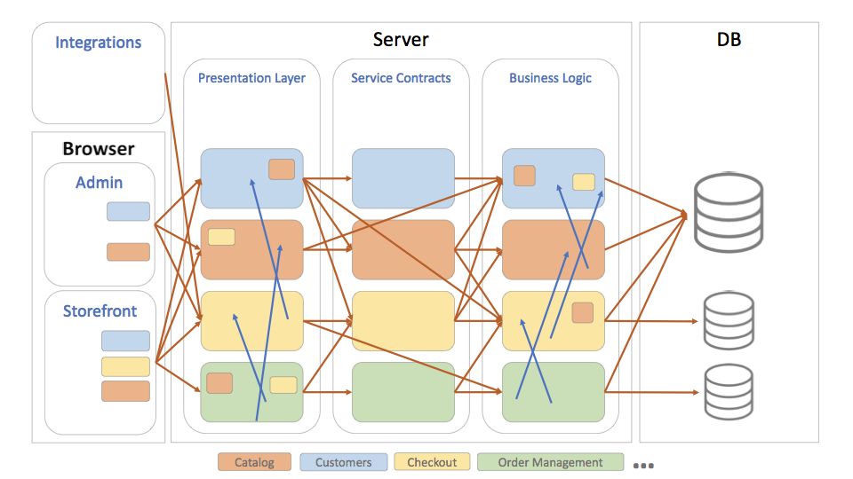
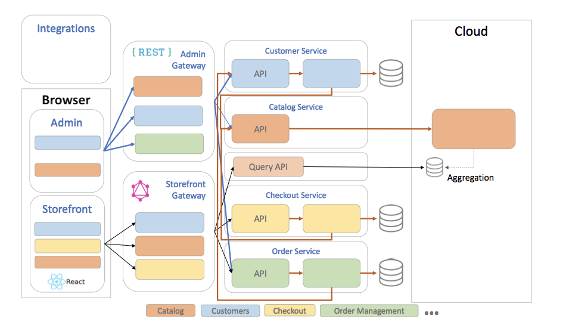
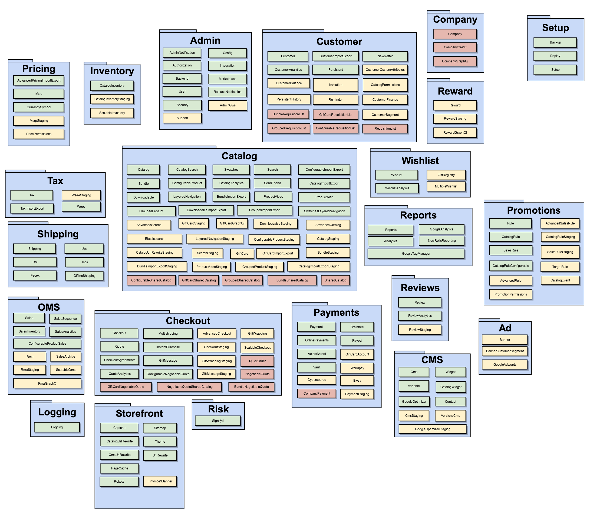

# Magento Component Isolation

## Historical context
Magento Commerce was designed as a monolithic modular application: all codebase is split to functional modules but is deployed together. This has following implications:

* Application has to be deployed as a whole. No ability to deploy updated versions of separate components independently
* Application has to be scaled as a whole. No ability to scale separate components independently. Only X-axis and Z-axis scaling are supported
* Even though modular code structure groups related behavior, it is easy to introduce an undesired dependency between application components as components are not deployed and tested independently. Only static modularity analysis is performed.

## Current state
Introduction of service contracts in Magento 2.0 was the first step towards component isolation:

* Every component defines its API (service contracts) – PHP interfaces that can both be called from within PHP process or remotely through REST, SOAP or AMQP APIs
* Every component is allowed to call other components only through their service contracts
* Implementation of any service contract can be replaced with a proxy that does a call to remote component through REST or SOAP API

In consequent releases more service contracts were introduced, and more modules were switched to service contract communication, but legacy undesired dependencies (direct inter-module model-to-model and presentation-to-model dependencies) still exist. This fact does not allow true component separation. Most of undesired inter-component dependencies reside in UI (presentation-to-model).

On data level, ability to split checkout and order management databases was introduced. This improved scalability of Magento instances.

### PWA & Component isolation
The decision to move all UI to browser as a part of PWA effort significantly reduces number of undesired dependencies in codebase: most dependencies reside in UI, and will not be present in PWA implementation.

## Desired state
Magento components (Catalog, Checkout, Order Management, ...) are isolated and only communicate through service contracts

Upsides:

* scalability – components can be scaled independently on Magento instances
* deployment – components can be deployed independently
* replaceability – it is easier for System Integrators to replace Magento built-in components with third-party systems
* teams have clear ownership boundaries
* easier to comprehend a single component
* clear contracts between components
* granular releases - components can be released independently
* in isolated components it is easier to use data storages with more appropriate storage models.
* easier to experiment and replace components

Downsides:

* Performance hit of inter-component communication
* Instance maintenance – it is harder to manage distributed Magento instance. This needs to be compensated with improved logging, tracking, debugging, and deployment capabilities.
* Any component can be replaced with a remote implementation

Current deployment model (single app) must be supported

Following application components are identified to be isolated:

 

### Implementation
To achieve the desired state two sets of changes are required: platform modifications and component isolation.

### Platform modifications
To support current ecosystem the platform and main APIs will have to stay the same (PHP, Magento Framework).

Part of platform work is required to allow independent component deployment (module separation, application framework, configurable service invokers, backends for frontends, support for split extensions in marketplace), other part is good to have to make independently deployed components manageable (cloud native, development environments).

### UI module separation

As mentioned earlier, many undesired inter-module dependencies reside in UI. To make independent component instances lighter by avoiding installation of all current module dependencies, all UI code must be extracted from Magento modules to separate ModuleNameUI modules.

### Application framework

Following library components are currently implemented as Magento modules. Many modules depend on these library components. It clutters module dependency graph. Effectively they will be required for most application components. So these library components (or application-agnostic parts of them) should be moved to Magento\Framework to reduce clutter in module dependencies:

* Amqp
* Config
* Cron
* Deploy
* EAV
* GraphQL
* Indexer
* MessageQueue
* MysqlMq
* WebAPI

### Configurable service contract invocations

As of 2.2 Magento service contracts only support local calls. Remote calls require manual implementation. Magento should be able to invoke service contracts either locally or remotely (if a service whose contract is called is deployed remotely). Two options to implement this are discussed:

(Preferred) Introduce service contract invoker that should be used by every client to invoke service contract. For local calls such invoker would just call a service contract, for remote components it would do a remote call. This option gives more control over service contract invocation, but requires modification of all current service contract clients
Auto-generated remote call proxies for service contracts that represent remote components. This option does not require code modifications but will produce harder to debug code
Remote invoker must contain improved logging, timeouts, retry logic, and circuit breakers to avoid failure state propagation between components.

First iteration of remote implementation should be based on existing synchronous APIs. Final desired state is to use asynchronous communication between services to reduce their runtime coupling.

Long-term goal: To avoid the leaky abstraction of remote invocations, new generation of service contracts has to expose asynchronous nature in APIs.

### Backends for frontends
Two entry point components need to be created for two main application clients: storefront and admin apps (admin, integrations). These endpoint components (backends for frontends) should act as façades to corresponding functionality:

* Storefront backend
  * cookie based authentication
  * routing to storefront scenarios only
  * GraphQL
* Admin backend
  * used by admin app and integrations
  * mostly CRUD operations for entities
  * token based authentication
  * ACL-based authorization.
  * REST

### Support for split extensions on Marketplace

Current data model of Marketplace does not support multiple packages per extension. Since an extension can customize multiple components, it should be possible to create an extension that consists of multiple composer packages. Such extensions must be supported by Magento Marketplace.

Example: MyVendorShippingMethod extension modifies shipment and checkout components. MyVendorShippingMethod extension consists of 2 composer packages in Marketplace: MyVendorShipment and MyVendorCheckout.

### Cloud-native
Following changes to Magento Commerce platform are required to make it friendly for cloud deployments

### Application configuration
Magento components must support centralized application configuration management.

NOTE: supported since 2.2 with configuration stored in env.php.

### Tracing
Correlation IDs must be added to internal calls to make tracing easier.

### Tooling
Current magento tool depends on application codebase being present on same machine. This makes it hard to manage a distributed instance of Magento.

New endpoint must be introduced that can be exposed on an secure network adapter and that would listen to commands from remote magento tool and execute them.

New standalone magento tool must be created.

### Schema migrations
Expansion-cleanup stages should be introduced into schema deployment tool to reduce downtime during service deployment

NOTE: declarative schema in 2.3 makes automated distinction possible

### Development environment

To make development of distributed instances easier, new developer environment must be created.

A prototype that uses Minikube VM with Kubernetes cluster is available.

NOTE: Distributed component deployment will make current Commerce/B2B linking approach impossible, so new approach of internal development environment installation must be used: installation of Magento modules from “path” type composer repositories (prototype working with Minikube is available).

### Design principles

General principles to follow for component isolation:

* Current service contracts must be preserved for backward compatibility
* All new service contracts must follow design principles described in technical guidelines + following principles:
* Idempotence
* Network communication is unreliable. Retries will be required, and some messages will be delivered more than once. To make these conditions safe, operations must be idempotent
* Sagas for consistency of distributed operations
* All new service contracts expose asynchronous APIs
* All new state modifying operations expose bulk APIs
* All service operations must be stateless
* No data dependencies between component. Every component has own data.
* Command & query responsibility segregation – storefront APIs for data immutable in storefront (catalog) should be optimized for data retrieval
* For every component that should support distributed deployment a ComponentNameWebapi module must be created that will have dependency on the root component package and will contain webapi declarations for this component.

Detailed design must be prepared for every component.

### Implementation approach

Iterative approach must be used for component isolation: one component at a time.

Based on component sizes and dependencies and priorities, following isolation sequence is proposed:

1. Inventory (started in MSI project)
1. Platform changes
1. Pricing
1. Checkout
1. Tax
1. Order Management
1. Customer
1. CMS
1. Reports
1. Payments
1. Shipping
1. Promotions
1. Wishlist
1. Rewards
1. Company
1. Marketing
1. Risk
