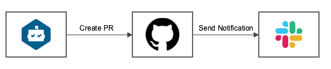
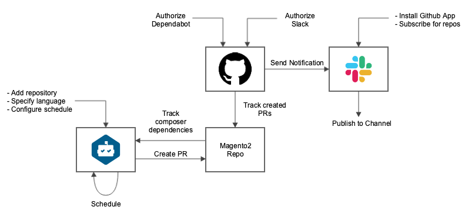

# Dependabot + Slack

[Dependabot](https://dependabot.com/) provides a functionality to track dependencies from `composer.json` and create PRs to the tracked repositories.
But it does not provide a notification mechanism. As [Slack](https://slack.com/) is the most popular corporate messenger and Magento uses it, and has a lot of customizations like bots and applications, it make sense to integrate a notification mechanism about newly created PRs.
Fortunately, Github already has a [mechanism](https://slack.github.com/) for Slack notifications.

In general this schema works like this:



Dependabot creates a PR with updated dependencies (one PR for one dependency), Github sends a notification to a Slack channel. As Dependabot and Slack are integrated with Github and don't depend on each other, they can be replaced/extended by other tools like [Greenkeeper](https://greenkeeper.io/) and
[Jira](https://marketplace.atlassian.com/apps/1219592/github-for-jira?hosting=cloud&tab=overview).

## General workflow

The next diagram shows how the more detailed workflow looks like:



 - Dependabot tracks `composer.json` dependencies for a specified repository
 - For a new versions of dependencies it creates a PR
 - Github built-in mechanism tracks newly created PRs and send a notification to Slack app
 - Github Slack app publishes a message in a channel according to the subscription rules (see Slack Integration section)
 - Custom labels (the default label is `dependencies`) or review assignees
 
## Dependabot Integration

Dependabot requires Github authorization and permissions to the needed repositories. Each tracked repository has own configuration. The configuration settings include:

 - Update schedule settings: live, daily, weekly, monthly
 - Branch to track
 - Filters, like security updates, top-level dependencies
 - Different updating strategies for `composer.json`

## Github Slack Integration

Github Slack integration also requires authorization and permissions to tracked repositories. Also, Github app should be installed for Slack workspace. More installation details can be found in the [documentation](https://github.com/integrations/slack#installing-the-github-integration-for-slack).

Github app provides the following commands to track interested repositories:

 - issues - Opened or closed issues
 - pulls - New or merged pull requests
 - statuses - Statuses on pull requests
 - commits - New commits on the default branch (usually master)
 - deployments - Updated status on deployments
 - public - A repository switching from private to public
 - releases - Published releases
 - reviews - Pull request reviews
 - comments - New comments on issues and pull requests
 - branches - Created or deleted branches
 - commits:all - All commits pushed to any branch
 
To track PRs with updated dependencies the following command might be used:

```bash
/github subscribe magento/magento pulls
```

Github app will notify about all newly created PRs in subscribed repository. Unfortunately, there is [no a possibility](https://github.com/integrations/slack/issues/384) to track PRs only with specific labels. A separate repository might be used as a temporal solution.

## Summary

Such schema covers tracking all dependencies from `composer.json`, automatically creates a PR with updated dependency and sends notification to a Slack channel. Also, this solution does not require custom tool or application and hardware resources. The solution does not cover indirect dependencies like MySql, ElasticSearch, etc. which are not specified in `composer.json`.

As tracking and notification mechanisms are independent, the more sources can be added in the future (like npm dependencies) and notifications can be send to different sources (like Jira).