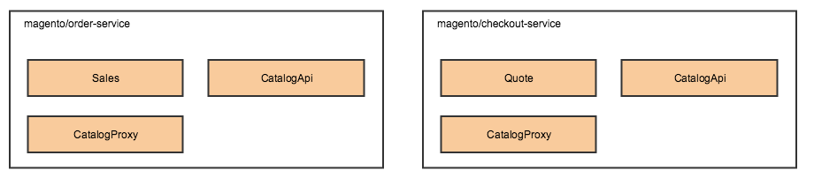

# Distributed deployment

## Problem

We want support distributed deployment Magento: 1) area specific instances, that will be responsible only for specific function: admin UI, cron, store front UI, web API, and CLI, 2) separate services.

Benefits
* Splitting modules decreases number of dependencies
* When deploying area specific instances, unnecessary dependencies not loaded and it should improve performance
* We don't have private interfaces (admin UI, cron) exposed, should improve security
* It's a step towards SOA

## Design

## Developer workflow

There are 2 options for developer work flow.

1. Work with monolith and split before deployment

Developer works with monolith application, workflow is similar to current.

Pros
* Magento doesn't need to distribute area specific projects
* Easier to install an extension, you just install on monolith and it's always one extension (if it's split, it will be aggregated using meta package)
* Easier to develop
* Easier to manage obsolete dependencies

Cons
* Not close to real system, some bugs might be introduced because we don't have code that is separated at the beginning

2. Magento distributes projects per area: admin UI, storefront, cron, etc

Developer works with application that that have admin UI, storefront, cron, etc deployed separately.

Pros
* Close to production

Cons
* Upgrade of each instance need to be done separately
* Harder to develop
* How to remove obsolete dependencies

To install extension we can have a tool (wrapper around composer) that
* Receives paths to code bases of the instances and extension that need to be installed
* Checkout that Magento version (potentially we can just download extension)
* Install extension on that Magento version
* Figure out parts of the extensions and then adds dependencies on each part of the extension to composer.json's of each instance

In both cases database upgrade need to be run only on admin instance or CLI instance.

### Decomposing monolith

Area specific instance will contain only relevant set of modules. For instance, admin instance will contain *AdminUi modules and their dependencies and will not contain store front modules.

Currently Magento 2 project depends on `magento/base` component, that contain project structure and entry points. We need to decompose it in the following way to not have unnecessary entry points on each instance.
`magento/base` (will not contain area specific code anymore)
`magento/web-application` - will contain index.php endpoint, for admin, store front and web API (if web API going to use the same endpoint in the future)
`magento/cron-application` - will contain cron.php endpoint
`magento/webapi-application` - will contain endpoint for webapi, if we decide to have separate


Installing all components will result in monolith, project for monolith will depend on all of the components. Installing `magento/base` and `magento/web-application` and Admin UI modules will result in admin instance.

In addition to base package decomposition, we need to add marker components that would identify area specific instance:
`magento/cron` - marker component, contains cron modules
`magento/admin-ui` - marker component, contains admin ui modules
`magento/ui` - marker component, contains store front modules

Different options for area specific instances deployment
1. Distribute different projects and use composer to manage dependencies

UI modules will have to depend on marker component area, so it would be possible to identify on which area specific instance they need to be installed. Modules that are reusable across instances will not have dependency on area specific instances. UI modules will depend on them and they will be included where they needed.

There are can be a case when extension is not necessarily depends on UI module but needs to be installed on particular instance or instances (for instance, extension that sends an email when the order is placed), in this place it will depend on base module (module that contains business logic) and will be installed on all instances.

Pros
* Simplifies developer workflow (see below)

Cons
* Will require us to publish more projects
* Potentially some modules that don't depend on UI and depend on base modules may be installed on all instances (need to investigate)
* May not work for distributed deployment of services (or one to many relationship, when module need to be installed on multiple instances), see diagram below
* How to manage obsolete dependencies (you remove module on once instance, need to remove relevant parts on another)?



2. Distribute different projects and introduce new type of configuration for declaring dependencies of packages on instances/services

Modules would define on which instances they need to be installed and tool would modify composer.json files of these instances to include modules.

ModuleName/instances_config.yaml
```
instances:
    admin-ui
    ui
    cron
related:
    module-name-ui
    module-name-admin-ui
    module-name-cron-ui
```

Pros
 * The same mechanism can be used for distributed deployment of services
 
Cons
* Will require us to publish more projects
* Need to add new type of configuration 

3. Convention based

We can have convention similar to this
* Modules that end with *admin-ui go to admin instance
* Modules that end with *ui and not *admin-ui go to store front instance

Cons
* Convention can't be reliable option (developers may not follow it, someone may call storefront module login-as-admin)
* Will not work for distributed deployment of services


4. Introduce new type of configuration, but don't distribute separate projects

There would be a tool that splits monolith before deployment.

Pros
* Easy upgrade
* Easy management of obsolete dependencies

Cons
* Need to add new type of configuration 
* More complicated deployment process
