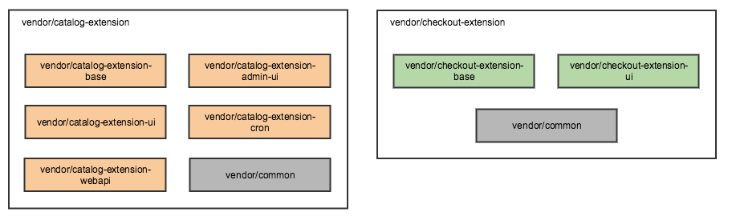
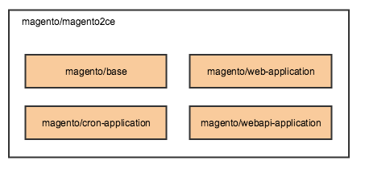

# Distributed deployment

## Problem

We want support distributed deployment Magento: 1) area specific instances, that will be responsible only for specific function: admin UI, cron, store front UI, web API, and CLI, 2) separate services.

Benefits
* Splitting modules decreases number of dependencies
* When deploying area specific instances, unnecessary dependencies not loaded and it should improve performance
* We don't have private interfaces (admin UI, cron) exposed, should improve security
* It's a step towards SOA

## Design

### Definitions

Distributed application - Magento monolith separated into applications by area (admin, storefront, cron, webapi) or separate services (catalog, checkout, inventory, etc).

Example extensions that later will be used in the examples.

### Uses cases for managing extensions

Use cases assume that extensions and instances use configuration proposed [here](https://github.com/magento/architecture/pull/145).

Note 1: not a problem for services deployment, but when we do deployment per area we need to update all instances at once because they share the same database and make sure

Note 2: `bin/magento setup:upgrade` will need to be run once on each type of the instance.

Note 3: we want to aggreagate extensions in metapackages, so they can be easily installed on monolith. Metapackages will not be installed on distributed application.

1. To install `vendor/catalog-extension` extension, developer will need to look at dependencies of the metapackage (download metapackage and it's dependencies and inspect composer.json files of the dependencies or look at Marketplace) on what instances they need to be installed and add dependencies on these packages and their versions to composer.json files on appropriate instances. After adding dependencies on each package, need to specify what metapackages installed on the system in composer.json on each instance (metapackages are the actual extensions, we need to record correspondence).

2. To remove extension developer will have to look at what packages that version of extension consists of (matapackage of the extension), then inspect composer.json files of these packages and remove them from the instances where they should be installed if there are no other dependencies on these packages if there are no other dependencies on them. To understand if there are no other dependencies on the package, developer will have to check if these dependency is not part of any other installed metapackage (installed metapackages specified on each instance).

3. To upgrade `vendor/catalog-extension` extension, developer will have to do #2 and then #1.

4. It is possible that use cases #1 and #2 fail if they both depend of the same package, but of different versions. In this case developer will have to chose one or not to have any of the extensions (the same would happen with monolith), the only different is that developer will have to remove extensions following #2.

5. It is possible that during #1 or #3, requirements of the extension on Magento components will not be met. In this case, developer will have to do #2.

6. It is possible (although it's very rare use case) that metapackage that developer wants to install or it's dependencies are listed in the conflict section of another package that is installed already. If conflict section specifies conflict with package that actually being installed, composer would not allow installation of this package. But package that may have conflict with metapackage specified. As metapackages not being installed anywhere, developer need manually check that any existing packages don't have conflict with metapackage.

### Developer workflow

There are 2 options for developer work flow.

1. Work with monolith and split before deployment

    Developer works with monolith application, workflow is similar to current.
    
    Pros
    * Magento doesn't need to distribute area specific projects
    * Easier to install an extension, you just install on monolith and it's always one extension (if it's split, it will be aggregated using meta package)
    * Easier to develop
    * Easier to manage obsolete dependencies

    Cons
    * Not close to real system, some bugs might be introduced because we don't have code that is separated at the beginning

2. Magento distributes projects per area: admin UI, storefront, cron, etc
    
    Developer works with application that that have admin UI, storefront, cron, etc deployed separately.
    
    Pros
    * Close to production
    
    Cons
    * Upgrade of each instance need to be done separately
    * Harder to develop
    * How to remove obsolete dependencies
    
    To install extension we can have a tool (wrapper around composer) that
    * Receives paths to code bases of the instances and extension that need to be installed
    * Checkout that Magento version (potentially we can just download extension)
    * Install extension on that Magento version
    * Figure out parts of the extensions and then adds dependencies on each part of the extension to composer.json's of each instance

In both cases database upgrade need to be run only on admin instance or CLI instance.

### Decomposing monolith

Area specific instance will contain only relevant set of modules. For instance, admin instance will contain *AdminUi modules and their dependencies and will not contain store front modules.

Currently Magento 2 project depends on `magento/base` component, that contain project structure and entry points. We need to decompose it in the following way to not have unnecessary entry points on each instance.
`magento/base` (will not contain area specific code anymore)
`magento/web-application` - will contain index.php endpoint, for admin, store front and web API (if web API going to use the same endpoint in the future)
`magento/cron-application` - will contain cron.php endpoint
`magento/webapi-application` - will contain endpoint for webapi, if we decide to have separate

Installing all components will result in monolith, project for monolith will depend on all of the components. Installing `magento/base` and `magento/web-application` and Admin UI modules will result in admin instance.

## Web setup wizard

Web setup wizard will not be supported for distributed deployment.
