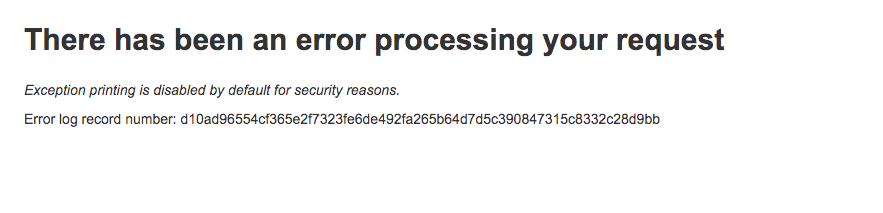
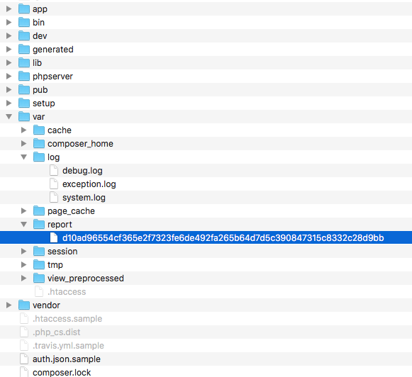
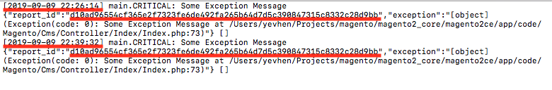
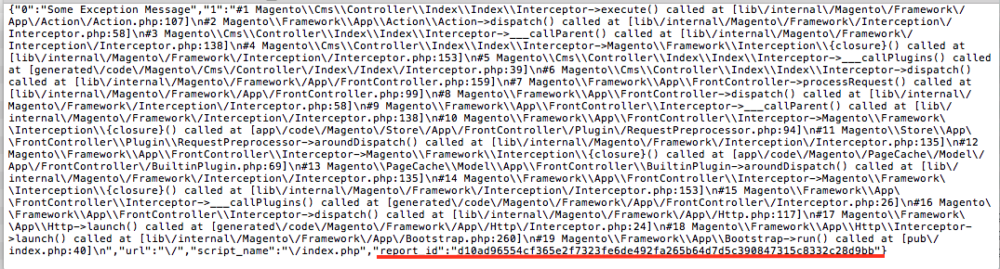
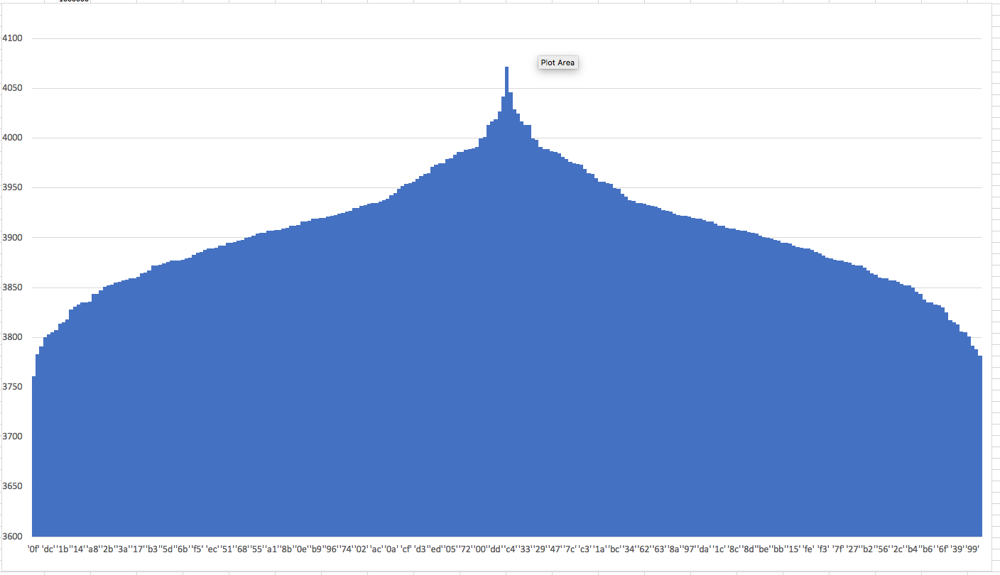

# Reduce q-ty of error reports created in `<magento_root>/var/report`

## Overview
The class `\Magento\Framework\App\Http` has a reporting mechanism about critical errors.

**In developer mode** (when the environment variable `MAGE_MODE` has value 'developer'),  an exception message will be written to the system log `<magento_root>/var/log/system.log`.  Exception information will be sent as a response to a user request with exception message, stack trace, entry point and etc.

**In production mode**, if an exception occurs during a user’s request in the Http object, then a message from the exception object will be written to the system log. After this, Http object tries to handle this exception with the available handlers in turn. The last handler will generate an exception report file in a directory `<magento_root>/var/report/`. Next, a response with an HTTP error code and the name of the report file will send  to the user.
If a lot of requests will be sent to the controller, where there is a critical problem, then there will be many report files about this error in the directory `<magento_root>/var/report`. These files will have the same contents but different names. The error message will only be written to the system log.
The log message and the error report does not have data on which they could be linked.

## Problem
Sometimes some clients have problems with this error reporting mechanism.
For example:
In the case when there are many requests to the Http application where there is a critical error, a huge number of reports about this error will accumulate in the directory `<magento_root>/var/report`. Magento does not have a mechanism for cleaning the report directory. System Integrator does not spend the time for monitoring the file reports, in most cases. As a result, report files are accumulated. The number of report files grows to hundreds of thousands, and sometimes it happens that the number of report files reaches a million or more.
With such a number of files in the folder, it becomes more difficult to work with error reports. It is not possible to look at the contents of the directory, and it is even difficult to remove the reports. There are cases that report files to occupy all the free space in the storage, which leads to the crash of the application.

## Solution
The solution to this problem is to save only unique reports `var/report/<unique_hash>` and associate them with the messages in the exception log `var/log/exception.log`. For associations, we may use a unique hash that will be generated using an exception trace, an exception message, $_SERVER['REQUEST_URI'] and $_SERVER['SCRIPT_NAME'].
The hash will be used to name the report file and this hash will be indicated in the report and the log message.
So, if you have some message from the exception log, you can take the hash from the message and use `grep` for understanding how long this happens.
If you need a trace of exception you can open the file in `<magento_log>/log/report/<hash>`.
In this way, we save a chronology of critical errors in the exception log and associate reports with them. This reports will be unique to each unique request and not be a repeat

**For example:**

***The error response to user:***

***The report file:***

***The message in the `<magento_root>/var/log/exception.log`:***

There is only one report file, although there are several messages in the exception log. Messages are the same but happened at different times

***Report File Content***

Of course, the decision to save only unique reports will not solve the problem of accumulating report files in a directory, this decision only delay the problem for another time. Anyway, over time, the number of files can grow up to several hundred thousand and working with such a directory will again be difficult.

To solve this problem, we can save reports in subdirectories with a configurable level of nesting.
For example, to add a new property `dir_nesting_level` to `<magento_root>/pub/errors/local.xml` for configuring directory nesting level to saving reports. And additionally, we can use the environment variable.

***Variants of name:***

1. MAGE_LOG_EXCEPTION_REPORT_DIR_NESTING_LEVEL
1. MAGE_EXCEPTION_REPORT_DIR_NESTING_LEVEL
1. MAGE_LOG_REPORT_DIR_NESTING_LEVEL
1. MAGE_REPORT_DIR_NESTING_LEVEL
1. REPORT_DIR_NESTING_LEVEL

The default value of the env variable/property is 0, in this case, report files will be saved to the directory `magento_root/var/report/<hash>`, without nesting.
If the environment variable has value more than zero, then subdirectories will be created. Each subdirectory will have a name like first two symbols of hash with offset on two symbols for next sub level.

***For Example:***

If we have hash sha256('')= 44ffb1087a44e61b018b3cdee72284d017f22e52755c24e5c85cbac1647ae7a7

1. MAGE_REPORT_DIR_NESTING_LEVEL=0 -> <magento_root>/var/report/44ffb1087a44e61b018b3cdee72284d017f22e52755c24e5c85cbac1647ae7a7
1. MAGE_REPORT_DIR_NESTING_LEVEL=1 -> <magento_root>/var/report/**44**/44ffb1087a44e61b018b3cdee72284d017f22e52755c24e5c85cbac1647ae7a7
1. MAGE_REPORT_DIR_NESTING_LEVEL=2 -> <magento_root>/var/report/**44**/**ff**/44ffb1087a44e61b018b3cdee72284d017f22e52755c24e5c85cbac1647ae7a7`
....
1. MAGE_REPORT_DIR_NESTING_LEVEL=32 -> <magento_root>/var/report/**44**/**ff**/**b1**/**08**/**7a**/**44**/**e6**/**1b**/**01**/**8b**/**3c**/**de**/**e7**/**22**/**84**/**d0**/**17**/**f2**/**2e**/**52**/**75**/**5c**/**24**/**e5**/**c8**/**5c**/**ba**/**c1**/**64**/**7a**/**e7**/**a7**/44ffb1087a44e61b018b3cdee72284d017f22e52755c24e5c85cbac1647ae7a7

If environment variable MAGE_REPORT_DIR_NESTING_LEVEL has value more then zero then max numbers of the subdirectories in subdirectories will be 256.
The number of reports in subdirectories will always depend on the frequency of coincidence of the first two characters, regardless of the nesting of directories and hash algorithm.
Next graph shows how one million reports will be distributed in subdirectories.

Quantity of reports will be from 3700 to 4100.

**Summary**

Implementing this mechanism, we will create an association between the message in the exception log and the report; we will reduce the number of reports, keeping only unique reports; and with the help of the subdirectories, we will avoid overflowing the directory `<magento_root>var/reports` with millions of files
