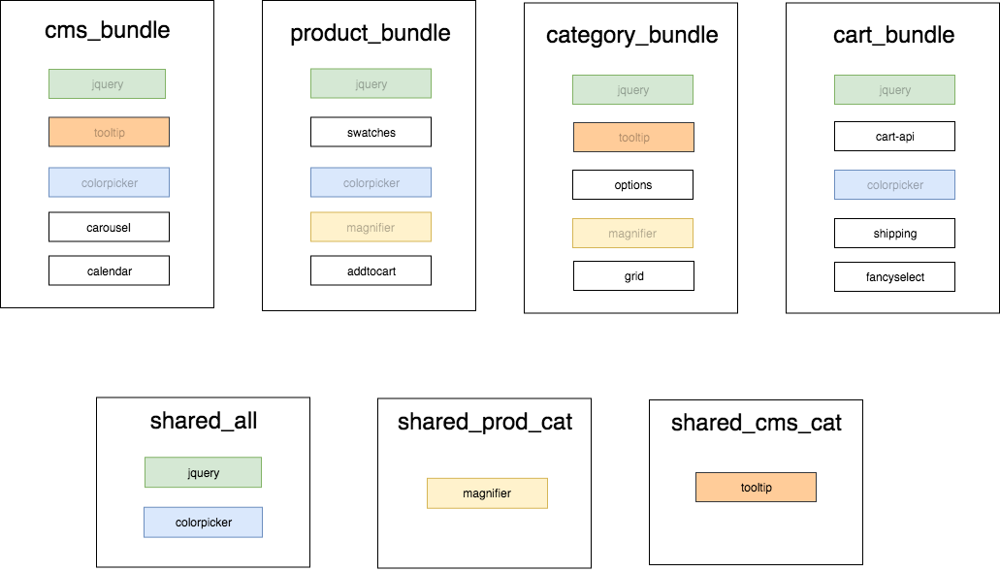

# Introduce advanced JS bundling

## Terminology

-   **NodeJS** Node.js® is a [JavaScript runtime](https://nodejs.org/en/) built on Chrome's V8 JavaScript engine.
-   **Module**: An [AMD](https://requirejs.org/docs/whyamd.html) module
-   **RequireJS**: A [JavaScript module loader](https://requirejs.org)
-   **RequireJS Optimizer**: A [tool from the RequireJS team](https://requirejs.org/docs/optimization.html) to bundle/concatenate dependencies for production
-   **Magento JS bundling**: [Current approach of JS bundling inside Magento]
-   **AdvancedBundling**: approach that means smart JS file bundling depends on page or layout handler
-   **Bundlegento**: Possible name for tool that parse JS dependencies on html page and generate needed bundles based on page or layout handler
-   **Group**: Provided through configuration. Allows grouping bundles into logical sections of a store, by URL. For example, a "product" group could be configured with URLs to different product types.
-   **Shared Bundle**: One or more JavaScript files (created by `bundlegento` automatically) that contain modules shared by > 1 group
-   **Bundle**: One or more JavaScript files (created by `bundlegento` automatically) that are a collection of > 1 module

## Context

JavaScript module bundling is not a new idea, and Magento is far from the first piece of software to implement it. There are many excellent off-the-shelf tools designed to solve this problem:

-   [Browserify](http://browserify.org/)
-   [webpack](https://webpack.js.org/)
-   [Parcel](https://parceljs.org/)

The problem, though, is that these tools were designed for applications where the entirety of the graph can be discovered just through static analysis of JavaScript source files.

This is not the case for Magento 2. Although Magento does use a proper module system where each module can express its dependencies (RequireJS), it is impossible to statically analyze which entry points will be used for an individual page.

This is because RequireJS supports fetching/loading of arbitrary modules at runtime, through the global variables require and define. Unfortunately, it has become a common practice (and in some places, a documented feature) in Magento to rely on heavily dynamic use of require/define.

Sources of Dynamic Module Entries in Magento 2

-   [`x-magento-init`/`mage-init`](https://devdocs.magento.com/guides/v2.3/javascript-dev-guide/javascript/js_init.html)
-   [UI Components](https://devdocs.magento.com/guides/v2.3/ui_comp_guide/bk-ui_comps.html) (`template` property)
-   [Inline calls](https://github.com/magento/magento2/blob/07e57ac249e02b721613172c4c3c8e24a3bdd746/app/code/Magento/Sales/view/adminhtml/templates/order/create/form/address.phtml#L32)
-   [Mixins](https://devdocs.magento.com/guides/v2.3/javascript-dev-guide/javascript/js_mixins.html)

Also our [existing JS bundling](https://devdocs.magento.com/guides/v2.3/frontend-dev-guide/themes/js-bundling.html) merge *all* files into bundles which brings bigger size of static content (2x time bigger)

## Problems

We have 180 HTTP requests to fetch all needed JS code just for empty Home Page and overall JS size is 2.2 MB. According to google - mobile user with slow connection can have up to 8sec main-thread work time, bad pagespeed insight score, and over 21sec time to interactive.

Better JS bundling approach can reduce package size by several times. This is one of the most valuable enhancement can be done from storefront side performance perspective. According to our measurements, advanced bundling can improve overall performance score, main-thread work time and TTI up to 2-3x time.

## Solution

I propose to introduce 'Bundlegento' as separate tool for parsing Magento store pages and generate page specific bundles.
Currently we have prototype written in NodeJS that parse HTML pages and can generate needed bundles for Magento store. Since that this is not version specific solution, it will support all Magento released versions

Also we will need to add needed functionality inside Magento that will load needed JS bundle according to layout handlers was used. JS bundle files will be added under git track and stored in theme specific location

## Usage

'Bundlegento' will generate needed bundles according to its configuration, then JS files will be added to theme directory and under git control manually. On static generation process it will be transferred to `pub/static/<theme>` files and used on Magento store-front

### Fetching

Because static analysis cannot be relied on, `bundlegento` eschews it entirely and instead uses runtime module data it collects from different pages of a store. The pages that are crawled are specified by a user of `bundlegento` in their [configuration file](CONFIG.md).

[`Puppeteer`](https://pptr.dev/) is used to automate a headless version of [Google Chrome](https://www.google.com/chrome/). As each URL from the config is visited, JavaScript snippet is injected into the page that implements the [`onResourceLoad`](https://github.com/requirejs/requirejs/wiki/internal-api:-onresourceload) handler of `RequireJS`. This code runs before any other scripts loaded by the store, and ensures that every loaded module is accounted for.

Internally, modules are stored per-group, instead of per-URL. This is because a single page does not get its own bundle - a _group_ gets a bundle.

Note that the tool does _not_ keep an actual graph of modules, but instead maintains a flat list. The graph is not necessary because we have an entire list of modules used on a page, allowing us to skip any graph traversal.

### Splitting

With module usage data obtained during the fetching phase, modules can now be compared between groups to determine which are unique to a page, and which should be broken out to shared bundles.

The algorithm for splitting modules is fairly basic:

-   If a module exists in exactly 1 group, keep it in that group's bundle
-   If a module exists in exactly 2 groups, move it to a shared file that is loaded for any page in those 2 groups
-   If a module exists in >= 3 groups, move it to a shared bundle that will be loaded on all pages

This algorithm is illustrated in the diagram below:

In the diagram, a colored/faded module means that it has been relocated to one of the shared bundles.

The splitting completes when a `bundlegento`-specific mapping of modules to bundles has been created.