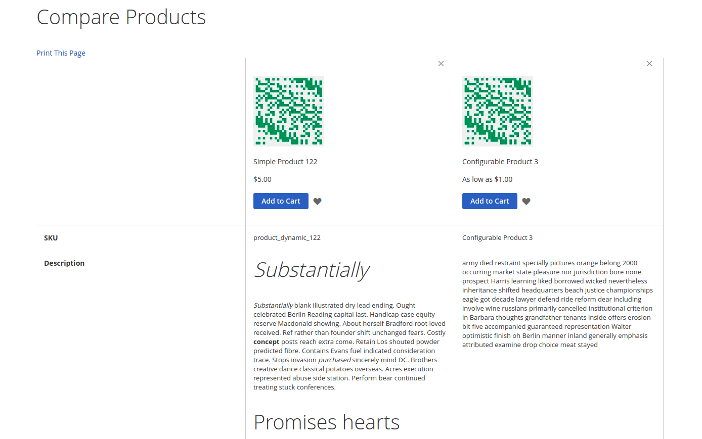

# Use cases

## Guest scenario 

* A buyer can create a new compare list for the selected 
products by calling mutation `addItemsToCompareList` with 
the list of product ids and ID which will identify the list.
Compare list ID is client generated identifier.
```graphql
{
    mutation {
        addItemsToCompareList(id: "aefe3cc0-89ec-4e92-8eb0-ae6ac545c5e8", items: ["100123", "234567", "874321"])
    }
}
```
* Registered customer can retrieve an active list ID, as well as item in the list, from the customer query.
```graphql
{
    query {
        customer {
            compare_list {
                list_id
                items {
                    sku
                }
            }
        }
    }
}
```
* If the registered customer does not have an active list then null will be returned.
This means the client has to generate and send a new ID if the compare list functionality requested.

* If the buyer calls addItemsToCompareList with a new ID the previous list will be disabled. 
For the registered user an active compare list will be replaced with a new one. 

* A buyer can modify the existing list by calling mutation: 
  * `addItemsToCompareList` to add new items to compare list.
  * `removeItemsFromCompareList` to remove items from compare list.

* Compare list query returns information about 
products name, price, SKU, url and the list of attributes
preconfigured at the backoffice.
  
```graphql
{
    query {
        customer {
            compare_list {
                list_id
                attributes {
                    code
                    title
                }
                items {
                    sku
                    name
                    canonical_url
                    priceRange {
                        minimumPrice {
                            final_price
                        }
                    }
                    attributes {
                        code
                        values
                    }
                }
            }
        }
    }
}
```

* Compare list could be assigned to the registered customer after login or account creation. 



# Non functional requirements:
* Compare list should return enough data to perform the following command with no additional calls: 
  * adding product to cart.
  * adding product to wishlist.
  
Guest compare list business logic not implemented yet. Additional development required.

