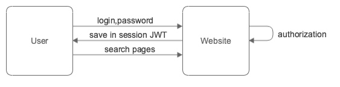
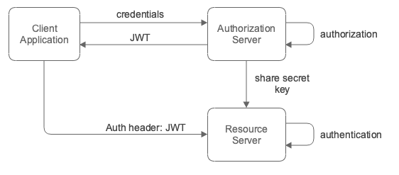
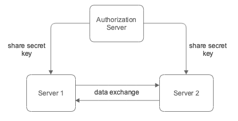
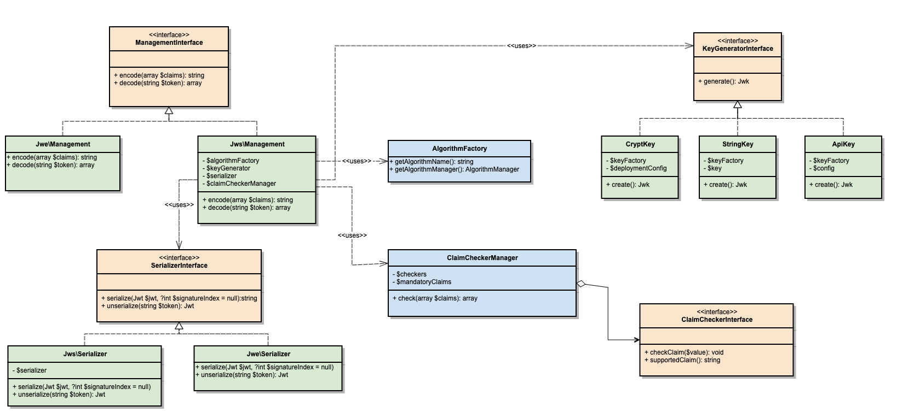

# Support of JWT authentication out-of-box

## Overview

JSON Web Token (JWT) is an open standard ([RFC 7519](https://tools.ietf.org/html/rfc7519)) that defines a compact and self-contained way for securely transmitting information between parties as a JSON object. This information can be verified and trusted because it is digitally signed (also, can be encrypted). JWTs can be signed using a secret (with the HMAC algorithm) or a public/private key pair using RSA or ECDSA.

The main use cases of JWT usage:

#### Client side sessions



JWT contains user's "session" representation. After successful login, all user session data (like ID, permissions, etc.) is stored in JWT token and user's permissions and allowed operations can be verified just based on information from JWT.

#### API authorization



Allows for client application to make API calls to needed resource with JWT as authorization token. The resource application can verify needed permissions from JWT claims. Authorization server can be separate application or the as resource server. In first case, the resource application should retrieve the secret key from the authorization server or send JWT to the authorization server for the verification.

#### Data exchange



Allows to built communication between multiple servers. An authorization server shares secret keys between servers or servers can send JWT to the authorization server for the future verification.

#### Data verification


Allows to verify if data is received from trusted source. The diagram shows RSA keys usage for content encryption but different types of keys can be used for the data verification like octet strings, key files, X.509 Certificates, etc.

The JWT structure has three main parts:

 - `header` - contains information about signature verification algorithms
 - `payload` - contains data (JWT-claims), the RFC defines a list of standard optional claims (https://tools.ietf.org/html/rfc7519#section-4.1)
 - `signature` - is used for data verification and represented as a hash of encoded `header` and encoded payload and secret key

And in general JWT looks like this: `header`.`payload`.`signature`.

The JWT usage became more and more popular for authentication and data verification purposes and Magento has a lot of integrations with different 3rd party systens, we should support JWT creation/validation/parsing out-of-box. Another benefit, that JWT is language agnostic and token generaten with one programming language can be parsed with another, the only key should be shared between applications.

## Solution

We do not need to implement own solution for key generation, parsing tokens, encryption/decryption, etc. [There are](https://jwt.io/#libraries) multiple PHP libraries which support all needed operations and algorithms and we need to create own wrappers.

[PHP JWT Framework](https://github.com/web-token/jwt-framework) - is proposed as a library because:
 - implements all algorithms from RFC
 - provides implementation for JWS, JWT, JWE, JWA, JWK, JSON Web Key Thumbprint, Unencoded Payload Option
 - supports different serialization modes
 - supports multiple compression methods
 - full support of JSON Web Key Set
 - has a good documentation
 - supports detached payload, multiple signatures, nested tokens

## Implementation

The following diagram represents needed interfaces to unify the workflow for JWT usage.



The `\Magento\Framework\Jwt\KeyGeneratorInterface` provides a possibility to use different types of key generators like: Magento deployment secret key, X.509 certificates or RSA keys.
```php
interface KeyGeneratorInterface
{
    public function generate(): Jwk;
}

class CryptKey implements KeyGeneratorInterface
{
    public function __construct(SecretKeyFactory $keyFactory, DeploymentConfig $deploymentConfig)
    {
        $this->deploymentConfig = $deploymentConfig;
        $this->keyFactory = $keyFactory;
    }

    public function generate(): Jwk
    {
        $secret = (string) $this->deploymentConfig->get('crypt/key');
        return $this->keyFactory->create($secret);
    }
}
```

The `\Magento\Framework\Jwt\ManagementInterface` is a base abstraction for JWT encoding/decoding/verification:
```php
interface ManagementInterface
{
    /**
     * Generates JWT in header.payload.signature format.
     *
     * @param array $claims
     * @return string
     * @throws \Exception
     */
    public function encode(array $claims): string;

    /**
     * Parses JWT and returns payload.
     *
     * @param string $token
     * @return array
     */
    public function decode(string $token): array;
}
```

It has implementations for JWS and JWE. The default preference is JWS implementation and looks like this:
```php
class Management implements ManagementInterface
{
    public function __construct(
        KeyGeneratorInterface $keyGenerator,
        SerializerInterface $serializer,
        AlgorithmFactory $algorithmFactory,
        Json $json,
        Manager $claimCheckerManager,
        BuilderFactory $builderFactory
    ) {
        $this->keyGenerator = $keyGenerator;
        $this->serializer = $serializer;
        $this->algorithmFactory = $algorithmFactory;
        $this->json = $json;
        $this->claimCheckerManager = $claimCheckerManager;
        $this->builderFactory = $builderFactory;
    }
    
    public function encode(array $claims): string
    {
        // as payload represented by url encode64 on json string,
        // the same claims structure with different key's order will get different payload hash
        ksort($claims);
        $payload = $this->json->serialize($claims);
        
        $jwsBuilder = $this->builderFactory->create($this->algorithmFactory->getAlgorithmManager());
        $jws = $jwsBuilder->create()
            ->withPayload($payload)
            ->addSignature(
                $this->keyGenerator->generate()->getKey(),
                [
                    'alg' => $this->algorithmFactory->getAlgorithmName(),
                    'typ' => 'JWT'
                ]
            )
            ->build();
        
        return $this->serializer->serialize(new Jwt($jws));
    }
    
    public function decode(string $token): array
    {
        $jws = $this->serializer->unserialize($token)
            ->getToken();
        
        if (!$this->verify($jws)) {
            throw new \InvalidArgumentException('JWT signature verification failed');
        }
        
        return $this->json->unserialize($jws->getPayload());
    }
    
    private function verify(CoreJwt $jws): bool
    {
        $verifier = $this->getVerifier();
        if (!$verifier->verifyWithKey($jws, $this->keyGenerator->generate()->getKey(), 0)) {
            return false;
        };
        
        $payload = $this->json->unserialize($jws->getPayload());
        $this->claimCheckerManager->check($payload);
        
        return true;
    }
}
```

### Claims validation

The `\Magento\Framework\Jwt\ClaimCheckerManager` provides a possibility to validate different set of claims like issuer, token, expiration time, audience. The list of claim checkers can be provided via `di.xml` and each checker should implement `\Magento\Framework\Jwt\ClaimCheckerInterface`.
The list of claims can be configured via `di.xml`.
```xml
<virtualType name="Magento\ModuleName\Model\VirtualClaimCheckerManager" type="Magento\Framework\Jwt\ClaimCheckerManager">
    <arguments>
        <argument name="checkers" xsi:type="array">
            <item name="exp" xsi:type="string">Magento\Framework\Jwt\ClaimChecker\ExpirationTime</item>
        </argument>
        <argument name="mandatoryClaims" xsi:type="array">
            <item name="exp" xsi:type="string">exp</item>
        </argument>
    </arguments>
</virtualType>
```

If `mandatoryClaims` argument is not specified and needed claim is not presented in the payload the check for this claim will be skipped.

The following test shows how different types of claim checkers can be used for the validation:
```php
public function testCheck(): void
{
    $claims = [
        'iss' => 'dev',
        'iat' => 1561564372,
        'exp' => 1593100372,
        'aud' => 'dev',
        'sub' => 'test',
        'key' => 'value'
    ];

    /** @var ClaimCheckerManager $claimCheckerManager */
    $claimCheckerManager = $objectManager->create(
        ClaimCheckerManager::class,
        [
            'checkers' => [
                IssuerChecker::class,
                ExpirationTimeChecker::class,
                IssuedAtChecker::class
            ]
        ]
    );

    $checked = $claimCheckerManager->check($claims, ['iss', 'iat', 'exp']);
    self::assertEquals(
        [
            'iss' => 'dev',
            'iat' => 1561564372,
            'exp' => 1593100372,
        ],
        $checked
    );
}
```

### Custom key generators

The `\Magento\Framework\Jwt\KeyGeneratorInterface` provides a possibility to create custom key generators like based on random string, API keys, etc. The default implementation provides key generators based on env `crypt/key` (`\Magento\Framework\Jwt\KeyGenerator\CryptKey`) and simple string (`\Magento\Framework\Jwt\KeyGenerator\StringKey`).

## Summary

The proposed functionality can be added in a patch release. The introduced interfaces can be marked as @api in the next minor release.

The [POC](https://github.com/joni-jones/magento2/tree/jwt-auth) provides a possibility to use JWT wrappers instead of own implementation for Cardinal Commerce integration.
