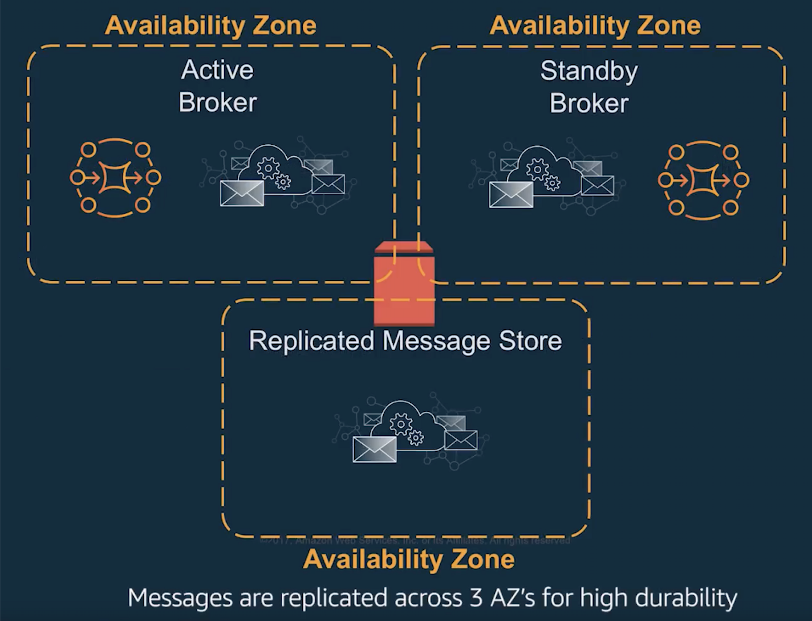

#### 2- AWS MQ 

AWS MQ is a Message Broker based on popular Apache ActiveMQ; it supports multiple protocols for connectivity for instance AMQP, JMS, STOMP, NMS, MQTT and WebSocket. 

| #    | Important Features               |
| ---- | -------------------------------- |
| 1    | Queues & Topics with Ordering    |
| 2    | Transient & persistent messaging |
| 3    | Local & distributed transactions |
| 4    | Request/reply                    |
| 5    | Message filtering                |
| 6    | Scheduled messages delivery      |
| 7    | Large message sizes              |

##### High Level Architecture

Since its a managed service, it provides multi zone fault tolreance and resiliancy out of the box.

##### Evaluation Table - Details

Most of the features are available since Magento is also using AMQP protocol with RabbitMQ, but the protocol version is different, RabbitMQ uses 0.9 and Amazon MQ is using AMQP 1.0; so any migration would require porting of Queues from RabbitMQ to AWS MQ. There might be some changes and adjustments to the QueueInterface implementation code to accomodate the new protocol differences. AMQP 1.0 is a completely different protocol.

Another challenge is that we have lack of any good implementation of AMQP 1.0 protocol for PHP. There is port of C library that is been recommended for Azure Message Bus, but technically it should work with AWS MQ as well.

[azure-uaqmp-c PHP Bindings for AMQP 1.0](https://github.com/norzechowicz/php-uamqp)

[Exported PHP Modules from native C Library](https://github.com/norzechowicz/php-uamqp/tree/master/ext/src/php)

| Method        | Evaluation  | Implementation Readiness                                     |
| ------------- | ----------- | ------------------------------------------------------------ |
| dequeue()     | Available   | receive()                                                    |
| acknowledge() | Available   | accept() / release()                                         |
| subscribe()   | *Workaround | Long Polling might need to be implemented, unless we find a good library that supports AMQP 1.0 in PHP; Java has full support though. |
| reject()      | Available   | reject()                                                     |
| push()        | Available   | sendMessage(Message, Destination)                            |

