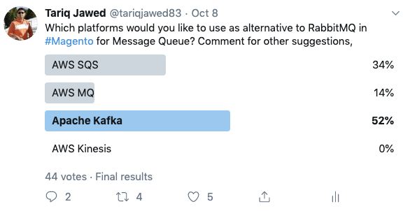
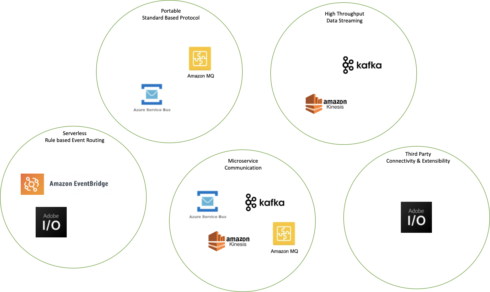

## Evaluation of Technologies 

There are many messaging technologies available in the market, we are specially focusing on Cloud Managed services, for this exercise. Please note that this evaluation is based on the current interface/contract and evaluating the possiblity of having another implementation of QueueInterface without breaking related functionality. 

### Interface based Comparison Summary

| Method        | [(1) AWS EventBridge](AWSEventBridge.md) | [(2) AWS MQ](AWSMQ.md) | [(3) AWS SQS](AWSSQS.md) | [(4) AWS Kinesis](AWSKinesis.md) |
| ------------- | ---------------------------------------- | ---------------------- | ------------------------ | -------------------------------- |
| dequeue()     | Not Possible or N/A                      | Available              | Available                | Possibility                      |
| acknowledge() | Not Possible or N/A                      | Available              | Possiblity               | Possiblity                       |
| subscribe()   | Not Possible or N/A                      | *Workaround            | *Workaround              | Workaround                       |
| reject()      | Not Possible or N/A                      | Available              | Possiblity               | Possiblity                       |
| push()        | Available                                | Available              | Available                | Possiblity                       |

| Method        | [(5) Apache Kafka](ApacheKafka.md) | [(6) Azure Service Bus](AzureServiceBus.md) | [(7) PHP Enqueue Library](PHPEnqueueLibrary.md) | [(8) Adobe I/O](AdobeIO.md) |
| ------------- | ---------------------------------- | ------------------------------------------- | ----------------------------------------------- | --------------------------- |
| dequeue()     | Possiblity                         | Available                                   | Available                                       | Not Possible or N/A         |
| acknowledge() | Possiblity                         | Available                                   | Available                                       | Not Possible or N/A         |
| subscribe()   | Possiblity                         | *Workaround                                 | Available                                       | Not Possible or N/A         |
| reject()      | Possiblity                         | Available                                   | Available                                       | Not Possible or N/A         |
| push()        | Possiblity                         | Available                                   | Available                                       | Not Possible or N/A         |

*Workaround - Feature maybe available but full support for PHP (library) is not available.

### Twitter Poll Results

Recent Twitter poll from #magento community shows huge interest in Apache Kafka and AWS SQS; there was also some interest in using Redis in this regard as well.

### Programming Language Support

AMQP 1.0 is not fully supported within any PHP library currently available (at the time of writing this document), although indirect C wrapper API is available, which will incur bit of setup overhead for the Magento customers, and it also provides subset of functionality. Unlike RabbitMQ which works with AMQP 0.9, Amazon MQ and Azure Service Bus supports AMQP version 1.0; although Amazon MQ supports more protocols.

| Platform          | PHP        | Java                      | Notes                                                        |
| ----------------- | ---------- | ------------------------- | ------------------------------------------------------------ |
| AWS EventBridge   | Supported  | Supported                 |                                                              |
| AWS/Amazon MQ     | Workaround | Supported                 | Java has support for many protocols unlike PHP, in which subscribe() can be implemented using listener or channel based callback for asynchronous message consumption. |
| AWS SQS           | Supported  | Supported                 | JMS support for SQS is also available,                       |
| AWS Kinesis       | Supported  | Supported                 |                                                              |
| Apache Kafka      | Supported  | Supported, Native Support |                                                              |
| Azure Service Bus | Workaround | Supported                 | AMQP 1.0  and limited Java JMS support available; most of the functionality can be fully supported in Java because of broader libraries and support |

### PHP Queue Abstraction - Libraries

As discussed above there is not a good support available for AMQP 1.0 in PHP; but we have PHP Enqueue and Symfony libraries available which provides an abstration layer over multiple brokers.

|                               | Supported Brokers / Protocols                                | Notes                                                        |
| ----------------------------- | ------------------------------------------------------------ | ------------------------------------------------------------ |
| Enqueue                       | Apcahe Kafka, AWS SQS/SNS, AMQP 0.9, Database, MongoDB, Redis etc. | Enqueue tries to follow JMS specification as close as possible; although this library does not have very good documentation.  Theoretically this library can enable multiple brokers for Magento;  with only few deviations in terms of configurations. [Checkout PHP Enqueue Library Evaluation Table](PHPEnqueueLibrary.md) |
| Symfony                       | AMQP 0.9, Doctorine, Redis, In Memory, Serializing Messages  | This is more mature framework with active community, also has better documentation |
| Symfony via Enqueue Transport | Add support for Enqueue Brokers with Symfony                 | https://github.com/sroze/messenger-enqueue-transport         |

### Use Case Summary of Technologies

To summarize different technologies, and how they stack up together, the diagram and table below will help you visualize 

| Platform          | Pub/Sub Mechanism                                  | Connectivity                                                 | Messge Ordering / FIFO | High Throughput Data Streaming | Rule Based Filter / Routing |
| ----------------- | -------------------------------------------------- | ------------------------------------------------------------ | ---------------------- | ------------------------------ | --------------------------- |
| AWS EventBridge   | *Available (limited to AWS Targets)           | *HTTPS (for publishers only)                                 |                        |                                | Available                   |
| AWS MQ            | Available                                          | JMS, NMS, AMQP 1.0, STOMP, MQTT, WebSocket                   | *Available             |                                |                             |
| AWS SQS           |                                                    | HTTPS                                                        | *Available             |                                |                             |
| AWS Kinesis       | Available                                          | HTTP/2 Persistent and HTTP REST                              | *Available             | Available                      |                             |
| Apache Kafka      | Available                                          | TCP Socket, Kafka Connect, Kafka Streams Apps                | *Available             | Available                      |                             |
| Azure Service Bus | Available                                          | AMQP 1.0 and REST                                            | *Available             |                                |                             |
| Adobe I/O         | *Available (limited to Adobe Event Providers) | *HTTP Webhooks (for subscribers only, designed for integration with Adobe SaaS solutions) |                        |                                | Available                   |

*Available with some limitations

**Other Aspects to consider (consumer groups, batching, multi-tenant seggregation, message encryption/security, aggregation, counting, scheduling, dead-letter queue)

