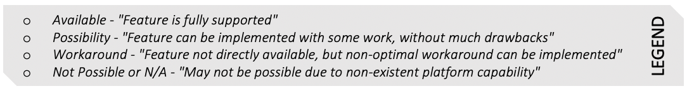

#### 7- PHP Enqueue Library 

PHP Enqueue provides JMS style abstraction layer over many brokers as discussed here

[PHP Queue Abstraction - Libraries](EvaluationTechnologies.md#PHP-Queue-Abstraction---Libraries)

[Enqueue Quick Tour](https://github.com/php-enqueue/enqueue-dev/blob/master/docs/quick_tour.md)

[Extentions for additional functionality](https://github.com/php-enqueue/enqueue-dev/blob/master/docs/consumption/extensions.md)

##### PHP Enqueue Library Evaluation Table - Details

| Method        | Evaluation | Implementation Readiness                                     |
| ------------- | ---------- | ------------------------------------------------------------ |
| dequeue()     | Available  | consumer.receive()                                           |
| acknowledge() | Available  | consumer.acknowledge(message) or Callback function / processor can return ACK |
| subscribe()   | Available  | consumer.bindCallback(topic, callback function) client.bindTopic(topic, callback function) consumer.consume() -- blocking call, runs until interrupted client.consume() -- blocking call, runs until interrupted |
| reject()      | Available  | consumer.reject(message) or callback function / processor can return REJECT or REQUEUE |
| push()        | Available  | client.sendEvent(topic, message)                             |

##### Magento to PHP Enqueue Queue Configuration

There is a Magento2 module available for Enqueue library, [Magento 2 Enqueue Quick Tour](https://github.com/php-enqueue/enqueue-dev/blob/master/docs/magento2/quick_tour.md), this extension provides easy to configure Magento Admin screen, to configure any supported Queue technology within Enqueue (behind the scenes it configures config file [Magento 2 Enqueue Config Example](https://github.com/php-enqueue/magento2-enqueue/blob/master/etc/config.xml)). In the end, it makes it straightforward to publish and consume messages in your PHP application.

Magento already implements lot of functionality by itself (for instance keeping track of Connection, Queues and their callbacks, consumer types etc.). We can potentially use only the subset of Enqueue library to interface with the undelying Messaging System in a uniform manner; by providing another QueueInterface implemention for **Enqueue** module.

Here is the [EnqueueManager.php](https://github.com/php-enqueue/magento2-enqueue/blob/master/Model/EnqueueManager.php), that already abstracts much of the complexity to enable Enqueue integration with Magento 2; it provides [SimpleClient](https://github.com/php-enqueue/enqueue-dev/blob/master/docs/client/quick_tour.md) library access to Magento application, which provides easy to use interface by hiding complexity.

| Config File Name (Magento) | Description                                                  | Config File Name (PHP Enqueue) | Description                                                  |
| -------------------------- | ------------------------------------------------------------ | ------------------------------ | ------------------------------------------------------------ |
| env.php                    | It defines queue connections parameters, separately for both AMQP and DB/MySql | config.xml                     | [Magento 2 Enqueue Config Example](https://github.com/php-enqueue/magento2-enqueue/blob/master/etc/config.xml) |
| queue.xml                  | Brokers definitions that processes topics (only required for MySQL, not for RabbitMQ) | N/A                            | N/A                                                          |
| communication.xml          | It defines the Topics (their request types, either response type for RPC style synchronous calls or schema, and multiple callback handlers (class type and method). | N/A                            | N/A                                                          |
| queue_consumer.xml         | It defines the consumer processes and their attributes (like queue name, connection, maxMessages, consumerInstance type and callback handler etc.) ConsumerInstance type defines what kind of Consumer you want to use in Magento as defined in [Different Types of Consumers]("#Different-Types-of-Consumers") | N/A                            | N/A                                                          |
| queue_topology.xml         | Defines the exchange where Topic is been published (Topic to Queue mapping) | N/A                            | N/A                                                          |
| queue_publisher.xml        | It defines the publishers and its attributes (connection name and exchange) | N/A                            | N/A                                                          |

##### Open Questions?

1. There are two places where callback handlers are defined for a Topic/Queue. One in communications.xml; and other in queue_consumer.xml, which one has priority over other? 