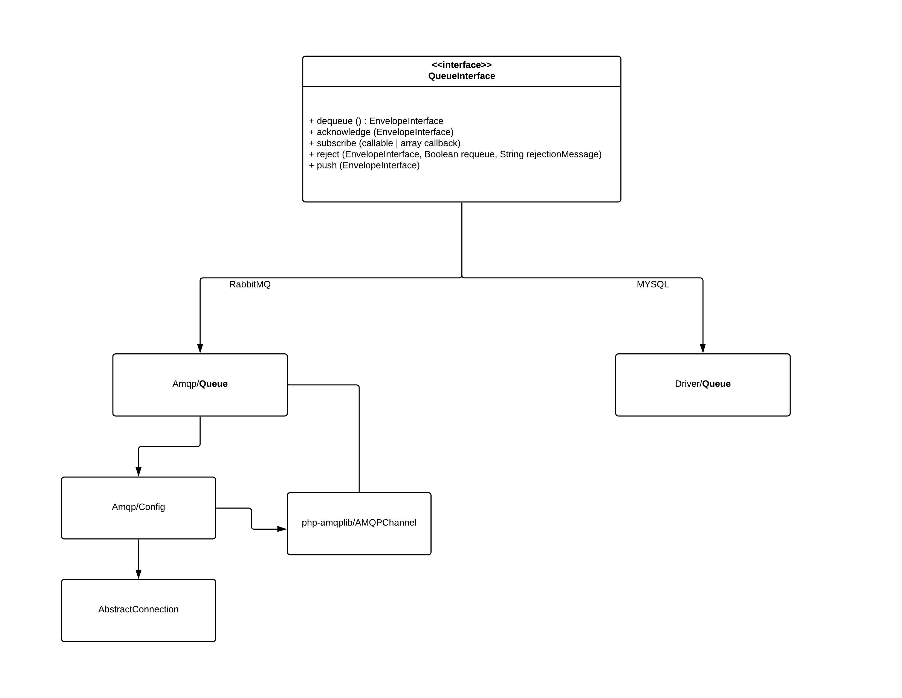
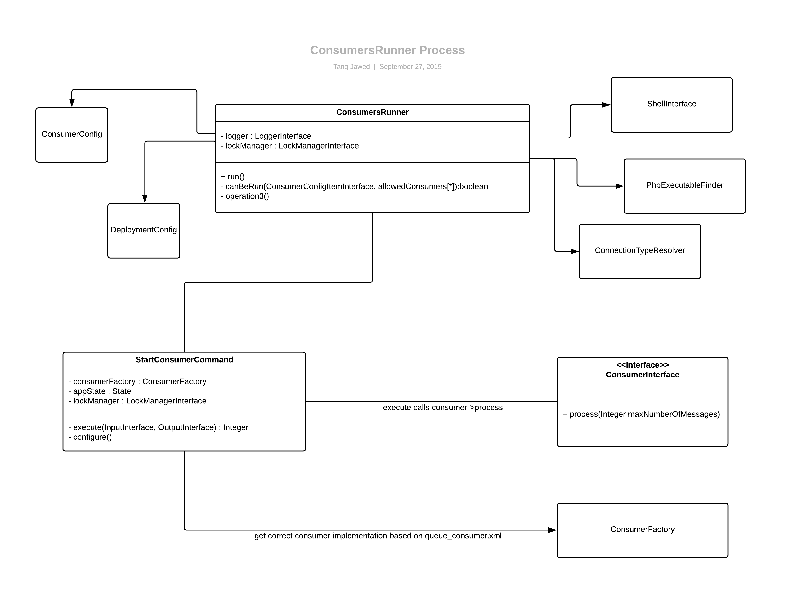
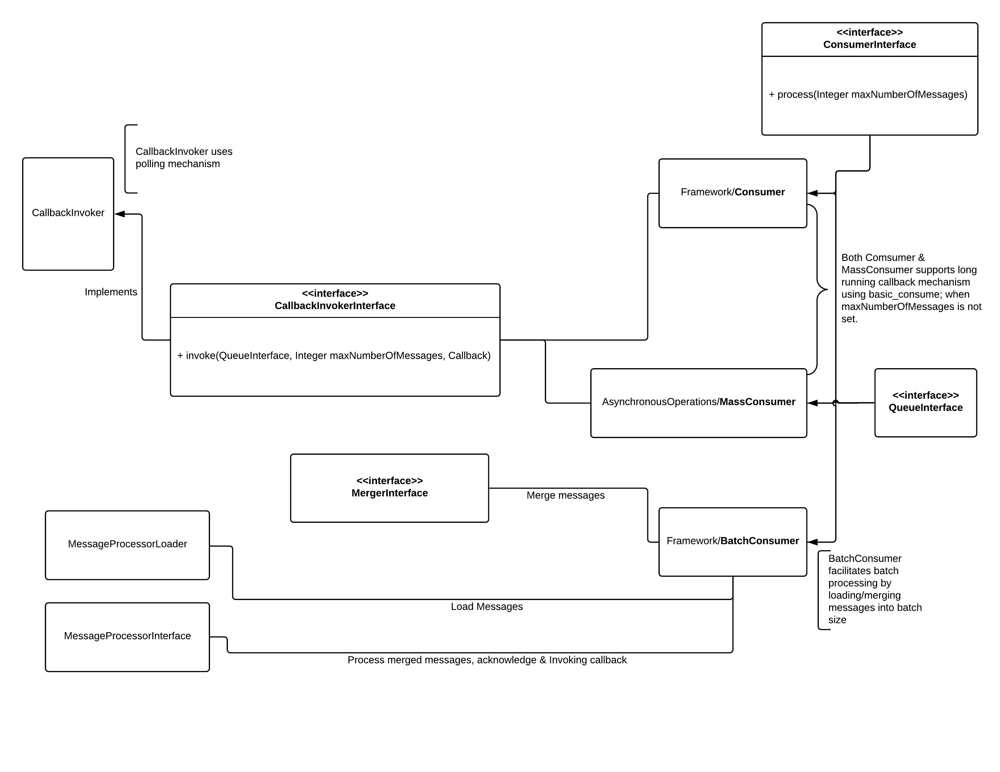
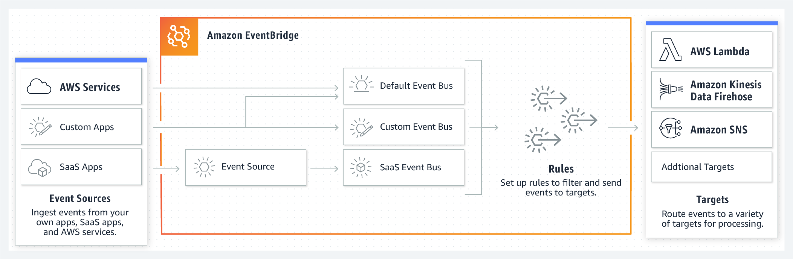
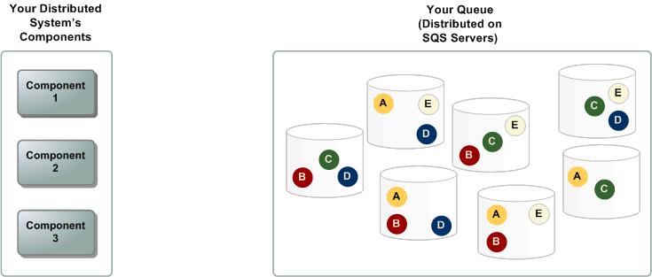
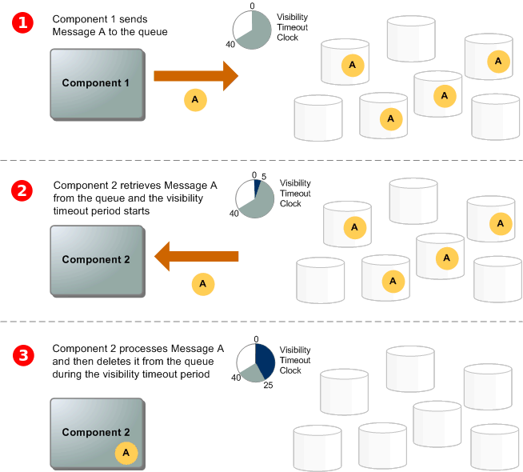
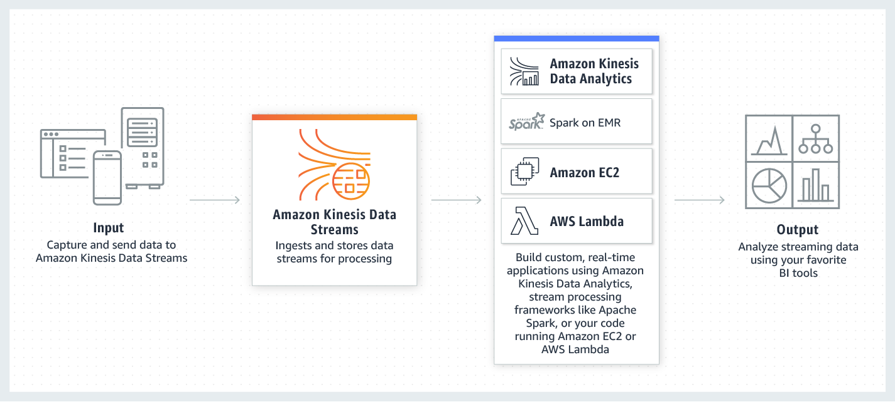

# Messaging Architecture and Options

# Contents

[Overview and Introduction](#Overview-and-Introduction)

[Message Queue Processing Design](#message-queue-processing-design)

[Consumers Runner Process](#consumers-runner-process)

[Queue Interface](#queue-interface)

[Evaluation of Technologies](#evaluation-of-technologies)

[Programming Language Support](#Programming-Language-Support)

[PHP Queue Abstraction - Libraries](#PHP-Queue-Abstraction---Libraries)

[(1) AWS EventBridge](#1--AWS-EventBridge) 

[(2) AWS MQ](#2--AWS-MQ)

[(3) AWS SQS](#3--AWS-SQS)

[(4) AWS Kinesis](#4--AWS-Kinesis)

[(5) Apache Kafka](#5--Apache-Kafka)

[(6) Azure Service Bus](#6--Azure-Service-Bus)

[(7) PHP Enqueue Library](#7--PHP-Enqueue-Library)

[(8) Adobe I/O](#8--Adobe-IO)

## Overview and Introduction

Magento uses message queue architecture for all asynchronous communication, where message sender and receiver are loosely coupled and doesn't talk to each other directly. For more information go through the following document 

[Magento Message Queue Overview](https://devdocs.magento.com/guides/v2.3/extension-dev-guide/message-queues/message-queues.html)

This document is looking into the current Queue Interface, its implementations, important interconnected modules like Queue Consumers & ConsumersRunner process; then finally looking into the different potential candidates for alternative Cloud Queueing technologies that can be used within Magento; which can serve as an alternative choice for the Magento customers in addition to currently supported technologies; the Queue technology should also support modern autonomous architecture for their communication needs for instance Event Sourcing and CQRS mechanism.

## Message Queue Processing Design

Currently we have two types of implementations of QueueInterface.

| Implementation | Description                                                  |
| -------------- | ------------------------------------------------------------ |
| MySQL          | This is based on MySQL database, currently it doesn't support the Bulk APIs; this doesn't scale well and designed for out of the box experience; for practical purposes RabbitMQ should be utilized to handle large scale requirements |
| RabbitMQ       | RabbitMQ implementations is based on AMQP protocol, which supports callback mechanism and polling based approach as its supported by underlying channel implementation & specification |

### Consumers Runner Process

ConsumersRunner is the main class, which facilitates the processing of Queued Messages, and based on the configuration in **queue_consumer.xml**, it calls the appropriate ConsumerInterface implementation. 

### Different Types of Consumers

This QueueInterface is been utilized by Consumer classes, there are currently three different implementations of ConsumerInterface

|      | Class Name    | Purpose / Description                                        |
| ---- | ------------- | ------------------------------------------------------------ |
| 1    | Consumer      | This class is for both synchronous and asynchronous style message processing; in synchronous style topics, **reply_to** queue is used for execution results |
| 2    | MassConsumer  | This is mainly designed for asynchronous style message processing; primarily used for Async APIs and Async Bulk APIs |
| 3    | BatchConsumer | This class supports batch processing of messages, helps in picking & merging the messages to a specified batch size, and then process them together, before querying another batch |

## Queue Interface

The table below describes all the method expected to be implemented by the specific Queue provider, and the intention of what functionality is expected from these methods.

| #    | Method        | Purpose / Description                                        | Related RabbitMQ Method |
| ---- | ------------- | ------------------------------------------------------------ | ----------------------- |
| 1    | dequeue()     | Get a single message from the queue                          | basic_get()             |
| 2    | acknowledge() | Acknowledge message delivery                                 | basic_ack()             |
| 3    | subscribe()   | Wait for messages and dispatch them, this is based on pub/sub mechanism, consumes the messages through callbacks, until connection is closed | basic_consume()         |
| 4    | reject()      | Reject message, messages gets returned to the queue          | basic_reject()          |
| 5    | push()        | Push message to queue directly without using exchange; it uses publish behind the scenes | basic_publish()         |
## Evaluation of Technologies 

There are many messaging technologies available in the market, we are specially focusing on AWS cloud and its provided managed services, for this exercise. Please note that this evaluation is based on the current interface/contract and evaluating the possiblity of having another implementation of QueueInterface without breaking related functionality. 

### Interface based Comparison Summary

| Method        | [(1) AWS EventBridge](#1--AWS-EventBridge) | [(2) AWS MQ](#2--AWS-MQ) | [(3) AWS SQS](#3--AWS-SQS) | [(4) AWS Kinesis](#4--AWS-Kinesis) |
| ------------- | ------------------------------------------ | ------------------------ | -------------------------- | ---------------------------------- |
| dequeue()     | Not Possible or N/A                        | Available                | Available                  | Possiblity                         |
| acknowledge() | Not Possible or N/A                        | Available                | Possiblity                 | Possiblity                         |
| subscribe()   | Not Possible or N/A                        | *Workaround              | *Workaround                | Workaround                         |
| reject()      | Not Possible or N/A                        | Available                | Possiblity                 | Possiblity                         |
| push()        | Available                                  | Available                | Available                  | Possiblity                         |

| Method        | [(5) Apache Kafka](#5--Apache-Kafka) | [(6) Azure Service Bus](#6--Azure-Service-Bus) | [(7) PHP Enqueue Library](#7--PHP-Enqueue-Library) | [(8) Adobe I/O](#8--Adobe-IO) |
| ------------- | ------------------------------------ | ---------------------------------------------- | -------------------------------------------------- | ----------------------------- |
| dequeue()     | Possiblity                           | Available                                      | Available                                          | Not Possible or N/A           |
| acknowledge() | Possiblity                           | Available                                      | Available                                          | Not Possible or N/A           |
| subscribe()   | Possiblity                           | *Workaround                                    | Available                                          | Not Possible or N/A           |
| reject()      | Possiblity                           | Available                                      | Available                                          | Not Possible or N/A           |
| push()        | Possiblity                           | Available                                      | Available                                          | Not Possible or N/A           |

*Workaround - Feature maybe available but full support for PHP (library) is not available.

### Twitter Poll Results

Recent Twitter poll from #magento community shows huge interest in Apache Kafka and AWS SQS; there was also some interest in using Redis in this regard as well.

### Programming Language Support

AMQP 1.0 is not fully supported within any PHP library currently available (at the time of writing this document), although indirect C wrapper API is available, which will incur bit of setup overhead for the Magento customers, and it also provides subset of functionality. Unlike RabbitMQ which works with AMQP 0.9, Amazon MQ and Azure Service Bus supports AMQP version 1.0; although Amazon MQ supports more protocols.

| Platform          | PHP        | Java                      | Notes                                                        |
| ----------------- | ---------- | ------------------------- | ------------------------------------------------------------ |
| AWS EventBridge   | Supported  | Supported                 |                                                              |
| AWS/Amazon MQ     | Workaround | Supported                 | Java has support for many protocols unlike PHP, in which subscribe() can be implemented using listener or channel based callback for asynchronous message consumption. |
| AWS SQS           | Supported  | Supported                 | JMS support for SQS is also available,                       |
| AWS Kinesis       | Supported  | Supported                 |                                                              |
| Apache Kafka      | Supported  | Supported, Native Support |                                                              |
| Azure Service Bus | Workaround | Supported                 | AMQP 1.0  and limited Java JMS support available; most of the functionality can be fully supported in Java because of broader libraries and support |

### PHP Queue Abstraction - Libraries

As discussed above there is not a good support available for AMQP 1.0 in PHP; but we have PHP Enqueue and Symfony libraries available which provides an abstration layer over multiple brokers.

|                               | Supported Brokers / Protocols                                | Notes                                                        |
| ----------------------------- | ------------------------------------------------------------ | ------------------------------------------------------------ |
| Enqueue                       | Apcahe Kafka, AWS SQS/SNS, AMQP 0.9, Database, MongoDB, Redis etc. | Enqueue tries to follow JMS specification as close as possible; although this library does not have very good documentation.  Theoretically this library can enable multiple brokers for Magento;  with only few deviations in terms of configurations. [Checkout PHP Enqueue Library Evaluation Table](#7--PHP-Enqueue-Library) |
| Symfony                       | AMQP 0.9, Doctorine, Redis, In Memory, Serializing Messages  | This is more mature framework with active community, also has better documentation |
| Symfony via Enqueue Transport | Add support for Enqueue Brokers with Symfony                 | https://github.com/sroze/messenger-enqueue-transport         |

#### 1- AWS EventBridge

AWS EventBridge is a serverless event bus, it facilitates receving data from your application & third parties to AWS Services. Currently it seems like the Targets are specifically AWS Services. These targets are set using specialized rules.  Following targets can be specified as of now 

[EventBridge Targets](https://docs.aws.amazon.com/eventbridge/latest/APIReference/API_PutTargets.html)

##### High Level Architecture 

##### Evaluation Table - Details

| Method        | Evaluation          | Implementation Readiness                                     |
| ------------- | ------------------- | ------------------------------------------------------------ |
| dequeue()     | Not Possible or N/A | Multiple **Targets** can be set, to receive the messages when they are available asynchronously. There is no concept of fetching the message from the Event Bus on-demand, its more of a serverless architecture. |
| acknowledge() | Not Possible or N/A | There is no need to acknowledge the message, AWS internally makesure that the Target receives the message. |
| subscribe()   | Not Possible or N/A | AWS related Targets can be set or subscribed for the EventBus based on the Rules; but we cannot set PHP Callback as Functions. |
| reject()      | Not Possible or N/A | The concept is not available or used.                        |
| push()        | Available           | PutEvents or PutPartnerEvents functions can be used for this purpose. |

#### 2- AWS MQ 

AWS MQ is a Message Broker based on popular Apache ActiveMQ; it supports multiple protocols for connectivity for instance AMQP, JMS, STOMP, NMS, MQTT and WebSocket. 

| #    | Important Features               |
| ---- | -------------------------------- |
| 1    | Queues & Topics with Ordering    |
| 2    | Transient & persistent messaging |
| 3    | Local & distributed transactions |
| 4    | Request/reply                    |
| 5    | Message filtering                |
| 6    | Scheduled messages delivery      |
| 7    | Large message sizes              |

##### High Level Architecture

Since its a managed service, it provides multi zone fault tolreance and resiliancy out of the box.

##### Evaluation Table - Details

Most of the features are available since Magento is also using AMQP protocol with RabbitMQ, but the protocol version is different, RabbitMQ uses 0.9 and Amazon MQ is using AMQP 1.0; so any migration would require porting of Queues from RabbitMQ to AWS MQ. There might be some changes and adjustments to the QueueInterface implementation code to accomodate the new protocol differences. AMQP 1.0 is a completely different protocol.

Another challenge is that we have lack of any good implementation of AMQP 1.0 protocol for PHP. There is port of C library that is been recommended for Azure Message Bus, but technically it should work with AWS MQ as well.

[azure-uaqmp-c PHP Bindings for AMQP 1.0](https://github.com/norzechowicz/php-uamqp)

[Exported PHP Modules from native C Library](https://github.com/norzechowicz/php-uamqp/tree/master/ext/src/php)

| Method        | Evaluation  | Implementation Readiness                                     |
| ------------- | ----------- | ------------------------------------------------------------ |
| dequeue()     | Available   | receive()                                                    |
| acknowledge() | Available   | accept() / release()                                         |
| subscribe()   | *Workaround | Long Polling might need to be implemented, unless we find a good library that supports AMQP 1.0 in PHP; Java has full support though. |
| reject()      | Available   | reject()                                                     |
| push()        | Available   | sendMessage(Message, Destination)                            |

#### 3- AWS SQS 

AWS SQS is a distributed & fault tolerant Queuing Technology; it provides point to point connectivity. It can be used with SNS to add publish / subscribe mechanism as well. Single message gets replicated across different SQS Servers.

##### High Level Architecture 

SQS uses Visibility Timeout to prevent other consumers to receive the same message, during which a consumer has to Delete the message explicitly afrer processing it or the message will be available for others for reuse.

##### Evaluation Table - Details

| Method        | Evaluation | Implementation Readiness                                     |
| ------------- | ---------- | ------------------------------------------------------------ |
| dequeue()     | Available  | ReceiveMessage() - possiblity with many available options for instance long & short polling. |
| acknowledge() | Possiblity | DeleteMessage() for positive acknowledge, by default message locked for **Visibility Timeout** period for other consumers. |
| subscribe()   | Workaround | ReceiveMessage() - Using polling based mechanism, it can be implemented; but not exactly as true callback mechanism. |
| reject()      | Possiblity | The messages are auto visible again for consumption, if explicit DeleteMessage() is not called before timeout, as explained above. |
| push()        | Available  | SendMessage()                                                |

#### 4- AWS Kinesis 

AWS Kinesis is a streaming based distributed messaging technology; it uses publish/subscribe mechanism for loose coupling between senders and receivers. It is designed for extremely high throughput for realtime applications. 

##### High Level Architecture 

Streaming and the concept of **Stream** itself is the central idea behind Kinesis. It is pretty similar to Apache Kafka with some differences. It is also suitable for implementing Event Sourcing and CQRS pattern, which is commonly used in Microservices Architecture because of the out-of-the-box support for high throughput messaging and publish/subscribe mechanism.

##### Evaluation Table - Details

| Method        | Evaluation | Implementation Readiness                                     |
| ------------- | ---------- | ------------------------------------------------------------ |
| dequeue()     | Possiblity | getRecords() - ShardIterator needs to be managed behind the scenes. Stream can be Queue name. It can use getShardIterator(), before the call. |
| acknowledge() | Possiblity | Need to maintain the ShardIterator & SequenceNumber associated with it, using getShardIterator(). We can save NextShardIterator from getRecords() to acknowledge the message. |
| subscribe()   | Workaround | Workaround - batch reads with long polling can be implemented, example [Long Polling Subscribe Mechanism in AWS Kinesis](https://github.com/kaliop-uk/kueueingbundle-kinesis/blob/master/Adapter/Kinesis/Consumer.php) |
| reject()      | Possiblity | If we don't move the ShardIterator to NextShardIterator, we are pretty much staying on the same message. |
| push()        | Possiblity | Since you will have to provide stream, data & partition; we need to have some strategy to for partition selection; and need to maintain these values for Consumers. |

#### 5- Apache Kafka

Apache Kafka is a popular open-source stream-processing / messaging platform; its by design distributed, replicated & resilient (or fault tolerent) which can acheive very high throughput.   

##### High Level Architecture

Topic and Publish / Subscribe mechanism is at the core of Kafka. Effective for implementing Event Sourcing and CQRS pattern, which is commonly used in Microservices Architecture. It is also used for variety of streaming use cases, which requires near real-time processing of records.

##### Evaluation Table - Details

Consumer is usually part of Consumer Group, it ensures that each group receives a copy of the message from the topic. Consumer needs to know its offset and partition, although parition can be automatically assigned when you begin consuming data from the topic, but you can also choose to manually assign parition, but these two cannot be mixed up. Consumer first needs to subscribe itself to the list of topics.

After you read the message(s), you can either configure auto-commit or allow manual commits for the offsets, in real-life use-cases you probably would want to control manually based on your strategy.

| Method        | Evaluation | Implementation Readiness                                     |
| ------------- | ---------- | ------------------------------------------------------------ |
| dequeue()     | Possiblity | Initiate **poll () or consume()**. If there are records available, the call will immediately returns, otherwise it will wait for specified timeout which can be passed as parameter. |
| acknowledge() | Possiblity | There are several ways to commit the offset, which indicates that a particular consumer has consumed those messages. The way you call commit API controls the delivery semantics. |
| subscribe()   | Possiblity | There are multiple ways in which the subscribtion mechanism can be implemented, the default Kafka subscribtion is telling Kafka which topics a consumer is interested in. But we can also subscribe a callback function; and we can use Kafka Stream API to receive messages in near realtime. |
| reject()      | Possiblity | If we don't auto-commit or manually commit the offset, then we are not moving the needle. |
| push()        | Possiblity | Since you will have to provide topic, data & partition; we need to have some strategy to for partition selection; and need to maintain these values for Consumers. |

#### 6- Azure Service Bus

Microsoft Azure Service Bus is a fully managed enterprise integration message broker. It support familiar concepts like Queues, Topics, Rules/Filters and much more.

##### High Level Architecture

##### Evaluation Table - Details

Azure Service Bus supports AMQP 1.0,  and couple of languages, PHP support is again limited for the protocol

[AMQP Azure Service Bus Overview](https://docs.microsoft.com/en-us/azure/service-bus-messaging/service-bus-amqp-overview)

[azure-uaqmp-c PHP Bindings for AMQP 1.0](https://github.com/norzechowicz/php-uamqp)

[Exported PHP Modules from C Native Library](https://github.com/norzechowicz/php-uamqp/tree/master/ext/src/php)

| Method        | Evaluation  | Implementation Readiness                                     |
| ------------- | ----------- | ------------------------------------------------------------ |
| dequeue()     | Available   | receive()                                                    |
| acknowledge() | Available   | accept() / release()                                         |
| subscribe()   | *Workaround | Long Polling might need to be implemented, unless we find a good library that supports AMQP 1.0 for PHP; Java has full support for required features. |
| reject()      | Available   | reject(errorCondition, errorDescription)                     |
| push()        | Available   | sendMessage(message, destination)                            |

#### 7- PHP Enqueue Library 

PHP Enqueue provides JMS style abstraction layer over many brokers as discussed here

[PHP Queue Abstraction - Libraries](#PHP-Queue-Abstraction---Libraries)

[Quick Tour](https://github.com/php-enqueue/enqueue-dev/blob/master/docs/quick_tour.md)

[Extentions for additional functionality](https://github.com/php-enqueue/enqueue-dev/blob/master/docs/consumption/extensions.md)

##### PHP Enqueue Library Evaluation Table - Details

| Method        | Evaluation | Implementation Readiness                                     |
| ------------- | ---------- | ------------------------------------------------------------ |
| dequeue()     | Available  | Consumer > receive()                                         |
| acknowledge() | Available  | Consumer > acknowledge(message) Callback function / processor can return ACK |
| subscribe()   | Available  | bindCallback(topic, callback function)                       |
| reject()      | Available  | Consumer > reject(message) callback function / processor can return REJECT or REQUEUE |
| push()        | Available  | sendEvent(topic, message)                                    |

#### 8- Adobe I/O 

Adobe I/O is a serverless event driven platform that allows you to quickly deploy custom functions/code in the cloud without any server setup. These functions executes via HTTP requests or Adobe I/O Events. These Events can be orchestrated with Sequences & Compositions. It is built on top of Apache OpenWhisk framework. 

Events are triggered by Event Providers with Adobe Services for instance Creative Clous Assets, Adobe Experience Manager & Adobe Analytics. To start listening to events for your application, you need to register a Webhook (URL endpoint) specifying which Event Types from which Event Providers it wants to receive; Adobe pushes events to your webhook via HTTP POST messages.

*"Magento SaaS based next generation platform can push it's Events on Adobe I/O Events like other Adobe Services, to be consumed by Developers through Adobe I/O Runtime for custom functionality and integrations. But it is not a right candidate for Magento Event Bus"*

[Adobe I/O Runtime Docs](https://www.adobe.io/apis/experienceplatform/runtime/docs.html)

[Apache OpenWhisk](https://openwhisk.apache.org/)

[Adobe I/O Events](https://www.adobe.io/apis/experienceplatform/events.html)

##### Example Architecture

Here is a nice example of Slack integration with Adobe Experience Manager (AEM) for asset change notification,

[For more details follow the link](https://medium.com/adobetech/monitoring-aem-asset-updates-with-adobe-i-o-events-9c2a8395880d)

##### Evaluation Table - Details

| Method        | Evaluation          | Implementation Readiness                                     |
| ------------- | ------------------- | ------------------------------------------------------------ |
| dequeue()     | Not Possible or N/A | There is not a concept of explicit fetching of event, rather you define a trigger/event and the actions associated with it. |
| acknowledge() | Not Possible or N/A | This concept is not used, the architecture is funadementally different |
| subscribe()   | Not Possible or N/A | A PHP callback function is not possible, although a custom webhook (http endpoint) can be configured to be triggered for a particular Event. |
| reject()      | Not Possible or N/A | This concept is not used, the architecture is funadementally different |
| push()        | Not Possible or N/A | Events are triggered by Adobe SaaS Services in the Adobe Cloud. |

