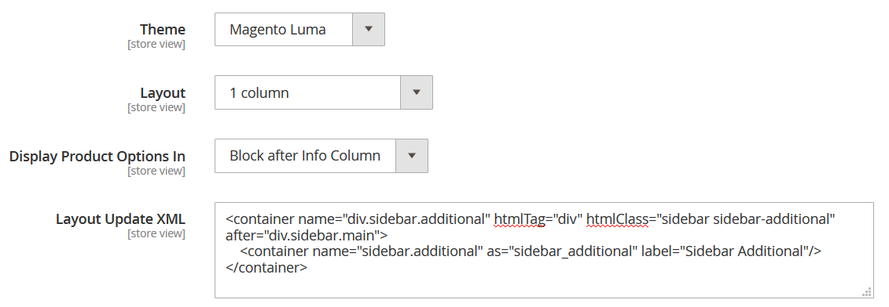
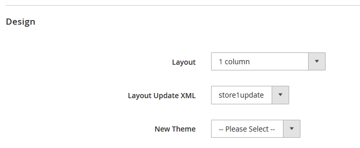

### Move category, product and page specific layout updates
Custom layout updates can be provided for specific categories, products and CMS pages via respective forms in the admin
panel - this is how Merchants can customize entity-specific pages to include additional design and functionality.
 

### The problem
Layout updates are defined using XML and certain instructions often using PHP classes. Only developers can
posses knowledge required to create a layout update yet the only way to provide these updates
is via user forms more commonly used by content managers. That's the __1st problem__ - content managers don't
need that functionality and it is better to hide it from them to avoid them from executing PHP code on the server.
 
__2nd problem__ is that we do not allow developers to work with entity-specific layout updates in a developer way.
Meaning that there is no way to use version control while editing these layout updates.

### Solution
Read custom layout updates from physical files on the server. Convert existing textarea _custom_layout_update_ field
in category/product/cms page forms into a _select_ field where existing custom layout update files could be selected.
 
To provide layout updates for admin users to select developers will create layout files following existing naming conventions for per-entity layouts
\([page layout handles](https://devdocs.magento.com/guides/v2.3/frontend-dev-guide/layouts/layout-overview.html)\)
like _\<Magento_Theme_module_dir\>/view/frontend/layout/\(catalog\_product\_view\|catalog\_category\_view\|cms\_index\_index\)\_id\_\<entity ID\>\_selectable\_\<Layout update name\>.xml_.
Special _selectable_ handle will be added for category/product/cms pages to pick up these files based on the selected by an admin
update.
 
Example: a file with the name _app/code/MyCompany/MyExtension/view/frontend/layout/cms_index_index_id_2_selectable_store1update.xml_ is created,
then the select on the home page's edit form (home page has ID = 2) will look like this:
 

 
This way merchants will still be able to manage different layouts for different stores or staging updates. In case
of the example above the developer could also create _cms_index_index_id_2_selectable_anotherstoreupdate.xml_ and
_cms_index_index_id_2_selectable_myjune2019update.xml_ to use for another store or for staging.
  
This way only developers will be able to change layouts for specific entity pages and be able to use
VCS while creating the layouts.
 
### Availability to merchants without dedicated teams
The described way to create these selectable updates requires creating a module/theme for a Magento installation which
may make things a bit more difficult for merchants without dedicated teams comparing to being able to just copy-paste
layout XML into the forms. However we could provide a detailed instruction with the link to it thoughtfully provided
near the new selector to guide merchants on how to create these layout files step by step.
 
### Backward compatibility
In order to preserve backward compatibility existing layout updates will work but users will not be able to create new ones.
When an entity already had a layout update provided via the text area the select will show _'\*Existing layout update\*'_.
 
This proposals allows to remove the 'Custom layout XML' textarea from admin pages in the next patch release - 
existing custom layouts will remain and content managers will still be able to change layouts for specific entities by
creating files on their server and selecting a desired layout even without a development team.
