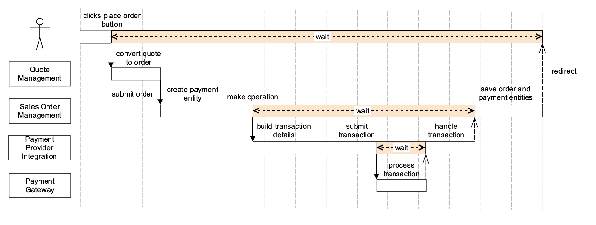
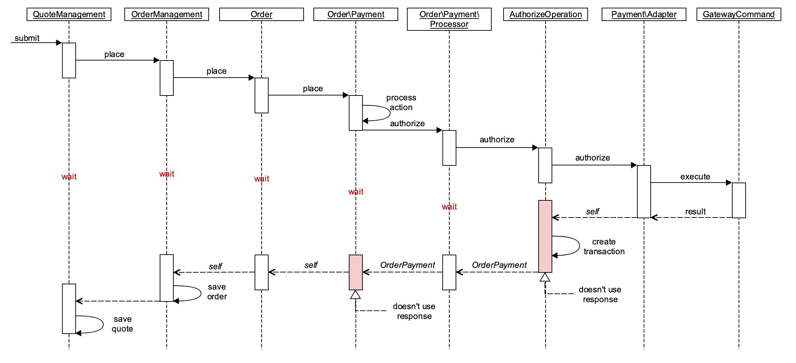

# Immediate Place Order and deferred payment transaction

## Overview

The current place order flow assumes that an order will be created after a payment transaction is completed and approved. So, the order entity is saved to the database only if the payment transaction is completed. This architecture has multiple drawbacks:

- If payment transaction fails the order entity won't be saved into the database
- A successful transaction does not guarantee that an order will be saved into the database
- If order place action fails, a customer won't get any details like reserved order increment ID, so we can't easily link a customer's failed order with the failed payment transaction
- A customer waits a success/failure redirect during place order flow
- Order entity state depends on payment transaction details and should be updated directly
- If order fails after payment transaction, the payment transaction won't be void or refunded
- Sales module contains interfaces to work with payments infrastructure (like adapter classes) but payment infrastructure anyway depends on the order entity

## The current architecture state

The following diagram visualizes the main problem - a customer is waiting until order creation and payment transaction processing is finished.

Despite on explicit timeouts the current architecture has own benefits. A customer will see if transaction fails and can update needed details like credit card or billing address. But modern payment integrations use approach to validate credit card and provide a fraud analytics even before making a real transaction. Also, 3D Secure 2.0 standard [significantly reduces](https://usa.visa.com/dam/VCOM/global/visa-everywhere/documents/visa-3d-secure-2-program-infographic.pdf) a risk of fraud transactions.

Another problem that Sales Order Payment [designed](https://github.com/magento/magento2/blob/2.3-develop/app/code/Magento/Sales/Model/Order/Payment.php#L341-L393) to modify an order entity directly but not to get back payment details, so, each payment integration updates order entity data and Sales Order Payment calls methods to persist it.

Let's more closer how the authorize payment action looks:

The red blocks show the action does not use the result from the called operation. It means that the operation modifies the state of the original object by reference and the code which calls the operation does not rely on operation's result and depends on state modification. Another problem that we have a synchronous flow and each operation is waiting when a child operation will be executed. But the main problem - we have a lot of operations between order entity creation and saving into the database, there are too many steps which can cause an exception and the order entity won't be saved. The same problem is relevant for a quote entity (it won't be updated if something goes wrong).

## The desired state

To reduce timeouts we need to split up place order and processing payment transaction operations. The order entity should be saved as soon as it converted from quote and submitted to place operation. The payment transaction execution should be asynchronous background process.

According to this flow, the customer will be redirected to success/failure page immediately. 3D Secure 2.0 standard allows assuming that 95% of transactions will be successful and fraud check will be done even before placing order. We can assume that even if payment transaction fails, the fail's reason won't depend on customer details and rather on integration implementation details or configuration. Anyway, this approach assumes that customer will get a notification and we will provide a mechanism to make another payment transaction or re-try the previous. The proposed flow allows solving mentioned issues and speed up order processing flow.

Also, the current architecture contains a lot of abstractions which just proxy calls to other classes, they should eliminated or simplified, the interfaces and classes break SOLID principles and should be refactored as well.

## The solution

Magento payment infrastructure should be separated from Order Management as payment integrations should not worry about order entities. In general, payment integrations should get input details like customer data, amount, items and just execute a payment operation and should not contain any knowledge about order and how to update it. To achieve this state we can apply CQRS principles. Sales Order Management will dispatch events and Payment Infrastructure execute appropriate commands and dispatch other events, Order Management will listen to payment events and update order entities and other related data.

Splitting payment's infrastructure from Sales is aligned to Service Isolation project. These improvements resolve circular dependencies between payments and sales and allow scale and replace Sales Order Management and payment integrations.

The current Sales Order Management does not provide a mechanism to void/refund a payment transaction if the order's saving operation fails but splitting up payments and sales infrastructure will allow executing independent operations for any action or event.

According to the proposed flow, the order entity should be saved multiple times. Now, it's a heavy operation because to save payment details we need to save the whole order entity. To resolve this issue, the order entity should be decomposed (now it contains a knowledge about items, address details, items, payment details, etc) and the components, which interact with order entity, should call the commands to update only related details.

Magento provides a layer to communicate between Sales and Payment components it's `\Magento\Sales\Model\Order\Payment` but `\Magento\Payment\Model\MethodInterface` should be refactored to provide a possibility to return a result.

The payment transaction processing should be moved to background asynchronous flow. Asynchronous operations should be used to execute payment transactions. Also, a lot of payment gateways support batch operations, so some transactions can be combined to bulks and executed in the one scope. The [Message Queue](https://devdocs.magento.com/guides/v2.3/extension-dev-guide/message-queues/message-queues.html) framework can be used to perform payment operations. The asynchronous flow should be configurable and by default should be disabled to preserve a backward compatibility for possible customizations.