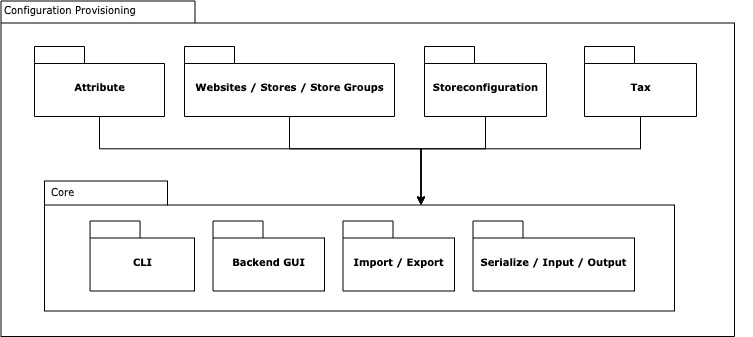

## Configuration Provisioning

### Overview

When you start a new Magento project there are similar initial tasks to set up configuration including websites, stores, tax, store configuration, attributes and more. This leads to the following known problems:

* Boilerplate Code in data patches (copied from Google, DevDocs, StackOverflow, other projects, maybe poorly adjusted)
* Update and Delete operations are tedious and complex as you have to manage relations and identification inside data patches (i.e. store code vs. autoincrement id)
* Installation from scratch with scope level configuration inside `config.php` is not possible if you rely on it in data patches

There should be a declarative schema approach to provision a new instance with all necessary configuration to run. It is related to the existing delcarative database schema but manages configuration data like:

* Websites
* Stores
* Store Groups
* System configuration
* Attribtues
* Attribute Sets
* Attribute Groups
* Tax

This is at least the most basic configuration. The design approach aims to leverage the extensibility so that more configuration entities can be included in the list above.

**Additional feature:** There should also be an export functionality which generates declarative schema files for an existing Magento instance which includes all configuration. This feature would be priority 2 as it is more important to import them first via declarative schema.

### Design

#### Module structure

The main dataflow and import functionality is provided by a core module. It controls the workflow and provides generic functionality for all configuration modules. On top of that there is a module for every configuration entity (website, store, tax...) which uses the core module to import and export the data.



The core module provides:

* CLI Commands: Imports and exports single configuration entities
* Backend GUI: Offers functionality to export configuration via admin interface
* Import / Export workflow: Abstract definition of the workflow
* Serialize / Input / Output: Read- and write adapter, offers merge logic for declarative files and offers `maintained` flag logic

#### Provisioning sequence

There are entities which can be declared on project scope and entities which can be declared on module scope. All project declarations belong into `app/etc`. Basically everything which can be declared on module scope can also be declared on project scope and will be overwritten by the project scope as it enforces the rules project wide and also can change module introduced entities.

**Project declarations:**

* Attribute Sets/Attribute Groups
* Attributes
* Websites/Stores/Store Groups
* System configuration (basically the config.xml functionality will be used for this)
* Tax
* future entities can be added...

**Module declarations:**

* Attributes
* System configuration (basically the config.xml functionality will be used for this)
* Tax

The usual behavior for installing from scratch or upgrading is the following:

`bin/magento setup:install`

* Declarative Schema (DB)
* Install Schema
* Upgrade Schema
* Recurring Schema
* Install Data
* Upgrade Data
* Recurring Data
* app:config:import

`bin/magento setup:upgrade`

* Declarative Schema (DB)
* Install Schema
* Upgrade Schema
* Recurring Schema
* Install Data
* Upgrade Data
* Recurring Data
* app:config:import

There is a dependency tree during installation like the following:

* Declarative Schema 
* Schema Patches 
* Recurring Schema Scripts
* Websites => Store Groups => Stores 
* System Configuration 
* Attributes => Attribute Sets / Attribute Groups
* Tax 
* Data Patches
* Recurring Data Scripts
* app:config:import


#### Data structure

As already mentioned the data structure is related to the existing database declarative schema. Every module can define such a XML file for a configuration type. All configuration files for the same type would be merged to one big logical structure. Therefore every configuration type module should at least support merge logic. This is done individually as for example websites are merged differently than attributes.

Therefore a virtual type of `Magento\Framework\Config\Reader\Filesystem` will be defined which has a ` Magento\Framework\Config\ConverterInterface` which is responsible for merging the XML files.

#### Possibility of admin side changes

The admin should still be allowed to change certain data from admin side. And some data shouldn't be changed by admin.

Therefore there is a field `is_mutable` which defines if the declared data can be changed by the admin. There is a checkbox on admin side which can be unchecked to change the data. This is similar to the "use system value" in the store configuration. The following explains the behavior:

|                         | `is_mutable = true`                 | `is_mutable = false` |
| ------------------------| ----------------------------------- | -------------------- |
| new entity is installed | yes                                 | yes                  |
| checkbox on admin side  | exists and initially checked        | not visible          |
| admin can change entity | yes                                 | no                   |
| save btn                | disabled (until checkbox unchecked) | disabled             |
| delete btn              | disabled (until checkbox unchecked) | disabled             |

The `is_mutable` flag is always `false` in a default behavior, that would mean if it is not explicitly mentioned by XML, the admin can not change the entity.

If XML with the same attribute code will be created (because it was created by admin first) it will take over all responsibilities to a code side and will be then managed like attribute created by XML declaration.

**Optional behaviour:** If admin unchecked the checkbox and changes the entity, the data can be restored if the admin checks the checkbox again. The data from XML delcaration will then restore the entity. This behaviour is optional as it is not really necessary regarding a provisioning functionality, but of course nice to have.

#### Example: Attribute behavior
```
<?xml version="1.0"?>
<!--
/**
 * Copyright © Magento, Inc. All rights reserved.
 * See COPYING.txt for license details.
 */
-->
<attributes xmlns:xsi="http://www.w3.org/2001/XMLSchema-instance"
        xsi:noNamespaceSchemaLocation="urn:magento:framework:Attributes/Declaration/Data/etc/attributes.xsd">
    <customer>
        <attribute xsi:type="date"
           code="custom_design_from"
           frontend_label="Active From"
           backend_type="datetime"
           is_required="false"
           is_user_defined="true"
           is_unique="false"
           backend_model="Magento\Catalog\Model\Attribute\Backend\Startdate"
           attribute_model="Magento\Catalog\Model\ResourceModel\Eav\Attribute"
           is_mutable="false" <!-- is optional and has default value false-->/>
    </customer>
</attributes>
```

#### Example: Store Scopes behavior
We can define a `stores.xml` file on project scope like the following:

```xml
<?xml version="1.0"?>
<!--
/**
 * Copyright © Magento, Inc. All rights reserved.
 * See COPYING.txt for license details.
 */
-->
<store_scopes xmlns:xsi="http://www.w3.org/2001/XMLSchema-instance"
        xsi:noNamespaceSchemaLocation="urn:magento:framework:Stores/Declaration/Data/etc/store_scopes.xsd">
    <websites>
        <website code="admin"
                 name="Admin"
                 sort_order="0"
                 default_group_code="default"
                 is_default="0"
                 is_mutable="false"/>
        <website code="base"
                 name="Main Website"
                 sort_order="0"
                 default_group_code="main_website_store"
                 is_default="1"/>
    </websites>
    <store_groups>
        <store_group code="default"
                     name="Default"
                     root_category_path="Root Catalog"
                     default_store_code="admin"
                     is_mutable="false"/>
        <store_group code="main_website_store"
                     name="Main Website Store"
                     root_category_path="Default Category"
                     default_store_code="default"/>
    </store_groups>
    <stores>
        <store code="admin"
               website_code="admin"
               group_code="default"
               name="Admin"
               sort_order="0"
               is_active="1"
               is_mutable="false"/>
        <store code="default"
               website_code="base"
               group_code="main_website_store"
               name="Default Store View"
               sort_order="0"
               is_active="1"/>
    </stores>
</store_scopes>
```

#### Change or delete configuration

Changing or deleting configuration is a challenging task, especially for all the relations and true identifier of an entity (i.e. store code vs. autoincrement id). Every configuration type module should therefore define the identifier on its own, dependent on which configuration type it supports.

Example: Create and update store:

* The store/website/store group is identified by its code
* All other data than the code can be changed => will lead to an update
* If the code has to change: delete entity and create new one

Deletions must be done explicit similar how you explicitly deactivate a plugin with `disabled = true`. This allows for proper merging of the XML files.

Example Delete store:

* A `deleted=true` flag should be provided

```xml
<store code="default"
       website_code="base"
       group_code="main_website_store"
       name="Default Store View"
       sort_order="0"
       is_active="1"
       deleted="true"/>
```

#### Extension Points and Scenarios

Once the core provisioning logic and module is set up including the main workflow, we can adapt legacy code to the new functionality. For example registering themes is done via a recurring patch which we can easily adapt to the new configuration provisioning logic.

### Prototype or Proof of Concept

tbd.
