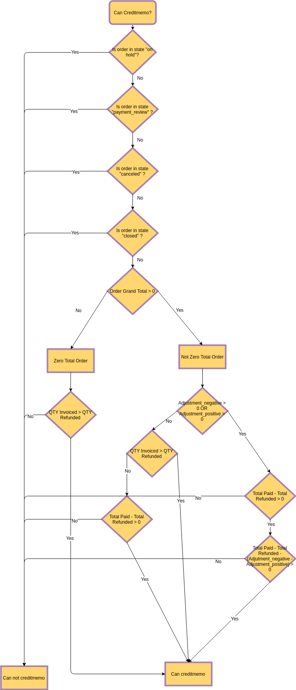

# 'Can Creditmemo' Flow

## Overview

### Motivation (The problem)
- The current implementation of verification if an order is not in a reliable state for Credit Memorandum creation.
- After discovering and fixing issues with Zero Orders, the realization becomes covered with a solid number of 'duck tapes' and need to be refactored (see listing under).
- Not all cases still covered by the current implementation (e.g. [magento/magento2#22825](https://github.com/magento/magento2/pull/22825)).

```php
class Order extends AbstractModel implements EntityInterface, OrderInterface
{
.....

    /**
     * Retrieve order credit memo (refund) availability
     *
     * @return bool
     */
    public function canCreditmemo()
    {
        if ($this->hasForcedCanCreditmemo()) {
            return $this->getForcedCanCreditmemo();
        }

        if ($this->canUnhold() || $this->isPaymentReview() ||
            $this->isCanceled() || $this->getState() === self::STATE_CLOSED) {
            return false;
        }

        /**
         * We can have problem with float in php (on some server $a=762.73;$b=762.73; $a-$b!=0)
         * for this we have additional diapason for 0
         * TotalPaid - contains amount, that were not rounded.
         */
        $totalRefunded = $this->priceCurrency->round($this->getTotalPaid()) - $this->getTotalRefunded();
        if (abs($this->getGrandTotal()) < .0001) {
            return $this->canCreditmemoForZeroTotal($totalRefunded);
        }

        return $this->canCreditmemoForZeroTotalRefunded($totalRefunded);
    }

    /**
     * Retrieve credit memo for zero total refunded availability.
     *
     * @param float $totalRefunded
     * @return bool
     */
    private function canCreditmemoForZeroTotalRefunded($totalRefunded)
    {
        $isRefundZero = abs($totalRefunded) < .0001;
        // Case when Adjustment Fee (adjustment_negative) has been used for first creditmemo
        $hasAdjustmentFee = abs($totalRefunded - $this->getAdjustmentNegative()) < .0001;
        $hasActionFlag = $this->getActionFlag(self::ACTION_FLAG_EDIT) === false;
        if ($isRefundZero || $hasAdjustmentFee || $hasActionFlag) {
            return false;
        }

        return true;
    }

    /**
     * Retrieve credit memo for zero total availability.
     *
     * @param float $totalRefunded
     * @return bool
     */
    private function canCreditmemoForZeroTotal($totalRefunded)
    {
        $totalPaid = $this->getTotalPaid();
        //check if total paid is less than grandtotal
        $checkAmtTotalPaid = $totalPaid <= $this->getGrandTotal();
        //case when amount is due for invoice
        $hasDueAmount = $this->canInvoice() && ($checkAmtTotalPaid);
        //case when paid amount is refunded and order has creditmemo created
        $creditmemos = ($this->getCreditmemosCollection() === false) ?
             true : (count($this->getCreditmemosCollection()) > 0);
        $paidAmtIsRefunded = $this->getTotalRefunded() == $totalPaid && $creditmemos;
        if (($hasDueAmount || $paidAmtIsRefunded) ||
            (!$checkAmtTotalPaid &&
            abs($totalRefunded - $this->getAdjustmentNegative()) < .0001)) {
            return false;
        }
        return true;
    }
.....
}
```

### Proposal

 
 
 The proposal is to align flow according to the Flowchart.
 