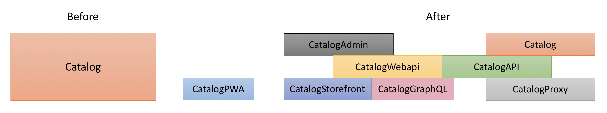

# Magento Service Isolation

Magento Commerce was designed as a monolithic modular application: the codebase is split to functional modules, but the modules are deployed together. This has following implications:

* Even though a modular code structure groups related behavior, it is easy to introduce an undesired dependency between application services, because services are not deployed and tested independently. Only static modularity analysis is performed.
* An application has to be deployed as a whole. You cannot deploy updated versions of separate services independently.
* An application has to be scaled as a whole. There is no ability to scale separate services independently.

## Current state
The introduction of service contracts in Magento 2.0 was the first step towards service isolation:

* Every module defines its API (service contracts), which are PHP interfaces that can be called either from within a PHP process or remotely through REST, SOAP or AMQP APIs.
* Every module can call other modules only through their service contracts.

In later releases, we introduced more service contracts, and more modules were switched to service contract communication. However, legacy undesired dependencies (direct inter-module model-to-model and presentation-to-model dependencies) still exist. This fact does not allow true module separation. Most of the undesired inter-module dependencies reside in the UI (presentation-to-model).

On the data level, we introduced the ability to split checkout and order management databases. This improved the scalability of Magento instances.


### PWA & Service isolation
The decision to move all UI to the browser as a part of PWA effort significantly reduces the number of undesired dependencies in the codebase. Most dependencies reside in the UI and will not be present in PWA implementation.

## Desired state

To resolve the current dependency issues, Magento should continue its path of Service isolation.

Magento _services_ (Catalog, Checkout, Order Management, ...) should be isolated and only communicate through service contracts.

A _service_ is a part of the Magento application that consists of one or more modules. It is responsible for distinct business behavior.

Examples of services:
   
- Catalog
    - Magento/Catalog
    - Magento/CatalogGraphql
    - Magento/ConfigurableProduct
    - Magento/Downloadable
    - Magento/BundleProduct
    - ...
- Checkout
    - Magento/Checkout
    - Magento/Quote
    - Magento/Multishipping
    - Magento/CheckoutAgreements
    - ...
    
The requirement to communicate through service contracts only applies to services, not modules. This significantly reduces the scope of required modifications and makes implementations and customizations easier. 

It should be possible to deploy services as independent instances.
 
Services must not share data store. It should be possible to deploy every service database as a separate instance.

The current deployment model (single app & single DB) must be supported for clients that don't require advanced scalability.

Magento testing builds should run Magento both as a monolithic application and as a set of independent services.

Benefits:

* Easier to comprehend services with less dependencies
* Easier for System Integrators to replace Magento built-in services with third-party systems when such need occurs
* Services can be scaled independently on Magento instances
* Teams have clear ownership boundaries
* Granular releases - services can be released independently
* In isolated services it is easier to use data storage with more appropriate storage models.
* Easier to experiment and replace services


The following application services are currently identified to be isolated (green - Magento Open Source, yellow - Magento Commerce, red - Magento B2B):

 

## Implementation
To achieve the desired state, two sets of changes are required: platform modifications and service isolation.

### Platform modifications

To support the current ecosystem, the platform and main APIs must stay the same (PHP, Magento Framework).

Work on the platform is required to allow independent service deployment (module separation, application framework, configurable service invokers, backends for frontends, support for split extensions in marketplace). Additional work will  make independently deployed services (cloud native, development environments) manageable.

### Application framework

The following library components are currently implemented as Magento modules. Many modules depend on these library components, which clutters the module dependency graph. Effectively, they will be required for most application services. These library components (or application-agnostic parts of them) should be moved to `Magento\Framework` to reduce clutter in module dependencies:

* Amqp
* Config
* Cron
* Deploy
* EAV
* GraphQL
* Indexer
* MessageQueue
* MysqlMq
* WebAPI

### Configurable service contract invocations

As of 2.3-develop, Magento service contracts can be called in a process, or through REST, SOAP, and AMQP APIs by remote clients. Remote calls require manual implementation of the client. Magento should be able to invoke service contracts either locally or remotely (if a service whose contract is called is deployed remotely). Two options to implement this are:

* Introduce a service contract invoker that should be used by every client to invoke a service contract. For local calls, this invoker would just call a service contract. For remote services, it would make a remote call. This option gives more control over service contract invocation, but requires modification of all current service contract clients.

* Auto-generated remote call proxies for service contracts that represent remote services. This option does not require code modifications, but it will produce code that is harder to debug.

A remote invoker must contain improved logging, timeouts, retry logic, and circuit breakers to avoid failure state propagation between services.

The first iteration of a remote implementation should be based on existing synchronous APIs.

Long-term goal: To avoid the leaky abstraction of remote invocations, a new generation of service contracts must expose the asynchronous nature of APIs to avoid runtime coupling between services.

### Backends for frontends

The following entry point services need to be created for two main application clients: storefront and admin apps (admin, integrations). These endpoint services (backends for frontends or BFFs) should act as façades to corresponding functionality:

* Storefront PWA BFF
  * Launch a PWA Application shell with page data (product information, category information)
  * Routing to storefront scenarios only
* Storefront GraphQL endpoint
  * Serve GraphQL requests of a PWA application
  * Potentially merged with PWA BFF
* Admin backend
  * Used by admin app and integrations
  * Mostly CRUD operations for entities
  * Token based authentication
  * ACL-based authorization
  * REST
  
### Split modules

The described separation of UI from APIs, and admin from storefront requires extracting all UI and Admin application logic to separate modules. For storefront applications, UI code will be moved to separate modules in PWA.

To support real and proxied implementations of modules, the APIs should be extracted to separate modules. Webapi should be extracted to separate modules in order to glue APIs, implementations, and Webapi declarations together.

The following diagram demonstrates the split:



* *CatalogPWA* - js module deployed on PWA host
* *CatalogStorefront* - deployed on GraphQL endpoint
* *CatalogGraphQL* - exposes GraphQL API, deployed on Storefront GraphQL endpoint
* *CatalogAdmin* - deployed on Admin BFF
* *CatalogWebapi* - deployed on Catalog service instance and depends on CatalogApi and Catalog modules
* *CatalogAPI* - contains module service contracts
* *Catalog* - contains an implementation of Catalog; deployed on Catalog instance
* *CatalogProxy* - contains proxy implementations of Catalog services. Deployed on client services (Checkout, OMS)

### Split database

Today Magento 2 supports ability to deploy Checkout and Order Management databases separately from main database. We should go further and isolate all service databases.

A service must not talk to other service database directly, only through service contracts.

This will require codebase modifications similar to those that were already done for Checkout and Order Management:
- Review application scenarios and minimize data relations in them
- Replace the required inter-service db-level data relations, joins, and transactions with application-level relations, joins, and transactions

Unlike current implementation (OS & Commerce split), the data relation decoupling should be performed in Open Source edition of Magento to simplify extension development.

### Support for split extensions on Marketplace

The current data model of Marketplace does not support multiple packages per extension. Since an extension can customize multiple services, it should be possible to create an extension that consists of multiple composer packages. Such extensions must be supported by Magento Marketplace.

Example: MyVendorShippingMethod extension modifies shipment and checkout services. MyVendorShippingMethod extension consists of 2 composer packages in Marketplace: MyVendorShipment and MyVendorCheckout.

### Cloud-native

The distributed deployment approach requires improved tooling to make it easy to deploy, monitor, and troubleshoot the Magento application. In addition to that, the Magento application must better follow the principles of [12-factor application](https://12factor.net/). 
The following changes are proposed:

#### Application configuration

Magento services must support centralized application configuration management.

>NOTE: supported since 2.2 with configuration stored in `env.php`.

#### Tracing
Correlation IDs must be added to internal calls to make tracing easier.

#### Tooling

##### Magento CLI
The current Magento CLI tool depends on the application codebase being present on same machine. This makes it hard to manage a distributed instance of Magento. To solve these issues:

* Introduce an endpoint that can be exposed on an secure network adapter and that would listen to commands from remote magento tool and execute them.

* Create a new standalone magento tool. The tool should have following commands:
    * ```magento instance:add [name] [url]``` - register a new managed remote instance
    * ```magento instance:remove [name]``` - unregister a managed instance from the tool instance list
    * ```magento instance:list``` - list registered remote instances
    * ```magento instance:update``` - load a list of commands supported by the instance
    * ```magento context:set [name]``` - select the default instance to be used in commands

##### Instance builder

With distributed deployment and split modules, `composer.json` management for different services will be complicated. A tool to build instance `composer.json` files for specific services based on enabled features or installed extensions should be built.

Input: 
* Project metadata files describing services to deploy (Catalog, Checkout, etc) and extensions to be installed

Output: 
* A list of `composer.json` files that can be deployed on different instances

The tool should be able to:
* Generate a list of `composer.json` files based on following input:
    * A list of extensions that need to be installed
    * A list of services deployed separately (`composer.json` files to generate)
* Check the compatibility of API versions between modules of different services
* Analyze the distributed instance of Magento:
    * Check API version compatibility
    * Display the list of distributed extensions
     
#### Schema migrations

Expansion-cleanup stages should be introduced into the schema deployment tool to reduce downtime during service deployment.

NOTE: The declarative schema feature in 2.3 makes automated distinction possible.

#### Development environment

To make development of distributed instances easier, a new developer environment must be created. The environment should allow to easily manage multiple services of magento.

Two developer environments are evaluated:
* Environment based on [Minikube](https://kubernetes.io/docs/setup/minikube/) VM with [Kubernetes](https://kubernetes.io/) cluster
* Environment based on [Docker Compose](https://docs.docker.com/compose/)

>NOTE: Distributed service deployment will make the current Commerce/B2B linking approach inconvenient, so a new approach of internal development environment installation must be used: installation of Magento modules from “path” type composer repositories.

## Design principles

General principles to follow for service isolation:

* Current service contracts SHOULD BE preserved for backward compatibility
* All new service contracts MUST follow design principles described in technical guidelines + following principles:
* All operations MUST BE idempotent. Network communication is unreliable. Retries will be required, and some messages will be delivered more than once.
* Sagas SHOULD BE used for consistency of distributed operations
* All new service contracts SHOULD expose asynchronous APIs
* All new state modifying operations SHOULD expose bulk APIs
* All service operations MUST BE stateless
* There MUST BE NO data dependencies between services.
* Command & query responsibility segregation – storefront APIs for data immutable in storefront (catalog) should be optimized for data retrieval
* Services MUST NOT manage session, this is responsibility of BFF. APIs of the services have to explicitly declare all required arguments.

A detailed design must be prepared for every service.

## Implementation approach

An iterative approach must be used for service isolation: one service at a time is extracted from a monolithic application.

Checkout is proposed to be the first service to extract.
