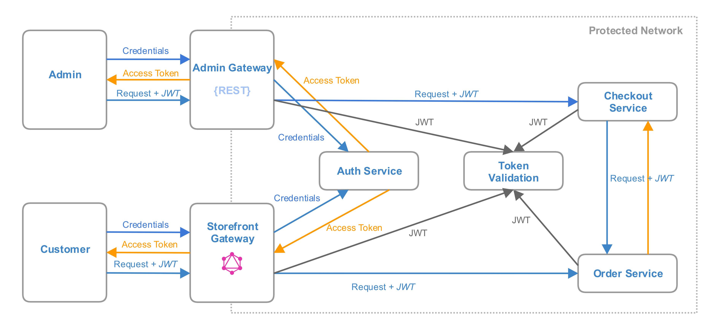

# Authentication and Authorization

## Overview

One of the important things that how a service knows which request is allowed to proceed and what type of data should be
available for the request initiator. In other words, Magento should provide entry points which allow making
authentication and authorization for different roles and users. Storefront Gateway should provide authentication for
customers, Admin Gateway for users with admin privileges.

There are few multiple strategies how to build authentication and authorization for services:
    
1. BFF/Monolith performs authentication and authorization 
     - Pros: a single entry point for permissions validation, no code duplication
     - Cons: services should trust BFF/monolith
2. A service performs authentication and authorization
     - Pros: services control all the flow of roles and privileges
     - Cons: the same logic is duplicated in multiple services
3. BFF/Monolith performs authentication, a service performs authorization
    - Pros: single entry point for authentication, services control roles & privileges
    - Cons: shared roles & privileges data between services
4. BFF/Monolith performs authentication and authorization, a service uses a "secure" token
    - Pros: a single entry point for credentials and permissions validation, more secure communication, avoids
[Confused Deputy Problem](https://en.wikipedia.org/wiki/Confused_deputy_problem)
    - Cons: additional logic to validate a "secure" token (could be extracted to a separate service)

According to described above strategies, the last approach looks like more convenient. It allows building authentication
& authorization flow with a single source of roles & privileges and provides additional secure communication for separate
services.

### Token-based Auth

Token-based auth allows users to use credentials like username and password to obtain a token which allows communicating
with the system without using credentials.
As Monolith/BFF performs authentication & authorization token-based auth allows using tokens for a secure communication
between a user, Monolith/BFF, and services.

[JWT](https://jwt.io/) could be used as a "secure" token implementation and the main benefits are:
* Allows using adaptive structure to pass permissions between services
* Could be encrypted (JWE) or just signed (JWS)
* As it's RFC it has implementations for most of the modern programming languages, so there is no a hard
dependency on some stack for the service implementation
    
## General Schema

As Magento should provide [multiple BFF](https://github.com/magento/architecture/blob/master/design-documents/service-isolation.md#backends-for-frontends)
it makes sense to extract authentication and authorization flow to a separate `Auth Service` to avoid credentials
validation and duplication of roles & privileges data. And the general schema might look like this:

And the basic scenario might be as following:

Also, there are a few variants of the proposed schema like to have separate services for token validation and renewal:

Now, each service validates a token through `Token Service` it reduces logic duplication but adds additional requests
which might impact on performance.

According to the proposed schema, user-Monolith/BFF scenario could use JWE tokens, Monolith/BFF - service could use JWS
tokens to make the communication more secure.

### OAuth 2.0

As `Auth Service` is the single entry for authentication & authorization it should store roles and privileges for all
services and generate an access token, this schema follows to OAuth 2.0 framework principles - `Auth Service` has a role
as`Authorization Server` and it a centralized storage of privileges for `Resource Servers`.

The usage of OAuth 2.0 framework has the next benefits:
* Defines authorization grant flows for different kinds of a communication
* Defines the rules for a token obtaining, issuing, refreshing
* Service-to-service authentication can be based on Client Credentials Grant ([CCG](https://tools.ietf.org/html/rfc6749#section-4.4))
* JWT could be used for a client authentication and authorization ([RFC7523](https://tools.ietf.org/html/rfc7523))
* Defines the standard for the response format, error codes

## Implementation Approach

On the first iteration, BFF/Monolith could be used as `Auth Service` and as a single point for roles & privileges storage.