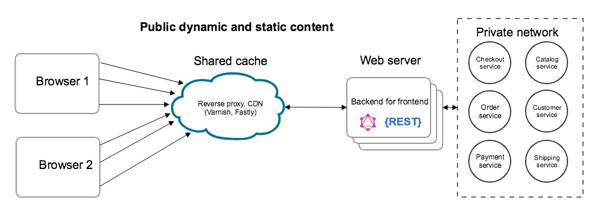
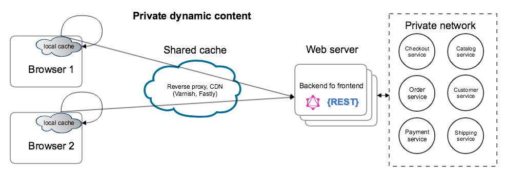
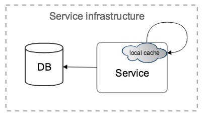
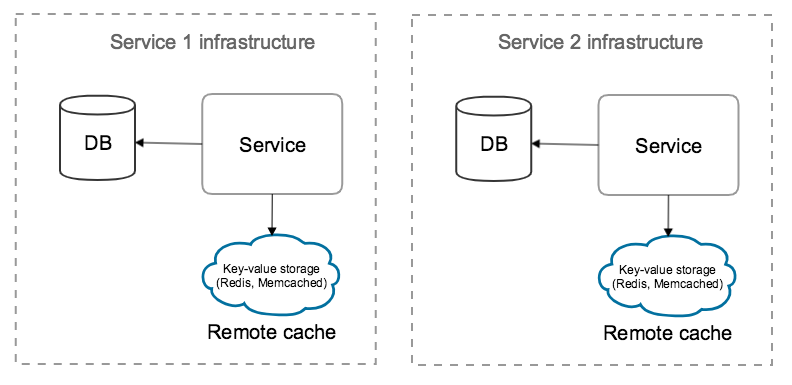
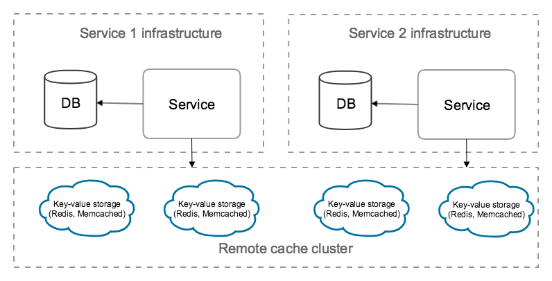

# Caching layer for Magento services

## Overview

Cache is one of the most important parts in a modern web application architecture.
Magento caching layer should effectively improve:
 * Performance
 * Availability
 * Scalability

Caching should be implemented on several levels:
 * Caching of http-responses returned by [BFF](https://github.com/magento/architecture/blob/master/design-documents/service-isolation.md#backends-for-frontends) (exposed web-server) 
 * Application data caching (results of DB queries, merged configurations etc.)

### Caching results of GET-requests to BFF (exposed web-server)

[BFF](https://github.com/magento/architecture/blob/master/design-documents/service-isolation.md#backends-for-frontends) http-responses contains static assets, **public** and **private** dynamic content.
Static assets should be cached using CDN. Reverse proxy should cache public content.
It could be Varnish (acts as reverse proxy) or Fastly (combines reverse proxy and CDN functions).
Varnish and Fastly are already integrated with Magento. Reverse proxy uses lazy caching approach.
Beside performance this type of cache has next benefits:
 * Protection against outages - can optionally serve stale content when there is a problem with origin server
 * Scalability - number of caching nodes can be increased
 * Flexibility – Varnish Configuration Language (VCL) builds customized solutions, rules and modules

 

A private or visitor-specific content should be stored on client-side (browser). After POST requests the cache 
in the web browser will be flushed and an AJAX call will be done to fetch an updated copy of the private content.
Also private content cache on client-side should expire according to TTL.

 
 
 In general, the same caching approach works in current monolith Magento architecture.
 For service oriented architecture next issues should be solved:
  * The http-response header should include a set of tags for effective cache purging on reverse-proxy.
 The set should be created while request is going via the chain of services. Appropriate design should be prepared.
  * Caching on reverse-proxy should be aligned with request authorization approach. The presence of an authorization token should be taken into account.

### Caching results of GET-requests in service-to-service communication (private web-server)

Services can produce a lot of GET requests to each other in the private network.
To reduce the overall load on service origin a reverse proxy should be used.
Varnish is offered as a proven solution. Should be aligned with request authorization approach.

 

### Application data caching

Service application needs to cache such data as DB query results, merged configurations for efficiently and rapidly respond to requests.

The three possible types of caches are the following:
 * Local caches
 * Remote caches dedicated to each service
 * Remote caches shared across the services
 
#### Local caches
 - Pros: fast, no network traffic associated with retrieving data
 - Cons: 
   - shares sources with application
   - can lead to data inconsistency when multiple instances of application servers are created
   - the information stored within an individual cache node cannot be shared with other application servers
   - not follow the 12-factor principles (any data that needs to persist must be stored in a stateful backing service)
 
 
 
#### Remote caches dedicated to each service
 - Pros: 
   - scalable, adheres to 12-factor principles
   - externalize application state
   - possibility dynamically change the number of service instances
   - contains only dedicated service data
   - multiple instances of the same service can use the same cache instance.
 - Cons: 
   - a slight delay in network calls
   - difficulties with centralized cache invalidation
 
  
 
#### Remote caches shared across the services
 - Pros: 
   - centralized cache invalidation is easy
   - scalable
   - adheres to 12-factor principles
 - Cons: 
   - cache nodes contain mixed data from different services
 
 
 
Local caches are isolated on the individual nodes and cannot be leveraged within a cluster of application servers.
Remote distributed caches on the other hand, provide low latency and higher levels of availability, when employed with read replicas and can provide a shared environment for all application servers to utilize the cached data.
Remote cache dedicated to each service allows to store only data of particular service. 
But there is no possibility (needs implementation) to flush all cache instances in case of upgrade or other huge changes.
Remote caches shared across the services are easy to flush centralized, but mix data from different services.

#### Cache invalidation
 - Service should store in cache only own data (DB, configuration, etc.) and be fully responsible for cache invalidation
 - Service mustn't store in cache data retrieved from other Magento service
 - In case of "Remote caches dedicated to each service" model service should provide entry point for full cache invalidation
 - In case of "Remote caches shared across the services" model full cache invalidation can be performed by any service

#### Technologies 
Today most key/value stores such as Memcached and Redis can store terabytes worth of data. Redis also provides high availability and persistence features. 
Redis and Memcached offer high performance. Memcached is designed for simplicity while Redis offers a rich set of features that make it effective for a wide range of use cases.
Unlike Memcached, Redis offers snapshots, replication, transactions, advanced data structures. So I propose to use Redis for application data caching.

### Resolutions
 - Model "Remote cache dedicated to each service" is most suitable.
 - REST entry point on each service for cache invalidation should be created.
 - Consider possibility of cache invalidation by publishing events in the message queue.
 - Create HLD for caching API REST requests (GET).
 