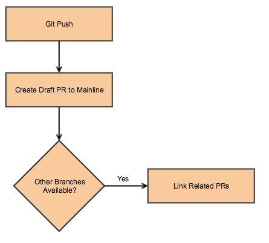
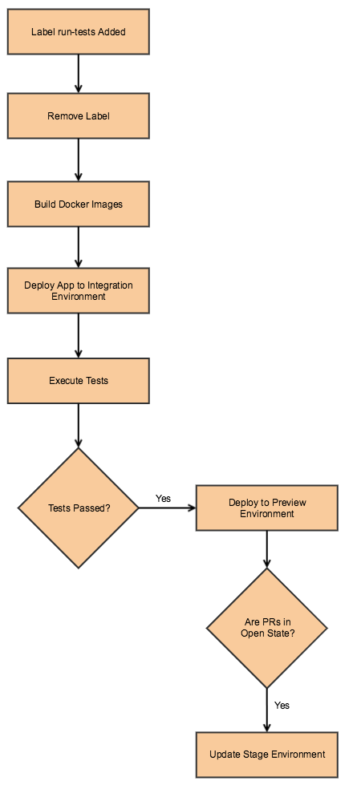
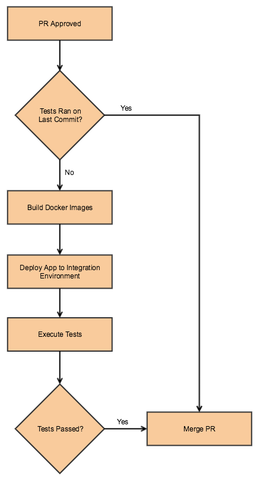
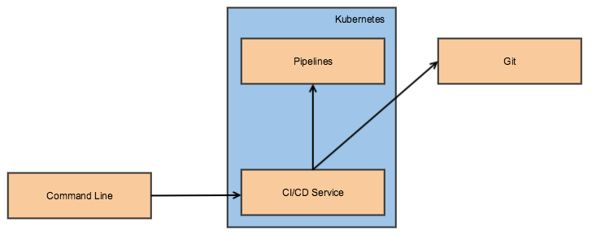

# CI/CD pipeline for service isolation

## About

CI/CD moves to GitOps direction where pipelines (builds, deployment, etc) triggered by interaction with Git.

In the scope of service isolation we want to have CI/CD process that would allow
* Running tests on code change and update preview environment
* Update stage environment (environment used for demos)
* PR delivery to mainline

These steps currently are not automated.

### Use cases (current and future)
1. Run builds on code change
1. Update preview environment used by the team for testing
1. Update stage environment used by the team for demos
1. Automatically merge pull requests after approval and builds are passed
1. Run builds for multiple repo combinations (open source + bundled extensions, commerce + bundled extensions, commerce only, etc)
1. Specify what type of tests to run, all or only unit tests for instance
1. Specify branches in each repository to use for a build 
1. Send notifications about tests failures
1. Collect and provide access to logs
1. Allow to run only specific tests
1. Have a smoke suite of tests that will run first and cache big issues with code
1. Deploy other services needed to run tests on the application when change is made to one service

## Design

### Solution
Pipelines should be configured by code and/or conventions. Triggered by interaction with Git. There are should be minimal/or no interaction with UI (with the exception of PR approvals) if the pipeline is successful to update environments, create builds, merge PR, etc.

The proposed solution works best when developing separate services, when each service lives in it's own repo. But can also work for testing monolith application, application that consists from separate UIs and arbitrary combination of extensions.

Branches named by convention. Branches that start with feature contain clean feature related changes. Pushing changes to feature branches triggers CI pipeline below. User receive notification via slack/email with links to builds.

Pipeline that creates PRs.

On commit to a feature branch, PR automatically being submitted to mainline in a draft state. Every time new PR being created, this pipeline also looks by convention for related PRs and link them automatically. There are should be also option to link PRs manually.

Pipeline that runs tests on PRs.

When `run-tests` label is added to one of the linked PRs it would trigger the following pipeline. If PRs are in active state, pipeline would also refresh stage environment.

Pipeline that merges PRs.

This pipeline will be executed after PRs approved. If branches contain latest mainline and tests run on latest commit, PRs will be merged immediately. Otherwise it will rerun tests and merge PRs if tests turn out green.

Each team may have it's own Kubernetes cluster that can be used to build images, run tests, etc.

Alternative approaches for triggering pipeline that runs tests
1. Add flag in the commit message
2. Trigger builds on each commit with a delay and restart when changes pushed to a different repo
3. Allow to specify flag to not ran the pipeline and do option #2

#### Storing pipeline configuration
Pipeline configuration can be stored in the separate repo. Pipeline build specific configuration can be stored in a separate repo or in the comment section on of the the PRs. Seems like storing pipeline configuration in the separate repo would be more clear.

#### Tools
Existing tooling doesn't have support support of multiple repositories. We may need to create our own tooling for orchestrating (reacting to Git hooks and triggering pipelines) pipelines and use existing solution to build and execute pipelines.

High level architecture might be as follows.

#### MVP of the service/prototype

For the first iteration I would propose to take [this prototype](https://git.corp.adobe.com/mkozell/m2-multi-container) and
1. Rewrite to use Kubernetes instead of Docker
1. Deploy to cloud
1. Add support of other types of tests
1. Add support of different deployments (Open Source, Sommerce, B2B, with bundled extensions, etc)

Then this prototype can be used internally to run tests on Magento application when UIs deployed separately.

## Future considerations
We can also automate the following
* Publication can be triggered by creating release on github
* Update production environment
* Blue/green deployment
* Canary deployment

## Open questions
* How to deliver security fixes?
