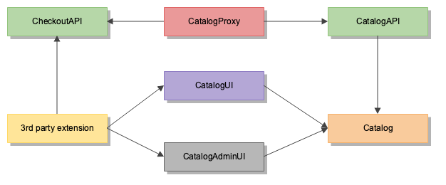

# Split modules/extensions strategy

## Overview

According to the [general schema](https://github.com/magento/architecture/blob/master/design-documents/service-isolation.md#split-modules), we want to split current modules into multiple modules to decouple dependencies.
As Magento has a lot of extensions, which can be also affected, we need to propose a strategy for splitting old modules|extensions into new modules.
The desired state that all modules/extensions should depend only on used component's parts like API, UI, etc. but not on whole component like now.



## Split strategy

There are multiple strategies how to split existing modules and extensions. Each strategy may imply a gradual separation into new modules.
A tool might be used to split modules like in [prototype](https://github.com/magento-architects/magento2/tree/split-framework/app/code/Magento). It does not guarantee that all modules can be split automatically but minimize the routine work.

### New Module - new class namespace

This strategy assumes splitting existing modules into new with namespaces changes according to the new modules names.
All dependant code should use new class namespaces.

Desired state for dependencies:

```json
"require": {
    "magento/module-catalog-api": "^104.0.0",
    "magento/module-catalog-adminui": "^104.0.0",
    "magento/module-catalog-ui": "^104.0.0"
}
```

Pros:
 - Introduce "right" dependencies
 - Dependant code use only needed modules
 
Cons:
 - Cause BIC as all dependant code should you new namespaces
 - All extensions should be affected
 
### New module - old class namespace
 
This approach proposes split modules but leave class namespaces as is. So all dependant code should require new packages in `composer.json` but does not require changes in codebase.
 
 Desired state for dependencies:
 
 ```json
"require": {
    "magento/module-catalog-api": "^104.0.0",
    "magento/module-catalog-adminui": "^104.0.0",
    "magento/module-catalog-ui": "^104.0.0"
}
```
 
Pros:
 - Introduce "right" dependencies
 - Dependant code use only needed modules
 - No changes in the dependant code
  
Cons:
 - Dependant modules and extensions should update `composer.json`
 - Extensions should split their modules in the same way as core modules and specify the correct dependencies

### New module - old composer

This strategy proposes to expose all new modules via one (currently existing) `composer.json` and more described in [this proposal](https://github.com/magento/architecture/issues/88).
The main idea that extensions will use the same dependency in `composer.json` which will be distributed as metapackage. Magento core modules will depend on new modules like `catalog-ui` but not to `catalog` metapackage, such metapackage will be distributed separately.

 ```json
"require": {
    "magento/module-catalog": "^103.0.0|^104.0.0"
}
```

Pros:
 - No changes in the dependant code
 - Allows to specify multiple package versions
  
Cons:
 - `composer.json` anyway should be changed to specify needed version of module
 - All modules and extensions still have coupling to all dependant code even if they do not use it
 - Such approach won't get benefits of modules decoupling as an extension still depends on the whole component