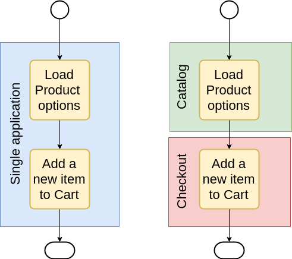

# Distributed services orchestration by using workflow (state machine)

This is an extension to [Service Isolation](service-isolation.md) document.

## Actual challenges
Keeping of strict boundaries between services rises a new challenge on how to organize complex cross-system communication that was inherited from the Magento application. The fact sub-applications can be deployed separately lead us to an obvious conclusion that such communication will be performed through the network and this communication does not have a state that can be shared between different components. The old scenario which required interaction across multiple domains, for instance, catalog and checkout, with this model of application deployment will have to invoke such operations remotely. The purpose of this document is to propose a way how to organize and manage such scenarios.


The main question, which must be addressed prior to many others is who will be responsible for organizing such communication? As soon as one service is starting to call other services through the network it becomes responsible for handling responses, managing timeouts, retries etc. As the result, increases overall complexity. Since this moment this service becomes responsible for handling network communication and receives knowledge about of called service like knowledge about foreign service signature. As a result, the service becomes more fragile. Changes that were made at another end may lead to original service invalidation.

Another drawback which should be considered, when one service encapsulates calls to another service such situation may affect the service replaceability. For instance, we have service `AddProductToCart` which encapsulate call to service `GetProductCustomizableOptions`. We can imagine a situation when a developer who knows about service `AddProductToCart` implementation details may build an extension with an assumption that `GetProductCustomizableOptions` will be always called inside of `AddProductToCart`. Replacing the service `AddProductToCart` by service `MyAddProductToCart` which is doing the same but does not call `GetProductCustomizableOptions` may unintentionally break logic of such extension.

Possible "accidental" performance degradation also is a point of consideration. In case we make it possible and convenient to call one service from another service we could loose track of cases when it happens. Network call must not be convenient to place it anywhere in the code (For instance, in a plug-in of a frequently called method). 


Without proper testing, such code may cause performance degradation that could be found after deploying on production. 

Also, debugging the application that may invoke remote services which also may invoke remote services with unlimited nesting is challenging(too much).

So, the decision that service should not invoke other services can simplify troubleshooting and helps us to get more predictable behaviour from extensibility standpoint.

With this decision we get the following:Such workflows helps to connect 
* Isolation, a service can be responsible only for operation declared in its domain.
* Replaceability, confidence that service replacement will not break extensions that depend on this service implementation.
* Better monitoring and troubleshooting. Due to the fact we have to keep our services more granular it is easier to find a cause of an issue in a small service (as well as performance drop). The fact that we do not need to debug our scenario through the multiple PHP session triggered by the nested calls is a huge plus from a development standpoint.

## Introduction of state machine

The assumption that services should not orchestrate themselves leads us to the need to define a way how integration between services may happen. Introduction of a workflow mechanism can solve this. 
Actually, this is not a new word in programming, exists several implementations: Step Functions made by Amazon to orchestrate lambdas, Azure Logic Apps by Microsoft (and lots more in the magic world of enterprise applications).
* [Amazon Step Function](https://aws.amazon.com/step-functions/)
* [Azure Logic Apps](https://docs.microsoft.com/en-us/azure/logic-apps/logic-apps-overview)

Such workflows connect execution across multiple operations, specify enter and exit condition. 
Due to a fact that a routine that represents step is quite isolated, it can be easily changed or replaced.
The overall scenario becomes less fragile.
Routine's interface is known only to the step which invokes it.
The beauty of this way to build an application is that the target system should not evolve at moment, scenario step can relate to an existing implementation, new services, external system etc.
Each step may specify data extraction logic to manage routine input arguments as well as output.
Development because more transparent because workflow can be easily exposed as a state machine diagram.
As well as monitoring and troubleshooting, a clear understanding of the step that causes an issue will reduce bugfix time. 

## State XML language
Workflow can be described with some high level language. For instance with XML :).
Lets consider the base syntax construction that we need to build reach application.
As an example, we can take [Amazon State Language](https://docs.aws.amazon.com/step-functions/latest/dg/concepts-amazon-states-language.html) and land it on Magento reality.

For states declaration we need the following:

### Common attributes
* Each step has to have a `name` which uniquely represents it in a scenario.
* Attribute `next` specifies the next step in scenario after the current.
### Task
Operation connected to routine, during this step will be executed declared routine.
```xml
<step xsi:type="Task" name="ExecuteStep1" next="ExecuteStep2" routine="example:step:1" />
```
* `routine` is a pointer to corresponding callable declared as an application routine. @see routines section.

### Transferring arguments
```xml
<step xsi:type="Task" name="ExecuteStep2" next="ScenarioSuccessfullyCompleted" inputPath="params/bar" routine="example:step:2" />
```
* `inputPath` specifies a path to arguments that will be transferred into a routine as parameters.
* `outputPath` specifies a path where will be placed a result of routine execution.
### Conditional operator
```xml
<step xsi:type="Choice" name="ExecuteStep3">
    <choice xsi:type="Decision" name="toStep5" next="Step5">
        <connective type="and">
            <condition type="eq" value="param/foo">1</condition>
        </connective>
    </choice>
    <choice xsi:type="Decision" name="toStep4" next="Step4">
        <connective type="and">
            <condition type="eq" value="param/bar">2</condition>
            <connective type="or">
                <condition type="eq" value="code2">2</condition>
                <condition type="eq" value="code2">1</condition>
            </connective>
        </connective>
    </choice>
</step>
```
The conditional operation allows to branch execution logic by specifying a set of particular conditions per start of each new branch.
The conditional step supports complex nested condition which can be use `AND`, `OR`, `NOR`.
## Error handling
With catch node, it is possible to declare a handler for an exceptional case. Each exception may have its own handler.
Also, it is possible to declare retry operation, the declaration is similar to exception handling declaration.
The trigger for retry is an exception.
```xml
<step xsi:type="Task" name="ExecuteStep4" next="Exit" routine="example:step:2">
    <catch exceptoin="InvalidArgumentException" next="Handler" />
    <retry exceptoin="ServiceUnavailableException" attempts="3" timeout="100" />
</step>
```

### Operation terminators (Success/Failure)
`<step name="ScenarioSuccessfullyCompleted" xsi:type="Success" outputPath="params"/>`

### Trivial Example
[Configuration schema](https://github.com/akaplya/mage-state-machine/blob/master/lib/internal/Magento/Framework/StateMachine/etc/stateMachine.xsd)

```xml
    <scenario name="ExampleRun">
        <step xsi:type="Task" name="ExecuteStep1" next="ExecuteStep2"
              inputPath="params/foo"
              outputPath="params/bar"
              routine="example:step:1"
        />
        <step xsi:type="Task"
              name="ExecuteStep2"
              next="ScenarioSuccessfullyCompleted"
              inputPath="params/bar"
              routine="example:step:2"
        />
        <step name="ScenarioSuccessfullyCompleted" xsi:type="Success" outputPath="params"/>
    </scenario>
```

## Routines
Routines configuration specifies a callable resource to be used in scenario steps.

Actually we have to support two base types of routines:
* Direct PHP Calls.
* Magento WebAPI  REST calls.

### Routines declaration example
```
    <routine xsi:type="MagentoWebAPIRoutine"
            name="Magento:Example:Step1"
            method="PUT"
            url="http:/magento2sm.local/rest/V1/example/step1"
    />
    <routine xsi:type="MagentoWebAPIRoutine"
             name="Magento:Example:Step2"
             method="PUT"
             url="http:/magento2sm.local/rest/V1/example/step2"
    />
``` 

[Configuration schema](https://github.com/akaplya/mage-state-machine/blob/master/lib/internal/Magento/Framework/StateMachine/etc/routines.xsd)

## Backward compatibility

Such a mechanism can be useful with the evolution of an existing application.
Major scenarios can be described with such language.
For monolithic app the scenario rewrote such way will be backward compatible because scenario will run the same operation in the monolith execution context.
### Real life example

Implementation of [\Magento\Sales\Api\OrderManagementInterface::place](https://github.com/magento/magento2ce/blob/2.3-develop/app/code/Magento/Sales/Model/Service/OrderService.php#L196) 
can be represented as the following scenario:
```xml
    <scenario name="Magento:Sales:OrderManagement:placeOrder">
        <step xsi:type="Task" name="PlacePaymentForOrder" next="PersistOrder"
              inputPath="params/order"
              outputPath="params/order"
              routine="Magento:Sales:OrderManagement:placeOrder"
        >
            <catch exceptoin="Magento\Payment\Gateway\Command\CommandException" next="PaymentFailureHandler" />
        </step>
        <step xsi:type="Task"
            name="PaymentFailureHandler"
            inputPath="params/order"
            exit="true"
        />
        <step xsi:type="Task"
              name="SaveOrder"
              next="OrderSuccessfullyPlaced"
              inputPath="params/order"
              outputPath="params/order"
              routine="Magento:Sales:OrderManagement:saveOrder"
        />
        <step name="OrderSuccessfullyPlaced" xsi:type="Success" outputPath="params/order"/>
    </scenario>
```
For monolith installation this scenario will exactly the same methods with the same arguments as it is now.
In the same time, such declaration provides new ways how to evolve such service.

## Extensibility
All steps are declared as XML node. 
So, by using native Magento XML config & merger we can declare or extend scenario in way we want.
In the example above payment failure handling step was added by SalesPayment module, which knows about `placeOrder` scenario.
And extends it with a new logic.
```xml
        <step xsi:type="Task" name="PlacePaymentForOrder" next="PersistOrder">
            <catch exceptoin="Magento\Payment\Gateway\Command\CommandException" next="PaymentFailureHandler" />
        </step>
        <step xsi:type="Task"
            name="PaymentFailureHandler"
            inputPath="params/order"
            exit="true"
        />
```

### Replaceability
With assumption that a service is replacable, everything that exists inside of a service implementation boundary is mutable.
We should not expect that code inside of services will trigger the same set of events in a future(because service can be replaced).
The beauty of scenarios in a fact that you can replace a scenario step, if you need to replace the step only.
Or you can redefine scenario if you need this. Both of cases are valid and depend on business requirements you have.
* By changing only step a developer works only with this step(s) developer introduced.
* Step does not have a strict interface of arguments that will be passed. This list vary depends on the step configuration.
    * Changing step, route to a function with an interface that is different from core one:
```xml
<step xsi:type="Task" name="PlacePaymentForOrder" next="PersistOrder"
      inputPath="params/order"
      outputPath="params/order"
      routine="Magento:MySales:OrderManagement:placeOrder"
/>
```

*
   * Extending the existing one scenario with more steps
```xml
<step xsi:type="Task" name="PlacePaymentForOrder" next="DoSomethingPersistOrder"/>
<step xsi:type="Task" name="DoSomethingPersistOrder" next="PersistOrder"/>
```
* Anyway if your code has the same interface with existing routine you can substitute routine only.
* If a developer replaced the whole scenario this is BiC change. But, quite visible and easy catchable even without analyzing PHP code.
All you need you can find in configuration (I did not investigate this question but pretty sure that it is possible to build visualization for scenario steps).

### Events and Observers

Step execution can be treated as an event in the system. So we can declare an observer on it.
```xml
<step xsi:type="Observer" name="SendEmail" after="PersistOrder"
    next="PersistOrder"
    inputPath="params/order"
    routine="Magento:MySales:OrderManagement:sendEmail"
/>

```
Observer can not return values into `outputPath` or start a new execution branch.
As a result, observer execution can be delayed or even processed async in background.
Observer can be declared `before` of `after` the step.

## Sync and Async adapters
Ideally, all scenarios should not be run synchronously.
The major benefit will be gained as soon as we will be able to move execution in a queue. 
But for BC purpose it make sense to introduce synchronously adapter, which will execute all steps in scope of a single process.

## Scenarios and 

## Solution evolution

Introduction of workflows does not require a separate service to manage them by default.
So the workflow can be used as a part of the monolith.
Basic routing plugin can transform network calls to direct PHP communication.
In another hand, the state machine component does not couple with an application and can be deployed separately and play a role of queue scheduler for asyn operations.
