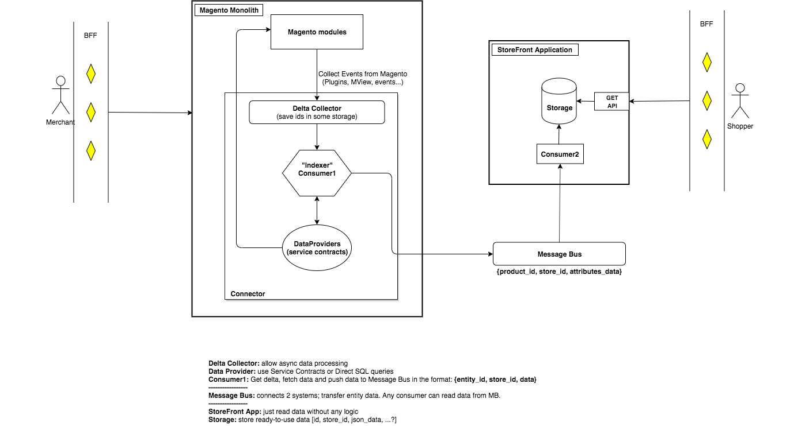

## Pre-requisites for split deployment (Monolith and Storefront App).

Storefront application (SF App) has to satisfy two requirements:
- should be performance efficient 
- should be decoupled from Monolith

Problem Statement:
- 1st requirement is addressed using plain SQL queries via Resource Connection object (framework) instead of re-using Magento Service contracts. But this leads to duplication of existing business logic and customizations. Taking into account that SF App supposed to be our prefered approach for GraphQL coverage - we should introduce a robust way which would avoid duplication of Business Logic and preserve existing customization by 3rd party developers.
- 2nd requirement addressed partially as new SF App implementation is not depending (there is still known tech debt here) on Magento Modules (code decoupling), but relies on the same Data storage (data decoupling).

Goal of current proposal is to address both of the issues above:
- Prevent duplication of business logic, preserving existing customizations
- Decouple data storage for Monolith and SF App, describing how to deliver data from the Magento Monolith to the Storefront services.

Responsibility of services:
- choose appropriate data storage (MySQL / Mongo DB / Elasticsearch etc)
- choose appropriate Data provider mechanism from monolith 
- some services (Order, Customer, etc) may require send data back to Monolith. This data transmission should be done through the same Message Bus, but in this case there would additional consumer on the Monolith side which suppose to handle these data. 

Desirable state for Catalog Storefront Application and ETL (Extract, transform, load) process for data retrieval from Store Management application.

### Diagram keys

- Delta Collector: allows async data processing 
- Data Provider: uses Service Contracts or Direct SQL queries
- Consumer1: Get delta, fetch data and push data to Message Bus in the format: {entity_id, store_id, data}
- Message Bus: connects 2 systems; transfer entity data. Any consumer can read data from MB.
- StoreFront App (GET API): read requested data. Does not contain any logic (changing system configuration on Monolith side will trigger full-reindex and push all data to Storage
- Storage: store ready-to-use data in the format: {id, store_id, attributes...}
