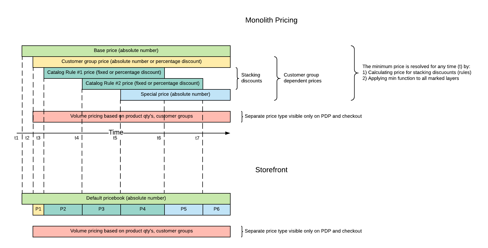
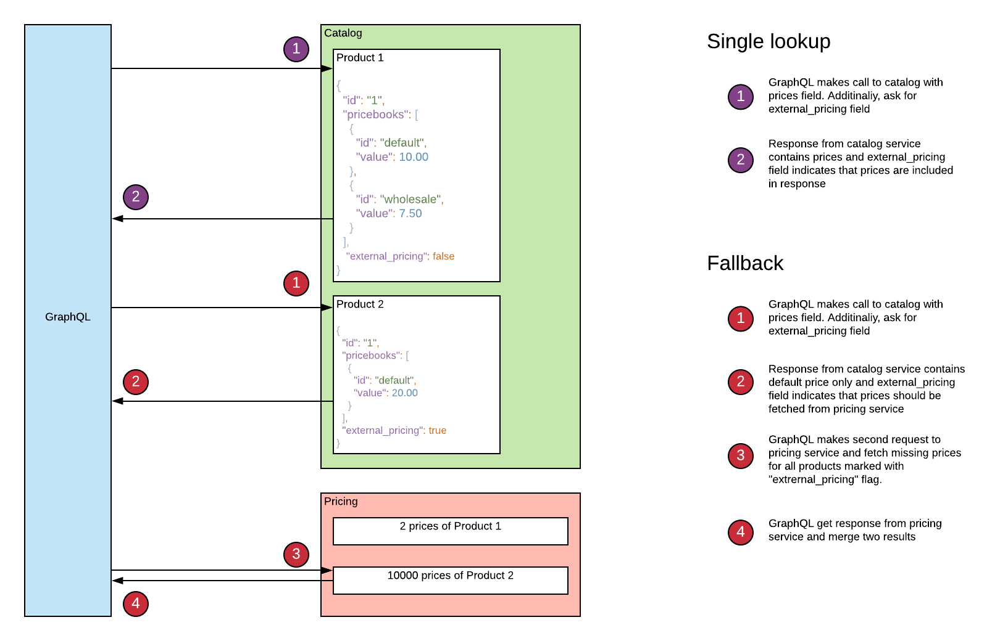

## Problem statement

The final price of the product in Magento monolith depends on multiple variables such as current customer group, current 
website, qty of items in the shopping cart and current date/time. 
Magento monolith calculates all possible permutations of prices in advance and store them in `price index`. These 
calculations are expensive and may not be done in reasonable time for large catalogs.

Few problematic use cases from real merchants:

- Each customer in the system has unique prices for very few products. Per-customer prices are result of a physical contract with pricing included.
The system has 20,000 customer groups, 10,000 products, promotions are excluded from the system. Magento will generate 200,000,000xCOUNT_OF_WEBSITES records to handle all possible combinations for this merchant. For one website it will consume 17,8 GB of space for data and 22.3 GB for index(40 GB total). Due to external promotion system, prices are synchronized periodically. The synchronization process consumes a lot of resources and time and eventually space.

- Customer groups are used for many things, but they are also a multiplier for prices
The system has 56 stores, 58 customer groups, 29,000 products, most customer groups are not global and used on one website only. Existing `price index` contains 25,000,000 records. The reindex process takes more than 7 hours. Customer groups are also used for promotions, cms content, product availability, B2B company, tax status and of course pricing. The real count of the prices is 26 times smaller. Potentially, reindex process may take 16 minutes.

The impact form cases describe above will be doubled(or even tripled) if we introduce a new storefront service with existing index structure inside. Thus, we need some other way to work with prices in storefront.

## Glossary
- Customer group - allocate each customer to a group and control store behaviour(catalog restrictions, pricing, discounts, B2B, CMS, payments, shipping, etc) according to which group a customer belongs to  
- Website, Store View - abstract Magento scopes - https://docs.magento.com/user-guide/configuration/scope.html . Magento modules and third-party extensions may utilize this scope as they want.
- Base price - the initial product price. Different values could be set per website in Magento monolith.
- Tier price - have two meanings `customer-specific price` and `volume based price`.  
- Special price - time based price for the product. Original price is strikedout in the UI. (e.g. was ~~$100.00~~, now $99.00) 
- Catalog Rule - Magento functionality that allows to apply the same discount to multiple products


## Goals

- Support up to 5,000,000 products and 15,000 customer groups
- Establish efficient sync of prices between Magento monolith and Magento storefront
- Reduce the size of pricing index
- Provide reliable support for personalized prices

## Solution

All price dimensions aren't used exclusively for pricing: 
multiple `websites` may have the same price, but represent different web domains; `customer group` could represent the company in b2b scenarios or class of customer service; `product` may have different pricing on one website only.
The solution is to reuse data where possible and make separation of dimensions, so `websites` or `customer groups` which are not a part of pricing will not trigger `price index` explosion.

### Price books

The `price book`(price list) is a new entity that holds a list of product's prices for a sub-set of catalog. 
The `price book` is a non-scoped entity, but it may hold information about linked customers, websites, etc. 
Instead of direct lookup in price index by customer_group, website and product, we will detect the customer's price book first, then we will extract two price books from the index: default and current `price book`. 
The resulting product price will be the value from current price book if it's exists, otherwise the product price will be extracted from default price book:


Guidelines:
* There is no need to resolve price book on each HTTP call. Resolved price book could be stored in JWT during "login" step 
and reused for consequent requests.
* In order to minimize "query-time" work, customer should have exactly one resolved price book.


### Default price book

A `default price book` is a predefined system price book that contains `base prices` for __all__ products in the system. User-defined `price books` may contain only sub-set of products. 
Default `price book` should be used as fallback storage if the price for a specific product doesn't exist in other resolved pricebook.

Other words, there is always some price for sku in `default price book`.

### Synchronization with monolith

One of the goals of `price books` is to speedup reindex process. Existing reindex process lives in the monolith and 
prepares the prices for luma storefront exclusively. The data produced by this indexer is useless for the new storefront, 
so old indexer should be disabled for the installation which uses the new storefront exclusively.

The following diagram shows the pricing structure for a given product, website and customer group. It also shows respective 
`price books` on the storefront.



- t1 - New product was created. Every product should have some base price, so new product also introduce one price in the system.
  - Storefront receives new base price and put it in the default price book
- t2 - New price for customer group was introduced on the monolith side
  - Message broker checks if price book for specified customer group exists on storefront and create new price book if needed
  - Message broker assigns product to the new price book and set appropriate price
- t3 - New catalog price rule was created on the monolith side. Catalog price rule has start and end dates.
  - Message broker checks if price book for specified customer group exists on storefront and create new price book if needed
  - Message broker detects products matched by the rule
  - Message broker calculate prices apply discounts for selected products and write prices to price book
- Alternative t3  
  - Monolith detects matched products and fire `price_changed` events for those products. Event includes information about affected customer groups. Product matches are stored in cache for the later use.
  - Message broker call monolith for prices of affected products
  - Monolith calculates prices based on the cache (product matches)
  - Message broker store prices in price book
### Price book API

```proto
syntax = "proto3";

package magento.pricing.api;

// Creates a new price book
// All fields are required.
// Throws invalid argument error if some argument is missing
message PriceBookInput {
    // Client side generated price book ID
    string id = 1;

    // Price book name (e.g. "10% off on selected products")
    string name = 2;

    // Customer groups associated with price book
    // A combination of customer group and website must be unique. Error will be returned in case when combination is
    // already occupied by another price book.
    repeated string customer_groups = 3;
    
    // Website ids associated with price book
    // A combination of customer group and website must be unique. Error will be returned in case when combination is
    // already occupied by another price book.
    repeated string website_ids = 4;
}

message PriceBookDeleteInput {
    string id = 1;    
}

message AssignProductsInput {
    message ProductPriceInput {
        string product_id = 1;
        float price = 2;
        float regular_price = 3;
    }
    repeated ProductPriceInput prices = 1;
}

message UnassignProducts {
    repeated string product_ids = 1;
}

message PriceBookCreateResult {
    int32 status = 1;
}

message PriceBookDeleteResult {
    int32 status = 1;
}

message PriceBookAssignProductsResult {
    int32 status = 1;
}

message PriceBookUnassignProductsResult {
    int32 status = 1;
}


message GetPricesInput {
    string price_book_id = 1;
    repeated string product_ids = 2;
}

message GetPricesOutput {
    message ProductPrice {
        string product_id = 2;
        // Price without applied discounts
        float regular_price = 3;
        // Price with applied discounts
        float price = 4;
        float minimum_price = 5;
        float maximum_price = 6;
    }

    repeated ProductPrice prices = 1;
}


service PriceBook {
    rpc create(PriceBookInput) returns (PriceBookCreateResult);
    rpc delete(PriceBookDeleteInput) returns (PriceBookDeleteResult);
    rpc assignProducts(PriceBookInput) returns (PriceBookAssignProductsResult);
    rpc unassignProducts(UnassignProducts) returns (PriceBookUnassignProductsResult);
}
```

### Customer tags instead of customer groups

Magento monolith uses `customer groups` for customer segmentation globally. There is one-to-many relation between customer groups and customers, 
so customer could be a member of excatly one group only. However, in modern world, each customer could be a 
member of different groups based on current behavior. For example, pricing system works with wholesale and regular buyers,
but recommendation system works with different groups of customers which are based on gender, age, ML-generated groups, etc.

In order to provide more flexibility in customer segmentation, we may introduce many-to-many. Also, having `customer groups` 
which are not bound to pricing functionality make them looks like a regular tags. Thus, we may also rename them to tags:


### Complex products support

The `minimum prices` of complex products calculated based on variation's prices, variation's availability and variation's stock.
Having variations as a separate products makes `minimum price` and `maximum price` dependent on products which may not
be visible for the current group or in a current catalog. Example: configurable product contains variation #1 - price $10,
 2 - price $9 and 3 - price $12. Let's imagine that variation #2 is visible for people with "VIP access" only,
then the desired `minimum price` of configurable product for basic access will be $10, for "VIP access" - $9. However, there is 
only one price book in the system, so we can hold only one value.

This happens because parent product and variation are separate products which could be assigned to different access lists 
and price books. In order to mitigate this issue products should be isolated, so product options fully define complex products.

The case from example above could be handled by two independent configurable products with different sets of variations 
for different access lists.

Details will be provided in the separate proposal.

### Prices fallback

A most efficient way to work with prices on catalog scenarios is to create a prices' projection in `catalog` service. This 
way we can retrieve prices in one query together with other product's information.

This approach will work fine till some limits. There are always some limits on data we can handle in any service. The 
`catalog` service is not an exception. It's designed to handle a large amount of products, but product itself is not infinite.
The target number of EAV attributes in the product is `300`, the limit of underlying storage is `10,000` attributes per product.
If we move closer to the limits, system may slow down and eventually fail.

These limits mean that we can't implement `personalized pricing` feature by storing all prices in product documents.
Even a large list of price books will be challenging for such approach. For such extreme use cases we may introduce a 
`prices fallback` on a service which is designed to work with the large amount of prices.



Consequences:
- Aggregation functions like facets in search service will not work properly for products with large amount of prices. Only default or limited number of prices will be available for faceting.
- Second request obviously affects performance. A good news, performance will be affected only in queries which fetch products with large amount of prices. Other queries or slices with small products will not be affected.


## Scenarios

#### Simple

- Admin sets a `base price` for the `simple` product
- `product listing`, `PDP` and `checkout` scenarios contain the `base price`
- Customer or guest are able to buy the product for the `base price`

#### Customer specific price

- Admin sets a `base price` for the `simple` product
- Admin sets a `customer-specific price` for the same product
- `product listing`, `PDP` and `checkout` scenarios contain `base price` for guests and `customer-specific price` for selected customer
- Customer is able to buy the product for the `customer-specific price`

#### Complex product pricing

- Admin creates a `configurable` product and assign different `base prices` to variations
- `product listing` scenario contains the minimum price of the variations
- `PDP` scenario contains the minimum price of the variation and the price of currently selected variation
- `product listing` scenario contains the price of currently selected variation
- Customer or guest are able to buy the product variation for the price of selected variation

#### Special prices

- Admin sets a `base price` for the `simple` product
- Admin sets a `special price` for the same product for the current date
- `product listing`, `PDP` and `checkout` scenarios contain `special price`
- Customers and guests are able to buy the product for the `special price`

