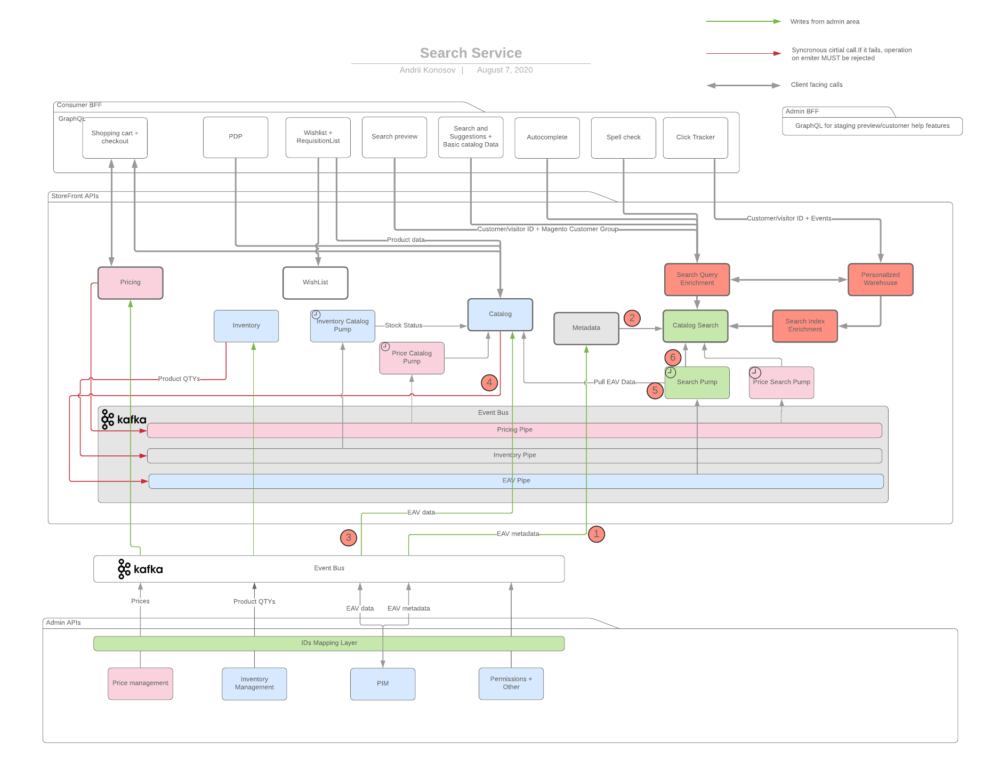
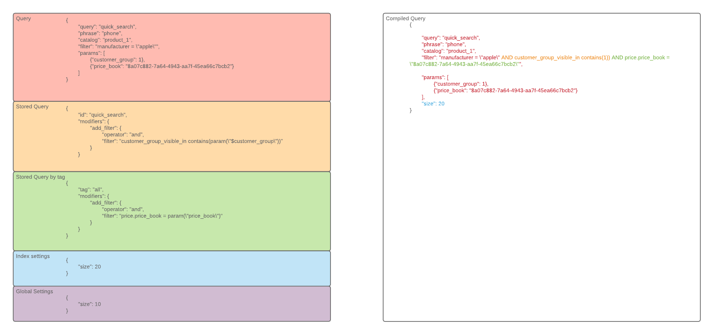

# Storefront Search 

## Overview
Storefront search is a separate service which includes a set of search APIs such as: product search api with faceting API, 
search result management API and data management API.

## Goals
* Provide a shape of main search APIs which should cover existing and future use cases
* Provide integration scheme with other storefront services and monolith


## Services breakdown
The following diagram shows how different service communicate with each other and how data eventually lands to the search service:



1. Magento monolith publish event about new searchable attribute. The event consumed by `Catalog Metadata` service which 
handles catalog taxonomy
2. Search is notified about new attribute
3. Magento monolith publish attribute's value to storefront catalog service
4. Storefront catalog publish event with changed attribute to downstream queue
5. Search fetch actual attribute value from catalog service
6. Search service store the actual value in the search storage

## Search service

Search Service provides API similar to Catalog Service and an additional capabilities specific to the search service 
which will be described in this chapter.

### Search query

```proto
syntax = "proto3";

import google.protobuf.any;

message CatalogSearchRequest {
    // Search phrase
    // For empty phrase search service will return all products
    string phrase = 1;

    // Required. Query name to execute (e.g. quick_search)
    string query = 6;

    // Required. 
    string catalog = 7;
    
    // SQL like filters which allow to specify a search conditions
    // (A combination of one or more predicates using logical operators: and, or)
    // 
    // Examples:
    //  - color = "blue" - matches only blue products
    //  - color != "blue" - matches everything except blue products
    //  - (color="blue" or color="red") and size = "L" - matches blue or red products with size L
    //  - color in ("blue", "red") and size = "L" - the same as above
    //  - weight >= 10.00 and weight < 20.00 - matches products in 10.00 - 19.99 weight range
    //  
    // InvalidArgument error will be returned in case of malformed filter 
    string filter = 2;
    
    message Sort {
        string attribute = 1;
        enum Direction {
            ASC = 0;
            DESC = 1;
        }
        Direction direction = 2;
    }

    // Optional sort. Default sort is asc by id, and desc by relevance + asc by id if search phrase is provided
    repeated Sort sort = 3;
    
    //Optional. Default value is 20
    int32 size = 4;

    //Optional. Default value is 1
    int32 page = 5;
    
    repeated Google.Protobuf.Any params = 8;
    
    //Described in rule secrion
    repeated Modifier modifiers = 9;
}


message CatalogSearchResponse {
    message CatalogSearchItem {
        message Highlight {
            string attribute = 1;
            string value = 2;
        }
    
        // Product id
        string id = 1;
        repeated Highlight highlight = 2;
    }
    message Aggregation {
        message Bucket {
            message ScalarBucketData {
                string title = 1;
                string id = 2;
                int32 count = 3;
            }
            message RangeBucketData {
                string title = 1;
                float from = 2;
                float to = 3;
                int32 count = 4;
            }
            message StatsBucketData {
                string title = 1;
                float min = 2;
                float max = 3;
            }
            string title = 1;
            oneof bucket_data {
                ScalarBucketData scalar_data = 2;
                RangeBucketData range_data = 3;
                StatsBucketData stats_data = 4;
            }   
        }
        string title = 1;
        string attribute = 2;
        repeated Bucket buckets = 3;
    }

    repeated CatalogSearchItem items = 1;
    repeated Aggregation facets = 2;
    repeated string suggestions = 3;
    repeated string related_terms = 4;
    int32 total_count = 5;
    int32 current_page = 6;
}
```

## Rules API
Defines stored customization for a specific query or for a set of queries grouped by tag. More specific rule wins in case 
of conflicting customization.

Rules consist of two main parts:

condition - defines circumstances in which rule should be triggered
modifiers - defines operations which should be performed on top of the existing query
The rule could be added via separate API call:

```proto
syntax = "proto3";

// Modifier that will be applied if condition above is matched
// Examples:
// - Promote Adobe products
// AddObject {
//    filter: "manufacturer = \"adobe\""
//    position: 0
// }
message Modifier {
    message AddObjects {
        string filter = 1;
        int32 position = 2;
    }
    message AddFilter {
        enum Operator {
            AND = 0;
            OR = 1;
        }
        Operator operator = 1; 
        string filter = 2;
    }
    message RemoveObjects {
        string filter = 1;
        repeated string ids = 2;
    }
    message ReplacePhrase {
        string search = 1;
        string replace = 2;
    }
    oneof modifier {
        AddObjects add_objects = 1;
        RemoveObjects remove_objects = 2;
        ReplacePhrase modify_phrase = 3;
    }
}

message CreateRule {
    string name = 1;
    // SQL like filters which allow to specify conditions for CatalogSearchRequest
    // Examples:
    // phrase contains "photo editor" and filter exists (category="Photo Editors") and query_tag = "listing"
    string condition = 2;
    
    repeated Modifier modifiers = 3;
}
```

### Possible modifier types
This is not a complete list of possible modifiers. Additional modifiers can be introduced in any moment in the future.

#### Add Objects Modifier
Adds specific objects or a set of objects which matches a separate query. These objects could be placed in any position 
of search results. The following example adds a few documents to the search result on 0 and 1 positions:
```
// Promote Adobe products
AddObject {
    filter: id = "ade2f538-d6e2-4e76-8e34-662a34e5a619"// Specific product
    position: 0
}
AddObject {
    filter: manufacturer = "adobe"//List of objects defined by filter
    position: 0
}
```

#### Remove Object Modifier

Removes an object from the result set:
```
// Remove specific product
RemoveObject {
    filter: id = "ade2f538-d6e2-4e76-8e34-662a34e5a619"// Specific product
}
```

#### Replace Query Phrase Modifier

Modifies the initial search term of the query. This could be useful if some part of the query was transformed into the filter. For example, entity recognition may detect the category from the search term and apply category filter in affected queries:
```
// We already in iphone category, there is no need to search for "iphone" word
ReplacePhrase {
    search: iphone,
    replace: ""
}
```

#### Filter Modifier
Adjust query filters

#### Facet Modifier
Adjust facets: reorder, pin, pre-apply, sort values

#### Attribute Modifiers
Force result set to contain some attributes

#### Sort order modifiers
Apply custom sort order

## Extension points & APIs
There are multiple layers which provide customization capabilities:

* Client generated query
* Stored query
* Tagged set of queries
* Index customizations
* Global settings


Sometimes the same part of the query could be customized on multiple levels. In this case, more specific conflicting 
customization wins. Example: the size of results could be specified for the whole index and for a specific query. In 
this case, query level customization will be applied. More detailed explanation:


## Middleware Query adjustments (code: middleware)
Query modifications could be also applied on network middleware - personalization service may adjust initial query and 
promote some specific products.

## Settings API
Settings API allows to specify a service settings globally and for some specific index. The API is a key-value endpoint 
with predefined keys. It's possible to specify some value or update existing value using the following syntax:

```proto
syntax = "proto3";

message Settings {
    bool enable_fuzziness = 1;
    int32 fuziness_factor = 2;
    int32 fuziness_prefix = 3;
    int32 results_count = 4;
    bool enable_synonyms = 5;
    // ... other search settings
}
```

## Scenarios
- Autocomplete (Separate functionality)
  - Popular search terms, products, categories, attributes (Autocomplete in layered navigation filters)
  - Maximum number of popular search terms to display in autocomplete results. (settings)
  - Maximum number of products to display in autocomplete results.(settings)
  - Maximum number of product attributes to display in autocomplete results.(settings)
  - Maximum number of categories to display in autocomplete results.(settings)
- Spellchecking (Separate functionality)
  - Search Fuzziness Configuration
    - Enable Fuzziness(settings)
    - Fuzziness Value. Allowed values "1", "2" or "AUTO".(settings)
    - Fuzziness Prefix Length(settings)
    - Max Expansion(settings)
  - Enable Phonetic Search(settings)
    - Phonetic Search Configuration - The Phonetic Analysis plugin provides token filters which convert tokens to their phonetic representation using Soundex, Metaphone, and a variety of other algorithms.https://www.elastic.co/guide/en/elasticsearch/plugins/master/analysis-phonetic.html (settings)
- Optimizer Rules (rules)
  - Per Store View (rules)
  - Model (static/dynamic) (rules)
  - Active from (rules)
  - Active to (rules)
  - Request type (rules)
  - Boost value (%) => Rule (rules, attribute DSL)
  - "Boost all products that are in stock", "Boost all new products", "Boost men products" (settings)
- Preview (Staging)
- Customizing product Sorting. (Rules, middleware)
  - Using the Search Optimizers
  - Manual sorting of products in a category
  - Manual sorting of products for a given search query
- Relevance Configuration (settings)
  - Fulltext Base Settings
    - Minimum Should Match 100%
    - Tie Breaker
  - Phrase Match Configuration
    - Enable Boost on Phrase Match
    - Phrase Match Boost Value
  - Cutoff Frequency Configuration
    - Cutoff Frequency. A number between 0 and 1. Used as automatic stopwords detection threshold.
- Thesaurus (Settings, Separate functionality)
  - Synonym: standard synonym feature, let you contribute a list of terms which are synonyms of each others. (Separate functionality)
  - Expansions: this kind of thesaurus allows to expand all search for a given term to an other list of terms one query to the engine, with a boolean structure
  - Thesaurus Configuration
  - General Configuration
    - Max Allowed Rewrites 2
  - Synonyms Configuration
    - Enable Synonyms Search
    - Synonyms Weight Divider 10
  - Query Expansions Configuration
    - Enable Search Expansions
    - Concepts Weight Divider 10
- Attributes (Entity DSL)
  - Use in Search
  - Search Weight
  - Used in spellcheck
  - Display in autocomplete (depends on Use in Search Results Layered Navigation)
  - Visible in Advanced Search (with results, with no result)
  - Use in Layered Navigation (is_filterable => aggregatable)
  - Use in Search Results Layered Navigation
  - Used for Sorting in Product Listing (sortable)
- Faceting configuration(rules, settings)
  - Facet coverage rate 90% [Ex: Brand facet will be displayed only if 90% of the product have a brand.]
  - Max number of values returned by a facet query.
  - Facet sort order [Result Count, Admin Sort, Name, Relevance]
  - Faceting configuration by category (Layered Navigation Filters)
    - Fallback on base
    - Display Mode [always hidden, always display, auto]
    - Facet coverage rate
    - Facet max. size
    - Sort Order
    - Pinned
    - Facted/attribute sorting
    - Using Sliders for Custom attributes
- Analytics(separate functionality)
- ES settings(settings)