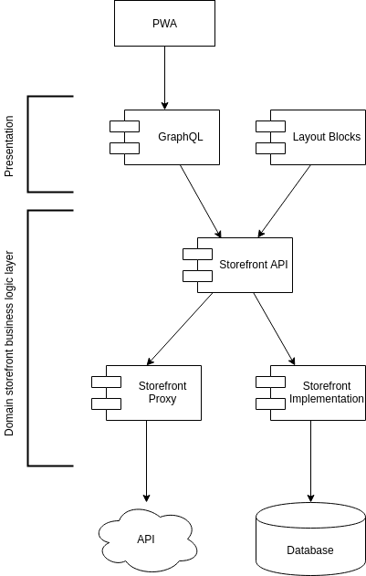
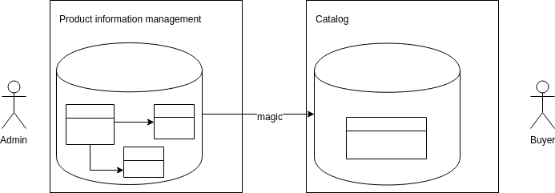
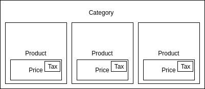

# Storefront API Technical Vision

## Definition

*Storefront APIs* - public operations and queries that 
will be available at the application storefront for buyers.


### Desired state




#### Storefront APIs are separated from admin APIs.

We are using different object representation for storefront and admin scenarios.
We are applying different rules and restrictions for such objects depending on where these objects appear.
Currently, we do not have ACL resources specified for the storefront.
So there are no particular reasons to keep admin and storefront APIs together.
Make sense to separate our APIs per purposes
and extract specific modules that will serve storefront applications.

#### Storefront application and admin application are using different databases (database objects).

Actually, Magento already has this principle partially implemented.
Admin commands manipulate with raw data sources,
when queries work mostly with indexes which were pre-populated
to return data in the most efficient way.



#### Storefront queries are eventually consistent 

This is a direct consequence of the previous statement.
At the moment Magento follows this principle.
Storefront queries use pre baked data. 
So exists some delay between the moment
when data was submitted to the system
and the moment when data become available for a storefront.

#### Storefront queries support deferred execution

At the moment all storefront implementation are trees.
Blocks generates by instruction from assembled layout.
GraphQL resolving data by traversing query tree.
We can assume that all possible future storefront implementation
will stick to this approach.
This leads us to N+1 problem.
Deferring data retrieving operation can resolve it.
Technically, we do not want to have 
a few similar repeating queries during the single page load.

For the module perspective, this means that storefront APIs, even queries will be **asynchronous**.
It does not mean that GraphQL or Blocks should be async either.
They both as clients can execute APIs with synchronous adapter.  Technically we already have this implemented with GraphQL resolvers.

[Promises/A+](https://promisesaplus.com/)

#### Storefront modules granularly sliced by modules

Storefront do not aggregate data into huge roots.
Actually, as usual this is responsibility of presentation.
This allows us to create small granular modules for storefront APIs.


```graphql
query {
	category {
    products {
      sku
      name
      price {
        amount
        tax {
          amount
        }
      }
    }
  }	
}

```
##### Involved APIs and modules 
```
    getProducts                     ----------> CatalogStorefront
    |
    `- getProductPrices             ----------> CatalogPriceStorefront
       |
       ` getProductPriceTaxes       ----------> CatalogTaxStorefront

```

#### Storefront modules does not depends on each other

Module purpose strictly restricted by the scenario it introduces.
The are no particular reason to do this because
all aggregation will be performed by the presentation layer.

#### Storefront APIs are replaceable

Because we are going to manage storefront APIs as a set of 
small granular modules which do not rely on each other 
we can assume that it should be pretty straightforward to replace each of them.
