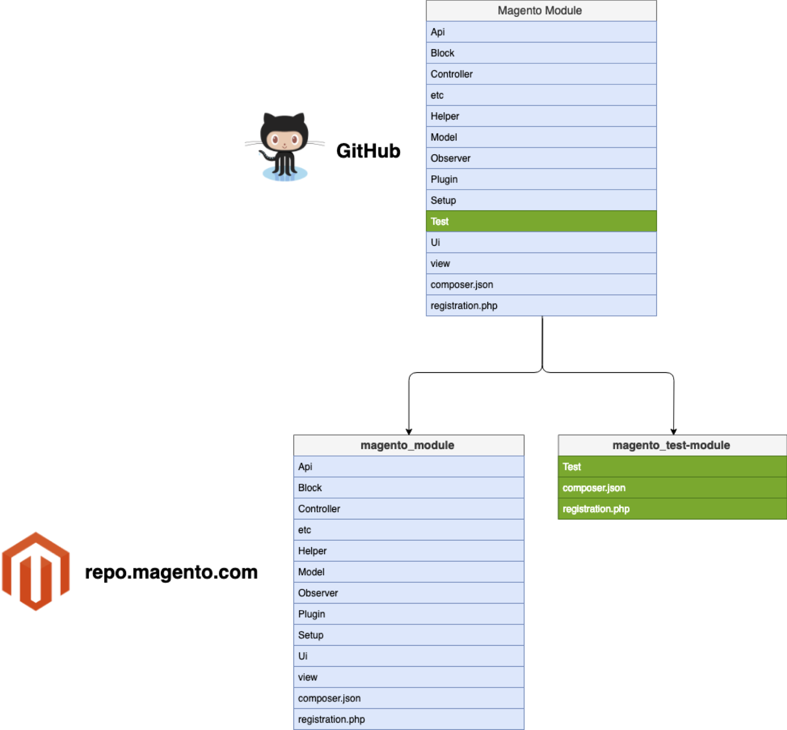
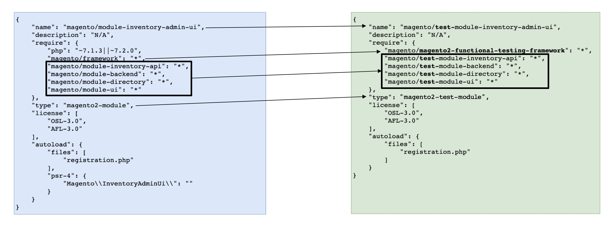

# Magento Functional Test packaging
The purpose of this document is to define a strategy of functional test packaging.

## Terminology
`MFTF` - Magento Functional Testing Framework

`MFTF tests` - means tests written to cover Magento functionality using MFTF

## Overview
### Current situation
In git repo all MFTF tests currently located under `app/code/Magento/*/Test/Mftf` directory.
When Magento releasing new version we package all modules to own packages and distribute them via repo.magento.com.
It means that all MFTF tests currently also distributed as a part of `magento2-module`.
When SIs or Extension developers installs Magento via Composer they are able to run and use MFTF tests for their own needs.

### Problem
This approach leads to situation where production environment always contains code (in our case xml configurations) which will never be used.

>There are couple reasons to separate tests from core distribution:
>
>Security:
> - reduce possible attack surface (less code)
> - the test code is not written with security in mind
> - even if we protect the access via .htaccess, some sites run Nginx or skip .htaccess making this code accessible
> - we had security issues in the past that resulted in remote code exec using code related to tests
>
>Future-proof:
> - ability to release separately, on separate cadence
> - matches the general plan for all other non-critical modules - we want to modularize and release separately things like payment extensions, shipping and more.

### Proposed solution
During Magento package new releases automated tool will exclude tests from main `magento2-module` package and create other package with type `magento2-test-module`.

## Packaging flows
### General Flow
1. Exclude `Test` folder from module and keep it for further packaging flow as it shown on image below.

2. Create `magento2-module` package as usual, but without tests.

3. Out of excluded tests create a separate package.
   - For this package we will automatically generate `composer.json` based on existing module `composer.json` file as shown on image below.
    

### Version setter flow #1
1. Versions will be set the same as for `magento2-module`. It means if we release `magento/module-store` version `101.0.3` we will specify same version for `magento/test-module-store`.
2. Metapackage `magento/product-tests-community-edition` and `magento/project-tests-community-edition` created and have the same versions as Magento metapackage. 

#### Benefits:
1. Very easy to understand what version of tests you need to run against existing Magento instance
2. Publication build will have small changes to enable this approach.

#### Disadvantages: 
1. Can not make separate releases for module or test. Always 2 packages will be released.

### Version setter flow #2
1. Versions will be set independently from Magento module based on SVC tool results.
2. Metapackage `magento/product-tests-community-edition` and `magento/project-tests-community-edition` created and have the same versions as Magento metapackage.

#### Benefits:
1. Possibility to release test package only

#### Disadvantages: 
1. Bigger changes to Publication build
    - require running SVC against latest release and current changes to determine package version to be set
2. Not possible to make Backward incompatible changes without generating new Metapackage
3. Difficult to determine what version of test package we should use against existing Magento Instance
    - Open question about "What package requires what?" see in "[Open Questions](#Open-Questions)" block

### Version setter flow #3
1. Versions will be set independently from Magento module based on SVC tool results.
2. Metapackage `magento/product-tests-community-edition` and `magento/project-tests-community-edition` created and have own versions based on smaller package version bumps.

#### Benefits:
1. Possibility to release test package only.
2. Full independence in releases from Magento release lines.

#### Disadvantages: 
1. Bigger changes to Publication build
   - require running SVC against latest release and current changes to determine package version to be set
2. Not possible to make Backward incompatible changes without generating new Metapackage
3. Difficult to determine what version of test package we should use against existing Magento Instance
   - Open question about "What package requires what?" see in "[Open Questions](#Open-Questions)" block

## Open Questions:
1. What package requires what?
   - Does Magento require-dev test packages?
   - Does test packages require Magento module?
   - Other potentials?
2. Are we using a dynamically created `composer.json` or we create them in advance under `app/code/<vendor_name>/<module_name>/Test/Mftf/` directory?
3. Do we really need packaging at all?
