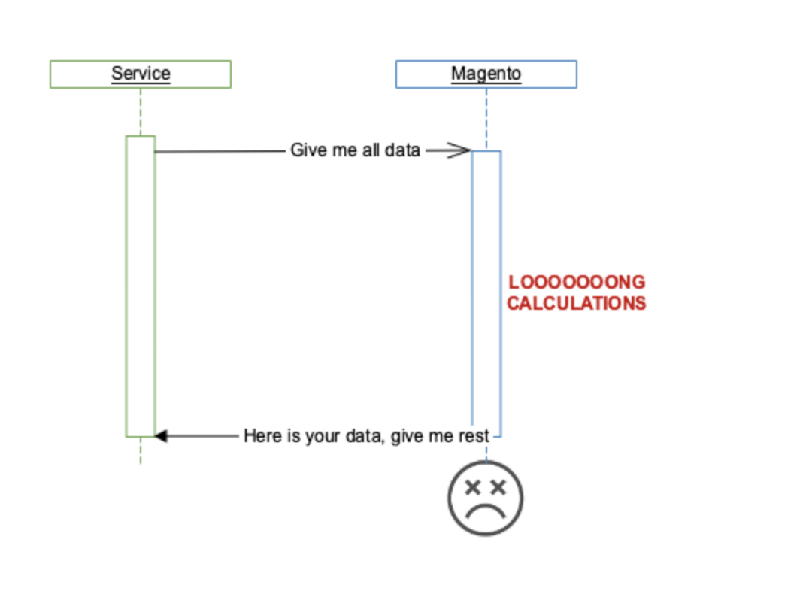
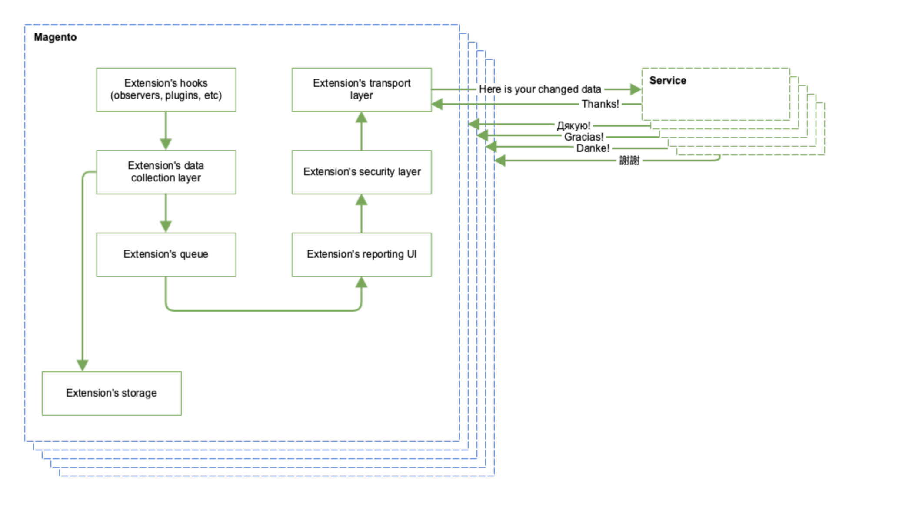
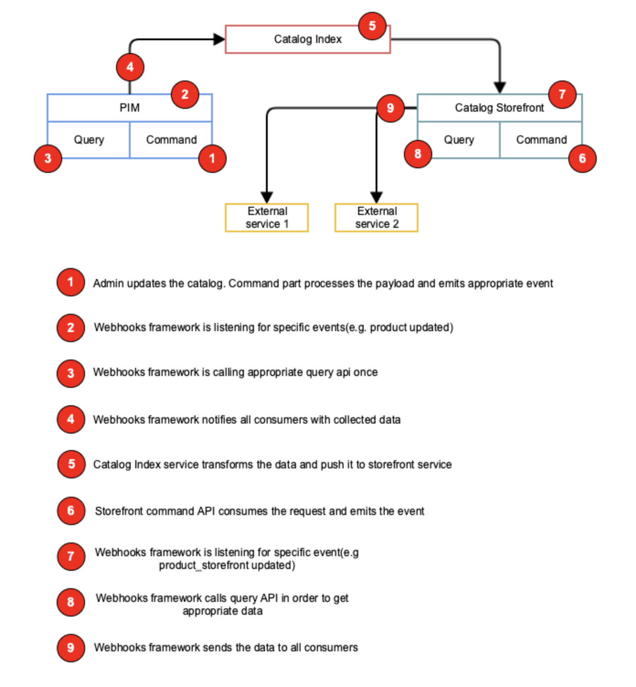

## Webhooks

### Terms

A webhook (also called a web callback or HTTP push API) is a way for an app to provide other applications with real-time information.

### Overview
As Magento is becoming more and more a composition of internal APIs and external services, Rest and GraphQL APIs are not able cover every real-life use case. Traditional Web APIs allow to retrieve or post content in a programmatical way, far from being optimal when you just want your application to be told when something changed. If that is the case, it would require polling of whole data at regular intervals, and that just doesn’t scale.



Polling a whole API's data is generally a wasteful and messy way of trying to retrieve updates.

Traditionally, Magento developers switch to push approach at this point. This approach supposes a separate integration specific extension, that is installed on Magento instance and pushes changed data into specific service.



This approach definitely improves communication scheme by sending only changed data. However, the scheme itself became much more complex and it needs to be implemented in every extension. Also, we're still wasting resources on multiple queues and multiple "extension's data collection layers". Last point is mostly visible on store-front data, where you need to pass data through business logic in order to get the final result. 

On this scheme each extension is doing the same job for the same data, but in most cases it will be done in different ways producing some mess and wasting server resources.

Of course this scheme also introduces a huge field for mistakes in authorization and authentication layers, because they need to be implemented in every extension.

The similar issues affect in-process communications as well as network communcations. A good example is full text search, which needs up-to-date store-front data and hooks in all possible places in order to track the changes.

Webhooks are aimed to solve exactly this class of issues and the underlying notification layer will solve in-process notification issues 

### Design

The principle scheme of catalog `webhooks` in context of services isolation environment:



Simpler example:
* Customer register on storefront (Command API)
* Command API emits `after_transaction_commit` event providing customer id after committing customer's data
* Webhook listener calls customer query API with provided customer id. The response may contain new data that was not provided in original request(e.g. totalSpent, customer_group, total_orders, etc)
* Webhook framework notifies all subscribers with customer data

#### Webhook declaration
New webhook could be defined by the following XML declaration in module context:

```xml
<!-- catalog_admin/etc/webhooks.xml -->
<webhooks>
    <webhook name="customer_updated" payload="\Magento\Customer\Api\Data\CustomerQueryInterface" />
</webhooks>
```
This declaration will be used as a unique identifier of payload and unique identifier for the subscription.
Also, having defined payload allows to generate webhooks documentation dynamically.

#### Event
Webhook listeners may listen to standard Magento events in order to collect changed entities:
```xml
<!-- Magento/Customer/etc/adminhtml/events.xml -->

<config xmlns:xsi="http://www.w3.org/2001/XMLSchema-instance" xsi:noNamespaceSchemaLocation="urn:magento:framework:Event/etc/events.xsd">
    <event name="customer_register_after">
        <observer name="customer_register_webhook" instance="Magento\Customer\Oberservers\RegisterWebhook" />
    </event>
</config>
```

#### Webhook emission
The central place of webhooks processing is webhook listeners. The responsibility of webhook listener is to identify changed entity, extract related data form query API and push the data into webhooks pipeline.
```php
// Magento/Customer/Observers/RegisterWebhook.php
use \Magento\Framework\Webhook\Dispatcher;

class RegisterWebhook
{
    public function execute(\Magento\Framework\Event\Observer $observer): void
    {
        $customerId = $observer->getEvent()->getData('customer_id');
        //Call to some query api
        $messagePayload = $this->customerQueryApi->get($customerId);
        $message = $this->webHookMessageFactory->create('customer_register', $messagePayload);
        $this->webHookDispatcher->send($message);
        
    }   
}
```
:warning: It's very important to use query API for data retreval purposes where applicable. Using query API allows to apply service business logic on top of changed data, so we can reduce copy-paste of business logic in consumers. Catalog example: `visibility` field + category permissions functionality + child product functionality affect the actual product visibility on store-front, so we need to send `category_assigment` event instead of providing the raw `visibility` field that should be processed on consumer's side in exactly same manner as Magento processes.:warning:

Webhook messages are created using provided payload that must implement `JsonSerializable` interface. Example:
```php
/**
 * The output of jsonSerialize is kind of api as external systems will rely on it's content
 * @api
 */
class CustomerUpdatePayload implements \JsonSerializable 
{
    public function jsonSerialize()
    {
        return [
            'id' => $this->id,
            'email' => $this->email,
            'first_name' => $this->first_name,
            'last_name' => $this->last_name,
            'total_spent' => $this->total_spent,
            'customer_group' => $this->customer_group_id
        ];
    }
}
```

Later, webhook dispatcher receives a webhook message object with payload inside. This message will be transformed to the following json object:

```json5
{
  type: "customer_register",
  created_at: "2019-05-24T16:32:55-06:00",
  idempotency_key: "8ea3bfd5-7e1e-4bd4-b662-ad7d090cc995",
  payload: {
    id: 4,
    email: "test@test.com",
    first_name: "Test first",
    last_name: "test_lastname",
    total_spent: "0",
    customer_group: 5
  },
  producer: "3bc4aef3-2718-4ca5-bdfc-e343793c0d40"
}
```
Key fields explanation:
- `type` - a type of event. This fields specifies how payload should be parsed on receiver side
- `idempotency_key` - unique identifier of the messages that allows to avoid double processing on receiver side
- `payload` - message payload specific to message type
- `producer` - unique identifier of Magento instance. It allows to accept requests from mutiple Magento instances on single URL


#### Webhook security
During registration of webhook each subscriber will recieve a unique shared secret. Each message produced by webhook framework will be wrapped in JWT token signed by appropriate shared secret using HMAC-SHA256 algorithm. This allows to verify the origin of webhook message on consumer side. Consumers MUST allow only this algorithm in JWT verification library.
All shared secrets should be at least 32 chars long - see https://auth0.com/blog/brute-forcing-hs256-is-possible-the-importance-of-using-strong-keys-to-sign-jwts/#Conclusion.

Having shared secret per consumers allows to prevent `replay` attacks on different consumers.

Additionally, webhook framework should allow subscribers to add custom headers and http authentication to HTTP calls in order to support legacy/temporary/local environments.

#### Other considerations

- Webhooks sender should be asynchronous
- Webhooks sender should retry the calls if receivers are not able to process the message (return non 200 HTTP response codes). Retry intervals shoud increase using log scale and expire at some point (e.g. 10min, 1hour, 1 day, 3 days, 1 week, expire, integration disregistered)
- Webhooks sender should use `multi_curl` approach (execute more than one http request in parallel)
- There should be at least three ways to subscribe for webhook message:
  - programmatically using web API - useful for isolated services which communicate with Magento by API only
  - programmatically using internal API - useful for intergrations which have a Magento module
  - manually using web interface - useful for testing and webhooks management by admin
- Events for custom entities/apis introduced by third-parties must have a unique suffix/namespace
- Consumer outages should be logged


#### Component Dependencies

- Cron
- Magento Framework Events  
 

